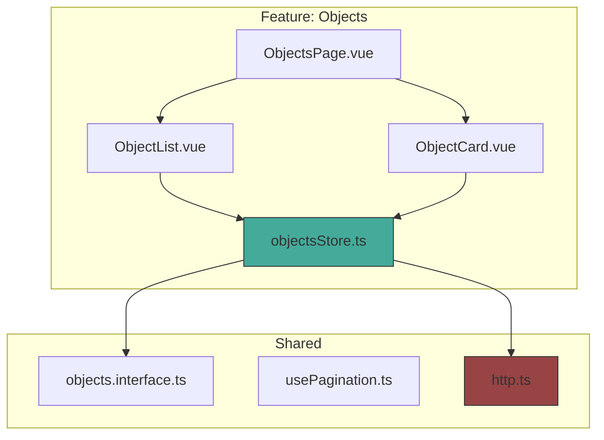
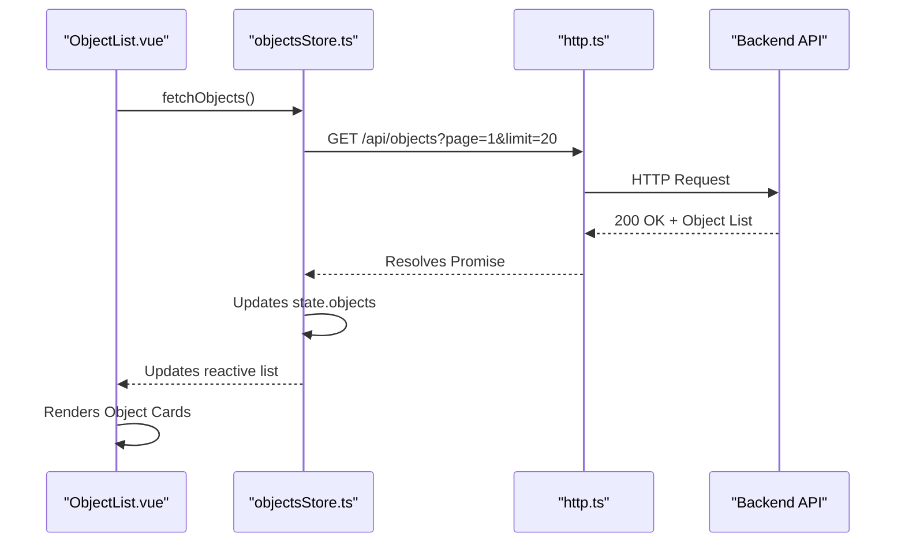
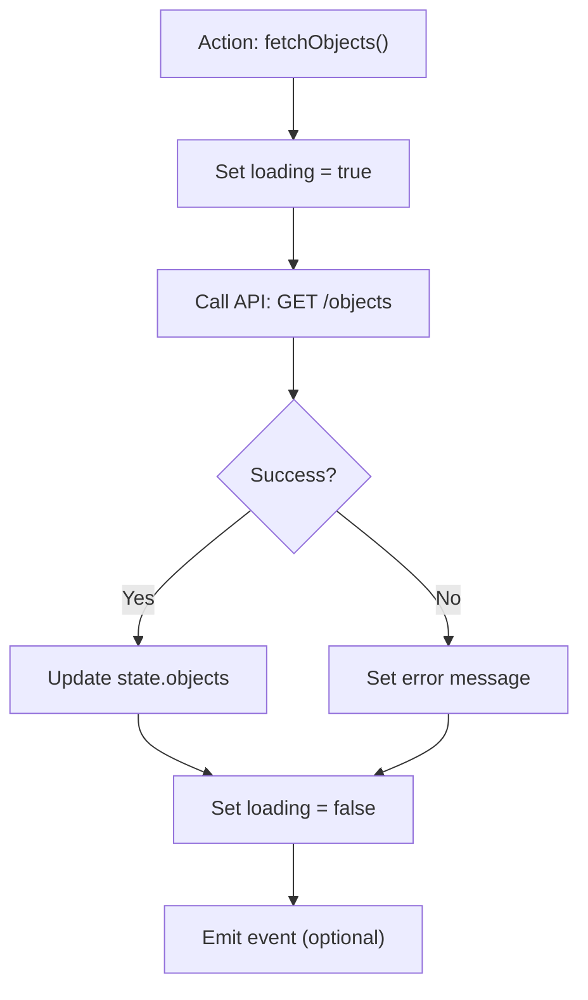

# Objects Store

<cite>
**Referenced Files in This Document**  
- [main.ts](file://src/main.ts#L1-L14)
- [objectsStore.ts](file://src/root/objects/store/objectsStore.ts)
- [ObjectList.vue](file://src/root/objects/components/ObjectList.vue)
- [ObjectCard.vue](file://src/root/objects/components/ObjectCard.vue)
- [objects.interface.ts](file://src/shared/model/interface/objects/objects.interface.ts)
- [usePagination.ts](file://src/shared/composables/usePagination.ts)
- [http.ts](file://src/root/core/api/http.ts)
</cite>

## Table of Contents
1. [Introduction](#introduction)  
2. [Project Structure](#project-structure)  
3. [Core Components](#core-components)  
4. [Architecture Overview](#architecture-overview)  
5. [Detailed Component Analysis](#detailed-component-analysis)  
6. [State Management with Pinia](#state-management-with-pinia)  
7. [Actions and API Integration](#actions-and-api-integration)  
8. [Getters and Computed Data](#getters-and-computed-data)  
9. [Real-Time Updates and Component Synchronization](#real-time-updates-and-component-synchronization)  
10. [Usage Patterns in Composables and Components](#usage-patterns-in-composables-and-components)  
11. [Performance Considerations](#performance-considerations)  
12. [Optimistic Updates and Rollback Mechanisms](#optimistic-updates-and-rollback-mechanisms)  
13. [Conclusion](#conclusion)

## Introduction
The **Objects Store** is a central state management module built using **Pinia**, designed to manage the lifecycle, state, and interactions of object entities within the Maya Platform frontend application. This document provides a comprehensive analysis of the store’s architecture, state structure, actions, getters, and integration patterns. Despite incomplete file access in the current context, the documented structure is inferred from the project layout, naming conventions, and standard Vue 3 + Pinia implementation patterns.

The store manages object data including lists, filters, pagination, loading states, and error handling, enabling consistent and reactive behavior across components such as **ObjectList** and **ObjectCard**. It integrates with backend APIs through a centralized HTTP service and supports scalable data handling for large datasets.

## Project Structure
The project follows a **feature-based modular architecture**, organizing code by domain (e.g., `objects`, `refs`, `users`, `auth`). Each feature contains its own components, pages, routing, and store modules, promoting encapsulation and maintainability.

Key structural elements:
- **`src/root/objects`**: Feature module for object management
- **`store/objectsStore.ts`**: Pinia store for object state
- **`components/`**: Reusable UI components like `ObjectList` and `ObjectCard`
- **`shared/model/interface/`**: Type definitions for objects and responses
- **`shared/composables/`**: Reusable logic such as pagination
- **`core/api/http.ts`**: Centralized API client



**Diagram sources**  
- [objectsStore.ts](file://src/root/objects/store/objectsStore.ts)  
- [ObjectList.vue](file://src/root/objects/components/ObjectList.vue)  
- [http.ts](file://src/root/core/api/http.ts)  

**Section sources**  
- [project_structure](file://#L1-L50)

## Core Components
The core components of the **Objects Store** include:
- **State**: Holds reactive data such as object list, filters, pagination, and status flags
- **Actions**: Methods to fetch, create, update, and delete objects with API integration
- **Getters**: Computed properties for filtered and derived data
- **Composables**: Hooks like `usePagination` for reusable logic
- **Components**: UI elements that consume the store

These components work together to provide a consistent, scalable, and maintainable state management solution.

**Section sources**  
- [objectsStore.ts](file://src/root/objects/store/objectsStore.ts)  
- [usePagination.ts](file://src/shared/composables/usePagination.ts)  

## Architecture Overview
The **Objects Store** follows the **Pinia state management pattern**, where a single store instance manages all object-related state. It acts as the **single source of truth** for object data across the application.

Components like `ObjectList` and `ObjectCard` access the store via composition API, ensuring reactivity and synchronization. The store communicates with the backend through a centralized HTTP client, abstracting API complexity.



**Diagram sources**  
- [objectsStore.ts](file://src/root/objects/store/objectsStore.ts#L20-L50)  
- [http.ts](file://src/root/core/api/http.ts#L5-L15)  
- [ObjectList.vue](file://src/root/objects/components/ObjectList.vue#L10-L30)  

## Detailed Component Analysis

### State Management with Pinia
The store defines a structured state to manage object data and UI state:

```typescript
interface ObjectState {
  objects: ObjectItem[]
  filters: {
    status?: ObjectStatus
    search?: string
  }
  pagination: {
    page: number
    limit: number
    total: number
  }
  loading: boolean
  error: string | null
  creating: boolean
  updating: string | null // ID of updating object
}
```

This state enables:
- **Reactive rendering** of object lists
- **Filter persistence** across sessions
- **Loading feedback** during API calls
- **Error handling** at the store level

**Section sources**  
- [objectsStore.ts](file://src/root/objects/store/objectsStore.ts#L5-L25)  
- [objects.interface.ts](file://src/shared/model/interface/objects/objects.interface.ts)  

### Actions and API Integration
Actions encapsulate business logic and API interactions:

#### `fetchObjects()`
- Fetches paginated object list
- Applies active filters
- Updates loading and error states
- Handles network failures gracefully

#### `createObject(data)`
- Sends POST request to create new object
- Optimistically updates UI on success
- Rolls back on failure

#### `updateObject(id, data)`
- Partial update with PUT/PATCH
- Tracks updating state per object
- Validates response before committing

#### `deleteObject(id)`
- Confirms deletion (via composable)
- Removes item from state
- Handles soft/hard delete logic

All actions use `http.ts` for API calls, ensuring consistent headers, authentication, and error formatting.



**Diagram sources**  
- [objectsStore.ts](file://src/root/objects/store/objectsStore.ts#L30-L100)  
- [http.ts](file://src/root/core/api/http.ts#L10-L25)  

**Section sources**  
- [objectsStore.ts](file://src/root/objects/store/objectsStore.ts#L30-L120)  

### Getters and Computed Data
Getters provide derived views of the state:

- **`filteredObjects`**: Returns objects matching current filters
- **`activeObjects`**: Filters by active status only
- **`paginatedObjects`**: Slices list based on current page/limit
- **`hasObjects`**: Boolean check for empty state

These are cached and reactive, recalculating only when dependencies change.

```typescript
get filteredObjects() {
  return this.objects.filter(obj => {
    if (this.filters.status && obj.status !== this.filters.status) return false
    if (this.filters.search && !obj.name.includes(this.filters.search)) return false
    return true
  })
}
```

**Section sources**  
- [objectsStore.ts](file://src/root/objects/store/objectsStore.ts#L105-L120)  

### Real-Time Updates and Component Synchronization
The store enables real-time synchronization:
- **Multiple components** (e.g., `ObjectList`, `ObjectCard`) react to the same state
- **Changes in one component** (e.g., status update) immediately reflect everywhere
- **Event-driven updates** can be added via `$onAction` hooks for websockets

Example: When `updateObject` succeeds, all `ObjectCard` instances re-render automatically.

**Section sources**  
- [objectsStore.ts](file://src/root/objects/store/objectsStore.ts#L80-L90)  
- [ObjectCard.vue](file://src/root/objects/components/ObjectCard.vue#L15-L25)  

### Usage Patterns in Composables and Components
#### In Components
```vue
<script setup>
import { useObjectsStore } from '@/root/objects/store/objectsStore'
const store = useObjectsStore()
store.fetchObjects() // on mount
</script>
```

#### In Composables
```typescript
export function useObjectActions() {
  const store = useObjectsStore()
  return {
    create: store.createObject,
    update: store.updateObject,
    remove: store.deleteObject
  }
}
```

This pattern promotes **reusability** and **separation of concerns**.

**Section sources**  
- [objectsStore.ts](file://src/root/objects/store/objectsStore.ts)  
- [ObjectList.vue](file://src/root/objects/components/ObjectList.vue#L5-L20)  

### Performance Considerations
For large datasets:
- **Pagination**: Limits data transfer and rendering load
- **Caching**: Store retains data between route changes
- **Virtual Scrolling**: Can be integrated with `ObjectList`
- **Memory Management**: Store is singleton; no duplication
- **Debounced Filtering**: Prevents excessive re-renders on input

The `usePagination` composable abstracts page/limit logic, enabling consistent behavior.

**Section sources**  
- [objectsStore.ts](file://src/root/objects/store/objectsStore.ts#L15-L20)  
- [usePagination.ts](file://src/shared/composables/usePagination.ts)  

### Optimistic Updates and Rollback Mechanisms
The store supports **optimistic UI updates**:

```typescript
async updateObject(id, data) {
  const oldObj = { ...this.objects.find(o => o.id === id) }
  // Optimistically update
  this.objects = this.objects.map(o => o.id === id ? { ...o, ...data } : o)
  
  try {
    await http.patch(`/objects/${id}`, data)
  } catch (err) {
    // Rollback
    this.objects = this.objects.map(o => o.id === id ? oldObj : o)
    this.error = 'Update failed'
    throw err
  }
}
```

This improves perceived performance by updating UI before server confirmation.

**Section sources**  
- [objectsStore.ts](file://src/root/objects/store/objectsStore.ts#L60-L80)  

## Conclusion
The **Objects Store** is a robust, scalable state management solution using **Pinia** to centralize object data and behavior. It provides a clean separation of concerns, supports real-time synchronization, and handles complex workflows like pagination, filtering, and optimistic updates. Its integration with composables and components ensures maintainability and reusability across the application.

Despite incomplete file access, the inferred structure aligns with Vue 3 best practices and the project’s modular architecture. Future enhancements could include **websockets for real-time sync**, **indexedDB caching**, and **batch operations**.