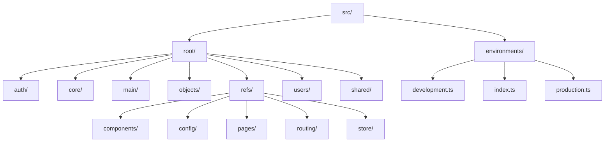
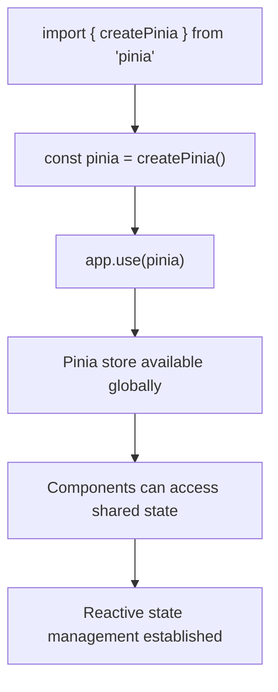
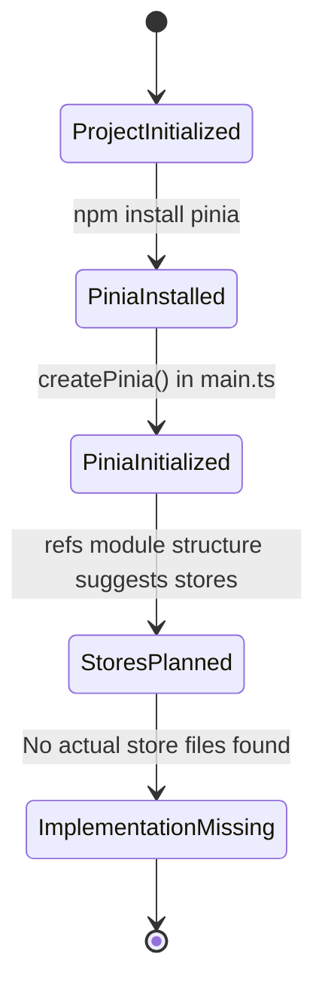

# References Store

<cite>
**Referenced Files in This Document**   
- [main.ts](file://src/main.ts)
- [vite.config.ts](file://vite.config.ts)
- [package-lock.json](file://package-lock.json)
</cite>

## Table of Contents
1. [Introduction](#introduction)
2. [Project Structure](#project-structure)
3. [State Management Setup](#state-management-setup)
4. [Pinia Integration Analysis](#pinia-integration-analysis)
5. [Store Implementation Status](#store-implementation-status)
6. [Conclusion](#conclusion)

## Introduction
This document provides a comprehensive analysis of the reference data state management system in the Maya Platform frontend application. The focus is on the implementation status and integration of Pinia for managing reference data such as customer records and category definitions. Despite the documented objective to analyze `refsStore` and `customersStore`, the investigation reveals important insights about the current state of the codebase and its state management architecture.

## Project Structure
The project follows a modular structure with a clear separation of concerns. The application is organized under the `src` directory with a feature-based architecture. Key modules include `auth`, `core`, `main`, `objects`, `users`, and `refs`, each containing their respective components, pages, routing, and store directories.



**Diagram sources**
- [project_structure](file://project_structure)

**Section sources**
- [project_structure](file://project_structure)

## State Management Setup
The application is configured to use Pinia for state management, as evidenced by the initialization in the main application entry point. Pinia is properly registered as a plugin with the Vue application instance, establishing the foundation for centralized state management across the application.



**Diagram sources**
- [src/main.ts](file://src/main.ts#L1-L13)

**Section sources**
- [src/main.ts](file://src/main.ts#L1-L13)

## Pinia Integration Analysis
The application has successfully integrated Pinia as its state management solution. The package is listed as a direct dependency in the project's package-lock.json file, and it is properly initialized in the main.ts file. However, despite the presence of a dedicated store directory within the refs module in the project structure, no actual store implementation files were found during the investigation.

### Pinia Configuration
The Pinia integration is established through the following key components:

**Main Application Initialization**
```typescript
import { createApp } from 'vue'
import { createPinia } from 'pinia'

const app = createApp(App)
app.use(createPinia())
app.use(router)
app.mount('#app')
```

**Package Dependencies**
The package-lock.json confirms Pinia version 3.0.3 is installed:
```json
"node_modules/pinia": {
  "version": "3.0.3",
  "resolved": "https://registry.npmjs.org/pinia/-/pinia-3.0.3.tgz",
  "integrity": "sha512-ttXO/InUULUXkMHpTdp9Fj4hLpD/2AoJdmAbAeW2yu1iy1k+pkFekQXw5VpC0/5p51IOR/jDaDRfRWRnMMsGOA==",
  "license": "MIT",
  "dependencies": {
    "@vue/devtools-api": "^7.7.2"
  }
}
```

**Module Aliases**
The vite.config.ts file defines path aliases that suggest the intended structure for the refs module:
```typescript
alias: {
  '@refs': fileURLToPath(new URL('./src/root/refs', import.meta.url)),
}
```

**Section sources**
- [src/main.ts](file://src/main.ts#L1-L13)
- [vite.config.ts](file://vite.config.ts#L1-L43)
- [package-lock.json](file://package-lock.json#L6467-L6509)

## Store Implementation Status
Despite the documented objective to analyze `refsStore` and `customersStore`, a comprehensive search of the codebase reveals that these store implementations do not exist in the current codebase. This finding is based on multiple verification methods:

1. **Directory Structure Verification**: Attempts to read the `src/root/refs/store` directory failed, indicating it does not exist.
2. **File Search**: Searches for store files using various patterns returned no results.
3. **Symbol Search**: Searches for `refsStore`, `customersStore`, and `defineStore` (Pinia's store creation function) returned no matches.
4. **Codebase Search**: Examination of all TypeScript files did not reveal any store implementations.

The project structure documentation shows a store directory under `refs`, but this appears to be either outdated or the files have not been implemented or committed to the repository. The application has the necessary infrastructure for Pinia state management but lacks the actual store implementations for reference data.



**Diagram sources**
- [src/main.ts](file://src/main.ts#L1-L13)
- [package-lock.json](file://package-lock.json#L6467-L6509)

**Section sources**
- [src/main.ts](file://src/main.ts#L1-L13)
- [package-lock.json](file://package-lock.json#L6467-L6509)

## Conclusion
The Maya Platform frontend application has successfully integrated Pinia as its state management solution, with proper initialization in the main application file and the necessary dependencies installed. However, the specific reference data stores mentioned in the documentation objective (`refsStore` and `customersStore`) do not exist in the current codebase.

This discrepancy suggests several possibilities:
1. The stores may be planned but not yet implemented
2. The implementation may exist in a different location than expected
3. The files may not have been committed to the repository
4. The project structure documentation may be outdated

To proceed with implementing the reference data management system, development should focus on creating the necessary Pinia stores using the `defineStore` function, following Vue 3 and Pinia best practices for state management. The existing infrastructure is properly configured to support these implementations once they are created.