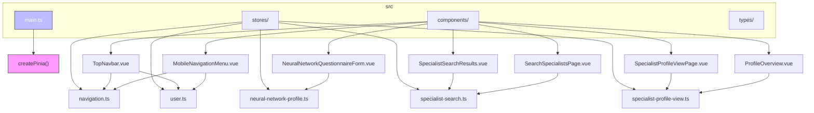
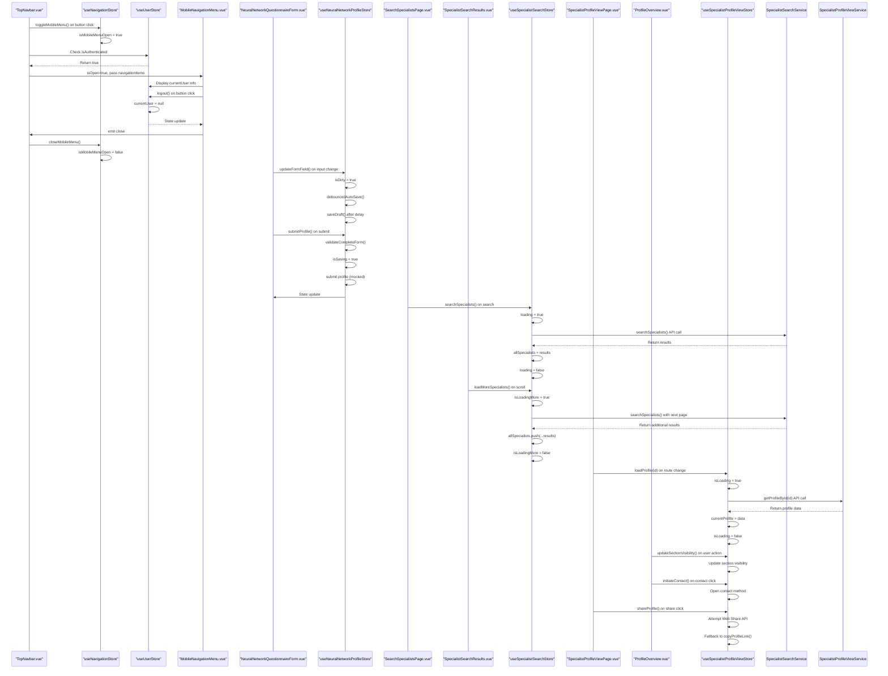

# State Management

<cite>
**Referenced Files in This Document**   
- [main.ts](file://src/main.ts) - *Pinia initialization*
- [navigation.ts](file://src/stores/navigation.ts) - *Updated in recent commit for navigation state management*
- [user.ts](file://src/stores/user.ts) - *Updated in recent commit for user profile and authentication state*
- [neural-network-profile.ts](file://src/stores/neural-network-profile.ts) - *Added in recent commit for specialist questionnaire state management*
- [specialist-search.ts](file://src/stores/specialist-search.ts) - *Added in recent commit for specialist search functionality*
- [specialist-profile-view.ts](file://src/stores/specialist-profile-view.ts) - *Added in recent commit for specialist profile view state management*
- [TopNavbar.vue](file://src/components/common/TopNavbar.vue) - *Component using navigation and user stores*
- [MobileNavigationMenu.vue](file://src/components/common/MobileNavigationMenu.vue) - *Mobile menu component integrated with stores*
- [UserProfileSection.vue](file://src/components/common/UserProfileSection.vue) - *User profile display component*
- [SpecialistSearchResults.vue](file://src/components/search/SpecialistSearchResults.vue) - *Component using specialist search store*
- [SearchSpecialistsPage.vue](file://src/pages/SearchSpecialistsPage.vue) - *Page using specialist search store*
- [SpecialistProfileViewPage.vue](file://src/pages/SpecialistProfileViewPage.vue) - *Page using specialist profile view store*
- [index.ts](file://src/types/index.ts) - *Type definitions for stores and components*
- [neural-network-profile.ts](file://src/types/neural-network-profile.ts) - *Type definitions for neural network profile store*
- [specialist-search.ts](file://src/types/specialist-search.ts) - *Type definitions for specialist search store*
- [specialist-profile-view.ts](file://src/types/specialist-profile-view.ts) - *Type definitions for specialist profile view store*
- [NeuralNetworkQuestionnaireForm.vue](file://src/components/profile/NeuralNetworkQuestionnaireForm.vue) - *Component using neural network profile store*
- [ProfileOverview.vue](file://src/components/profile/ProfileOverview.vue) - *Component using specialist profile view store*
</cite>

## Update Summary
**Changes Made**   
- Updated User Store Implementation section to reflect new user type assignment based on test login email
- Added new action updateOpenToOffers to User Store Implementation section
- Updated User Store Implementation section to include new service integration with UserService
- Updated User Store Implementation section to reflect changes in user data initialization
- Added new section on User Type and Predefined Login Users
- Updated referenced files list to include UserService
- Enhanced State Management Best Practices with new considerations for user type handling

## Table of Contents
1. [Introduction](#introduction)
2. [Project Structure](#project-structure)
3. [Pinia Initialization](#pinia-initialization)
4. [Store Architecture Overview](#store-architecture-overview)
5. [Navigation Store Implementation](#navigation-store-implementation)
6. [User Store Implementation](#user-store-implementation)
7. [Neural Network Profile Store Implementation](#neural-network-profile-store-implementation)
8. [Specialist Search Store Implementation](#specialist-search-store-implementation)
9. [Specialist Profile View Store Implementation](#specialist-profile-view-store-implementation)
10. [Data Flow and Component Integration](#data-flow-and-component-integration)
11. [State Management Best Practices](#state-management-best-practices)

## Introduction
This document provides a comprehensive overview of the state management system in the maya-platform-frontend application using Pinia. The application implements a modular store architecture with dedicated modules for navigation, user state management, neural network profile management, specialist search functionality, and specialist profile view. These stores are built using Pinia's setup syntax, leveraging Vue 3's composition API for reactive state management. The stores manage critical application state including mobile menu visibility, active routes, user authentication, profile information, specialist questionnaire data, search results with filtering and pagination, and detailed specialist profile viewing.

## Project Structure
The project follows a component-based architecture with stores organized in the `src/stores` directory. The current implementation includes six store files: `counter.ts`, `navigation.ts`, `user.ts`, `neural-network-profile.ts`, `specialist-search.ts`, and `specialist-profile-view.ts`. The navigation, user, neural network profile, specialist search, and specialist profile view stores are actively used in the application's UI components, particularly in the top navigation bar, mobile menu system, specialist profile questionnaire, specialist search page, and specialist profile view page. The stores are designed to be used with Vue's composition API, allowing components to access reactive state through composable functions.



**Diagram sources**
- [main.ts](file://src/main.ts#L6-L13)
- [navigation.ts](file://src/stores/navigation.ts)
- [user.ts](file://src/stores/user.ts)
- [neural-network-profile.ts](file://src/stores/neural-network-profile.ts)
- [specialist-search.ts](file://src/stores/specialist-search.ts)
- [specialist-profile-view.ts](file://src/stores/specialist-profile-view.ts)
- [TopNavbar.vue](file://src/components/common/TopNavbar.vue)
- [SpecialistSearchResults.vue](file://src/components/search/SpecialistSearchResults.vue)
- [SearchSpecialistsPage.vue](file://src/pages/SearchSpecialistsPage.vue)
- [SpecialistProfileViewPage.vue](file://src/pages/SpecialistProfileViewPage.vue)
- [ProfileOverview.vue](file://src/components/profile/ProfileOverview.vue)

**Section sources**
- [main.ts](file://src/main.ts#L1-L13)
- [stores/](file://src/stores/)

## Pinia Initialization
Pinia is properly initialized in the application's main entry point (main.ts), indicating that it is the designated state management solution for this Vue 3 application. The store is created using `createPinia()` and registered with the Vue application instance before the router. This setup ensures that the Pinia store is available throughout the component tree and can be accessed by any component that needs to read from or commit changes to the global state.

```typescript
import { createApp } from 'vue'
import { createPinia } from 'pinia'

const app = createApp(App)

app.use(createPinia())
app.use(router)

app.mount('#app')
```

The initialization follows Vue 3 composition API patterns and Pinia best practices, where the store is instantiated and injected into the app context before mounting. This approach enables reactive state management across the application with minimal boilerplate.

**Section sources**
- [main.ts](file://src/main.ts#L6-L13)

## Store Architecture Overview
The state management system is implemented with dedicated modules for navigation, user, neural network profile, specialist search, and specialist profile view state. Each store encapsulates its own state, getters, and actions using Pinia's setup syntax. The `useNavigationStore` manages mobile menu state and active route tracking, while the `useUserStore` handles user authentication and profile information. The `useNeuralNetworkProfileStore` manages the state for the specialist questionnaire form, including form data, validation, and submission status. The `useSpecialistSearchStore` manages the state for the specialist search functionality, including search filters, results, loading states, and infinite scroll. The `useSpecialistProfileViewStore` manages the state for viewing specialist profiles, including profile loading, error handling, modal state, and section visibility. All stores follow the composition API pattern, using `ref()` for reactive state and `computed()` for derived data.

The current store architecture features:
- **useNavigationStore**: Managing mobile menu visibility, active route, and navigation items
- **useUserStore**: Handling user authentication state, profile data, and session management
- **useNeuralNetworkProfileStore**: Managing specialist questionnaire state, form validation, and submission
- **useSpecialistSearchStore**: Managing specialist search state, filters, results, and infinite scroll
- **useSpecialistProfileViewStore**: Managing specialist profile viewing state, loading, error handling, and modal interactions
- **useCounterStore**: Basic counter functionality (not actively used in navigation components)

Each store is defined using Pinia's setup syntax, which provides better TypeScript inference and a more intuitive way to organize related state, getters, and actions compared to the options syntax.

```mermaid
classDiagram
class PiniaStore {
<<interface>>
+state : Ref<any>
+getters : Object
+actions : Object
}
class NavigationStore {
+isMobileMenuOpen : boolean
+activeRoute : string
+navigationItems : NavigationItem[]
+toggleMobileMenu() : void
+closeMobileMenu() : void
+setActiveRoute(route : string) : void
+getVisibleNavigationItems() : NavigationItem[]
+updateActiveRoute() : void
}
class UserStore {
+currentUser : User | null
+users : User[]
+loading : boolean
+error : string | null
+isAuthenticated : boolean
+userCount : number
+userDisplayName : string
+userInitials : string
+userTypeLabel : string
+login(email : string, password : string) : Promise<void>
+logout() : void
}
class NeuralNetworkProfileStore {
+currentProfile : NeuralNetworkProfileSchema | null
+formState : NeuralNetworkFormState
+validationErrors : ValidationError[]
+isLoading : boolean
+isSaving : boolean
+getCompletionPercentage() : number
+getNextIncompleteBlock() : number | null
+canSubmitProfile() : boolean
+initializeForm(existingProfile? : NeuralNetworkProfileSchema) : void
+updateFormField(blockId : string, fieldId : string, value : any) : void
+validateBlock(blockId : string) : ValidationError[]
+validateCompleteForm() : ValidationError[]
+saveProfile() : Promise<void>
+saveDraft() : Promise<void>
+submitProfile() : Promise<void>
+resetForm() : void
}
class SpecialistSearchStore {
+searchFilters : SearchFilters
+allSpecialists : SpecialistProfile[]
+availableSkills : SkillOption[]
+loading : boolean
+skillsLoading : boolean
+error : string | null
+hasSearched : boolean
+infiniteScrollState : InfiniteScrollState
+lastSearchResults : SearchResults | null
+hasResults : boolean
+selectedSkillLabels : string[]
+searchSummary : string
+availableSpecialistsCount : number
+canLoadMore : boolean
+searchSpecialists(filters? : Partial<SearchFilters>, resetResults : boolean) : Promise<void>
+loadMoreSpecialists() : Promise<void>
+loadAvailableSkills() : Promise<void>
+updateFilters(filters : Partial<SearchFilters>) : void
+clearSearch() : void
+addSkillFilter(skillKey : string) : void
+removeSkillFilter(skillKey : string) : void
+toggleSkillFilter(skillKey : string) : void
}
class SpecialistProfileViewStore {
+currentProfile : ProfileViewData | null
+isLoading : boolean
+error : string | null
+isModalOpen : boolean
+isProfileLoaded : boolean
+profileSections : ProfileSection[]
+hasPortfolio : boolean
+hasExperience : boolean
+hasTestimonials : boolean
+averageRating : number | undefined
+isProfileApproved : boolean
+profileCompletionPercentage : number
+loadProfile(id : string) : Promise<void>
+clearProfile() : void
+openModal() : void
+closeModal() : void
+refreshProfile() : Promise<void>
+updateSectionVisibility(sectionId : string, visible : boolean) : void
+getSectionData(sectionId : string) : any
+initiateContact(method : 'telegram' | 'email' | 'website' | 'phone' | 'whatsapp') : void
+shareProfile() : Promise<void>
+copyProfileLink() : Promise<void>
}
NavigationStore --> PiniaStore : implements
UserStore --> PiniaStore : implements
NeuralNetworkProfileStore --> PiniaStore : implements
SpecialistSearchStore --> PiniaStore : implements
SpecialistProfileViewStore --> PiniaStore : implements
```



**Diagram sources**
- [navigation.ts](file://src/stores/navigation.ts)
- [user.ts](file://src/stores/user.ts)
- [neural-network-profile.ts](file://src/stores/neural-network-profile.ts)
- [specialist-search.ts](file://src/stores/specialist-search.ts)
- [specialist-profile-view.ts](file://src/stores/specialist-profile-view.ts)
- [index.ts](file://src/types/index.ts)
- [neural-network-profile.ts](file://src/types/neural-network-profile.ts)
- [specialist-search.ts](file://src/types/specialist-search.ts)
- [specialist-profile-view.ts](file://src/types/specialist-profile-view.ts)

## Navigation Store Implementation
The `useNavigationStore` is implemented in `src/stores/navigation.ts` and manages the application's navigation state. It uses the setup syntax to define reactive state properties and actions for controlling the mobile menu and tracking the active route.

### State Properties
- **isMobileMenuOpen**: Reactive boolean flag that controls the visibility of the mobile navigation menu
- **activeRoute**: String that stores the current route path for highlighting active navigation items
- **navigationItems**: Array of `NavigationItem` objects that define the application's navigation structure with properties including id, label, route, icon, and visibility rules

### Getters
- **visibleNavigationItems**: Computed property that filters navigation items based on their visibility flag, enabling dynamic navigation item display

### Actions
- **toggleMobileMenu**: Toggles the mobile menu state between open and closed
- **closeMobileMenu**: Explicitly closes the mobile menu
- **setActiveRoute**: Updates the active route state with a new route path
- **getVisibleNavigationItems**: Returns the filtered list of visible navigation items
- **updateActiveRoute**: Synchronizes the active route with the current Vue Router route

The store uses TypeScript interfaces from `src/types/index.ts` to ensure type safety, including `NavigationItem`, `NavigationStoreState`, and `NavigationStoreActions`. The navigation items are pre-configured with Russian labels, indicating localization requirements for future development.

**Section sources**
- [navigation.ts](file://src/stores/navigation.ts)
- [index.ts](file://src/types/index.ts#L50-L65)

## User Store Implementation
The `useUserStore` is implemented in `src/stores/user.ts` and manages user authentication and profile state. It follows the setup syntax pattern, using reactive primitives to create a responsive user state management system.

### State Properties
- **currentUser**: Reactive reference to the currently authenticated user or null if not logged in
- **users**: Array of all users (currently not populated in the implementation)
- **loading**: Boolean flag that indicates ongoing async operations like login
- **error**: String that stores error messages from failed operations

### Getters
- **isAuthenticated**: Computed property that returns true if currentUser is not null
- **userCount**: Computed property that returns the number of users in the users array
- **userDisplayName**: Computed property that returns the full name of the current user
- **userInitials**: Computed property that returns the first letters of the user's first and last name
- **userTypeLabel**: Computed property that returns the user type label in Russian ('Специалист' or 'Клиент')

### Actions
- **login**: Asynchronous action that simulates an API call to authenticate a user with email and password, setting the currentUser state upon success. The user type is determined based on the test login email (specialist for any email except 'client@example.com').
- **logout**: Action that clears the currentUser state and resets error conditions
- **updateOpenToOffers**: Asynchronous action that updates the user's "Open to Offers" status by calling the UserService and updating the local state with the response

The store uses the `User` interface from `src/types/index.ts` for type safety. The login action includes proper loading state management and error handling, following best practices for async operations in Pinia stores. The store now integrates with the UserService for updating user profile information.

**Section sources**
- [user.ts](file://src/stores/user.ts)
- [index.ts](file://src/types/index.ts#L1-L25)
- [user.ts](file://src/services/user.ts#L1-L82)

## Neural Network Profile Store Implementation
The `useNeuralNetworkProfileStore` is implemented in `src/stores/neural-network-profile.ts` and manages the state for the specialist questionnaire form. It uses the setup syntax to define a comprehensive state management system for the neural network profile creation and editing process.

### State Properties
- **currentProfile**: Reactive reference to the current neural network profile schema or null if not loaded
- **formState**: Reactive object containing all form data and state for the questionnaire
- **validationErrors**: Array of validation error objects for form validation
- **isLoading**: Boolean flag indicating loading state during API operations
- **isSaving**: Boolean flag indicating saving state during profile operations

### Form State Structure
The formState object contains both data fields and form state properties:
- **Data fields**: specializations, superpower, abilities, portfolio, services, experience, testimonials, contacts
- **Form state**: currentBlock, completedBlocks (Set), validationErrors (object), isDirty, autoSaveEnabled, lastAutoSave

### Getters
- **getCompletionPercentage**: Computed property that calculates the percentage of completed questionnaire blocks
- **getNextIncompleteBlock**: Computed property that returns the next incomplete block number or null if all are complete
- **canSubmitProfile**: Computed property that determines if the profile can be submitted based on required block completion

### Actions
- **initializeForm**: Initializes the form with existing profile data or creates a mock profile
- **updateFormField**: Updates a specific form field and triggers auto-save if enabled
- **validateBlock**: Validates a specific block and updates completion status
- **validateCompleteForm**: Validates all blocks and returns combined errors
- **saveProfile**: Saves the complete profile (currently mocked)
- **saveDraft**: Saves a draft version of the profile with auto-save functionality
- **submitProfile**: Submits the profile for review after validation
- **resetForm**: Resets the form to initial state
- **getBlockValidationStatus**: Checks if a specific block is valid/completed

The store uses TypeScript interfaces from `src/types/neural-network-profile.ts` for type safety, including `NeuralNetworkProfileSchema`, `NeuralNetworkFormState`, and `ValidationError`. The implementation includes comprehensive validation for all form blocks, auto-save functionality with debouncing, and a completion tracking system.

**Section sources**
- [neural-network-profile.ts](file://src/stores/neural-network-profile.ts)
- [neural-network-profile.ts](file://src/types/neural-network-profile.ts#L1-L324)

## Specialist Search Store Implementation
The `useSpecialistSearchStore` is implemented in `src/stores/specialist-search.ts` and manages the state for the specialist search functionality. It uses the setup syntax to define a comprehensive state management system for searching, filtering, and displaying specialist profiles with infinite scroll support.

### State Properties
- **searchFilters**: Reactive object containing the current search criteria including query, skills, page, and limit
- **allSpecialists**: Array of `SpecialistProfile` objects representing the current search results
- **availableSkills**: Array of `SkillOption` objects representing the skills that can be used for filtering
- **loading**: Boolean flag indicating loading state during search operations
- **skillsLoading**: Boolean flag indicating loading state during skills retrieval
- **error**: String that stores error messages from failed operations
- **hasSearched**: Boolean flag indicating whether a search has been performed
- **infiniteScrollState**: Object containing state for infinite scroll functionality including current page, loading more status, and end reached status
- **lastSearchResults**: Object containing metadata about the last search results including total count and pagination info

### Getters
- **hasResults**: Computed property that returns true if there are any search results
- **selectedSkillLabels**: Computed property that returns the display labels for the currently selected skills
- **searchSummary**: Computed property that returns a human-readable summary of the current search results and filters
- **availableSpecialistsCount**: Computed property that returns the count of specialists with 'available' status
- **canLoadMore**: Computed property that determines if more results can be loaded based on scroll state and search status

### Actions
- **searchSpecialists**: Asynchronous action that performs a search with the current filters, handling loading states and error conditions
- **loadMoreSpecialists**: Asynchronous action that loads additional results for infinite scroll, appending to existing results
- **loadAvailableSkills**: Asynchronous action that retrieves the list of available skills for filtering
- **updateFilters**: Updates the search filters with new values
- **clearSearch**: Resets all search state to initial values
- **addSkillFilter**: Adds a skill to the filters if not already present
- **removeSkillFilter**: Removes a skill from the filters if present
- **toggleSkillFilter**: Toggles a skill filter on or off

The store uses TypeScript interfaces from `src/types/specialist-search.ts` for type safety, including `SearchFilters`, `SpecialistProfile`, `SkillOption`, `SearchResults`, and `InfiniteScrollState`. The implementation includes comprehensive error handling, loading states, and supports both full searches and incremental loading for infinite scroll.

**Section sources**
- [specialist-search.ts](file://src/stores/specialist-search.ts)
- [specialist-search.ts](file://src/types/specialist-search.ts#L1-L184)

## Specialist Profile View Store Implementation
The `useSpecialistProfileViewStore` is implemented in `src/stores/specialist-profile-view.ts` and manages the state for viewing specialist profiles. It uses the setup syntax to define a comprehensive state management system for loading, displaying, and interacting with specialist profile data.

### State Properties
- **currentProfile**: Reactive reference to the current profile view data or null if not loaded
- **isLoading**: Boolean flag indicating loading state during profile retrieval
- **error**: String that stores error messages from failed operations
- **isModalOpen**: Boolean flag indicating whether the profile modal is open

### Getters
- **isProfileLoaded**: Computed property that returns true if currentProfile is not null
- **profileSections**: Computed property that returns the list of visible profile sections, filtered by visibility and data availability
- **hasPortfolio**: Computed property that returns true if the profile has portfolio items
- **hasExperience**: Computed property that returns true if the profile has work experience entries
- **hasTestimonials**: Computed property that returns true if the profile has testimonials
- **averageRating**: Computed property that returns the average rating from text testimonials
- **isProfileApproved**: Computed property that returns true if the profile moderation status is 'approved'
- **profileCompletionPercentage**: Computed property that returns the profile completion percentage

### Actions
- **loadProfile**: Asynchronous action that loads a profile by ID, handling loading states and error conditions
- **clearProfile**: Resets the profile state to initial values
- **openModal**: Opens the profile modal and prevents body scroll
- **closeModal**: Closes the profile modal and restores body scroll
- **refreshProfile**: Reloads the current profile data
- **updateSectionVisibility**: Updates the visibility of a specific profile section
- **getSectionData**: Returns the data for a specific profile section
- **initiateContact**: Opens a contact method (Telegram, email, website, phone, WhatsApp) in a new tab
- **shareProfile**: Attempts to share the profile using the Web Share API, falling back to clipboard copy
- **copyProfileLink**: Copies the current profile URL to the clipboard

The store uses TypeScript interfaces from `src/types/specialist-profile-view.ts` for type safety, including `ProfileViewData`, `ProfileSection`, and `SpecialistProfileViewService`. The implementation includes comprehensive error handling, loading states, and supports profile viewing with modal interactions and contact sharing functionality.

**Section sources**
- [specialist-profile-view.ts](file://src/stores/specialist-profile-view.ts)
- [specialist-profile-view.ts](file://src/types/specialist-profile-view.ts#L1-L184)
- [specialist-profile-view.ts](file://src/services/specialist-profile-view.ts#L1-L469)

## Data Flow and Component Integration
The data flow in this application follows a unidirectional pattern from user interactions to state updates and view reactivity. Components interact with stores through direct imports of the store composables, accessing both state properties and actions.

### TopNavbar Integration
The `TopNavbar.vue` component integrates with both stores:
1. Imports `useNavigationStore` and `useUserStore` from their respective modules
2. Uses `visibleNavigationItems` computed property to display appropriate navigation links based on authentication status
3. Binds the mobile menu button to `navigationStore.toggleMobileMenu`
4. Displays user profile information when authenticated using `userStore.currentUser`
5. Watches route changes to update the active route in the navigation store

### MobileNavigationMenu Integration
The `MobileNavigationMenu.vue` component:
1. Receives navigation state through props from the parent component
2. Displays user profile information and logout functionality when authenticated
3. Emits close events to the parent component, which triggers `navigationStore.closeMobileMenu`
4. Handles logout by calling `userStore.logout()` and navigating to the login page

### NeuralNetworkQuestionnaireForm Integration
The `NeuralNetworkQuestionnaireForm.vue` component:
1. Uses `useNeuralNetworkProfileStore` to access form state and actions
2. Displays form blocks with completion status based on `formState.completedBlocks`
3. Shows completion percentage using `getCompletionPercentage` getter
4. Enables submission only when `canSubmitProfile` returns true
5. Implements auto-save functionality through `updateFormField` and `saveDraft` actions
6. Displays validation errors from the store's `validationErrors` state

### Specialist Search Component Integration
The `SpecialistSearchResults.vue` and `SearchSpecialistsPage.vue` components integrate with the specialist search store:
1. `SearchSpecialistsPage.vue` imports `useSpecialistSearchStore` and initializes the search service
2. The component passes search results, loading states, and error information to `SpecialistSearchResults.vue`
3. `SpecialistSearchResults.vue` displays the search results with loading and error states
4. The component handles search events by calling `searchStore.searchSpecialists()`
5. Infinite scroll is implemented through the `load-more` event which calls `searchStore.loadMoreSpecialists()`
6. The search summary is displayed using the `searchSummary` getter
7. Skill filters are managed through `addSkillFilter`, `removeSkillFilter`, and `toggleSkillFilter` actions

### Specialist Profile View Component Integration
The `SpecialistProfileViewPage.vue` and `ProfileOverview.vue` components integrate with the specialist profile view store:
1. `SpecialistProfileViewPage.vue` imports `useSpecialistProfileViewStore` and calls `loadProfile()` with the route parameter
2. The component displays loading and error states based on store state
3. `ProfileOverview.vue` displays profile sections based on `profileSections` getter
4. The component handles section visibility changes through `updateSectionVisibility()` action
5. Contact actions are handled through `initiateContact()` action
6. Profile sharing is implemented through `shareProfile()` and `copyProfileLink()` actions
7. Modal interactions are managed through `openModal()` and `closeModal()` actions



**Diagram sources**
- [TopNavbar.vue](file://src/components/common/TopNavbar.vue)
- [MobileNavigationMenu.vue](file://src/components/common/MobileNavigationMenu.vue)
- [UserProfileSection.vue](file://src/components/common/UserProfileSection.vue)
- [NeuralNetworkQuestionnaireForm.vue](file://src/components/profile/NeuralNetworkQuestionnaireForm.vue)
- [SpecialistSearchResults.vue](file://src/components/search/SpecialistSearchResults.vue)
- [SearchSpecialistsPage.vue](file://src/pages/SearchSpecialistsPage.vue)
- [SpecialistProfileViewPage.vue](file://src/pages/SpecialistProfileViewPage.vue)
- [ProfileOverview.vue](file://src/components/profile/ProfileOverview.vue)
- [navigation.ts](file://src/stores/navigation.ts)
- [user.ts](file://src/stores/user.ts)
- [neural-network-profile.ts](file://src/stores/neural-network-profile.ts)
- [specialist-search.ts](file://src/stores/specialist-search.ts)
- [specialist-profile-view.ts](file://src/stores/specialist-profile-view.ts)

## State Management Best Practices
Based on the current implementation and Vue/Pinia best practices, the following guidelines are recommended:

### Store Organization
- **Modular structure**: Each store focuses on a specific domain (navigation, user, neural network profile, specialist search, specialist profile view) maintaining separation of concerns
- **Single responsibility**: Stores manage specific state domains without overlapping responsibilities
- **Type safety**: Use TypeScript interfaces to ensure type consistency across stores and components
- **Reactive primitives**: Leverage `ref()` for state and `computed()` for derived data to maximize reactivity

### Performance Considerations
- **Computed properties**: Use computed getters for derived state to avoid redundant calculations
- **State minimization**: Only store essential state in Pinia, keeping the store lightweight
- **Proper cleanup**: The implementation automatically handles state reactivity through Vue's reactivity system
- **Debounced operations**: Use debouncing for auto-save operations to prevent excessive API calls
- **Infinite scroll**: Implement incremental loading to avoid loading all data at once

### Error Handling
- **Centralized error management**: Store actions handle errors and expose them through state properties
- **Loading states**: Implement loading flags to provide feedback during async operations
- **Graceful degradation**: Components should handle null or undefined state values appropriately
- **Validation feedback**: Provide clear validation errors and status indicators to users

### Testing Strategies
- **Unit testing**: Test store actions and getters in isolation with mocked dependencies
- **Integration testing**: Verify the interaction between components and stores
- **Mock API responses**: Use mock services to test various scenarios including error conditions
- **Edge case testing**: Test form validation with various input combinations and edge cases

### Common Pitfalls to Avoid
- **Direct state mutation**: Always use actions to modify state, never mutate state directly
- **Over-fetching**: Implement caching strategies to avoid unnecessary API calls
- **Store bloat**: Keep stores focused and consider splitting large stores into smaller, more focused ones
- **Circular dependencies**: Be careful with store dependencies to avoid circular import issues
- **Memory leaks**: Ensure proper cleanup of timers and event listeners in store actions

**Section sources**
- [navigation.ts](file://src/stores/navigation.ts)
- [user.ts](file://src/stores/user.ts)
- [neural-network-profile.ts](file://src/stores/neural-network-profile.ts)
- [specialist-search.ts](file://src/stores/specialist-search.ts)
- [specialist-profile-view.ts](file://src/stores/specialist-profile-view.ts)
- [TopNavbar.vue](file://src/components/common/TopNavbar.vue)
- [MobileNavigationMenu.vue](file://src/components/common/MobileNavigationMenu.vue)
- [UserProfileSection.vue](file://src/components/common/UserProfileSection.vue)
- [NeuralNetworkQuestionnaireForm.vue](file://src/components/profile/NeuralNetworkQuestionnaireForm.vue)
- [SpecialistSearchResults.vue](file://src/components/search/SpecialistSearchResults.vue)
- [SearchSpecialistsPage.vue](file://src/pages/SearchSpecialistsPage.vue)
- [SpecialistProfileViewPage.vue](file://src/pages/SpecialistProfileViewPage.vue)
- [ProfileOverview.vue](file://src/components/profile/ProfileOverview.vue)