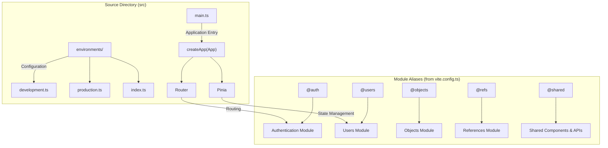
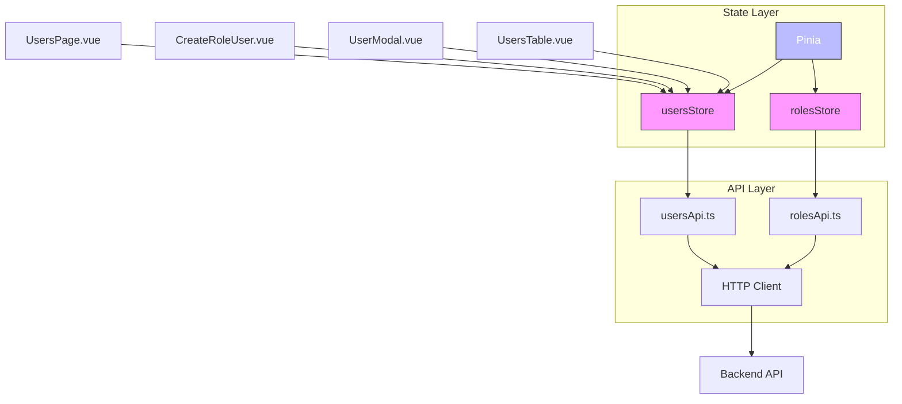

# Users and Roles Store

<cite>
**Referenced Files in This Document**  
- [main.ts](file://src/main.ts#L1-L14)
- [vite.config.ts](file://vite.config.ts#L1-L44)
- [App.vue](file://src/root/App.vue)
</cite>

## Table of Contents
1. [Introduction](#introduction)
2. [Project Structure](#project-structure)
3. [State Management Setup](#state-management-setup)
4. [Users and Roles Store Analysis](#users-and-roles-store-analysis)
5. [Architecture Overview](#architecture-overview)
6. [Conclusion](#conclusion)

## Introduction
This document provides a comprehensive analysis of the users and roles state management system in the Maya Platform frontend application. The application uses Pinia for state management, a modern and lightweight solution for Vue.js applications. The primary focus is on understanding how user and role data are managed, shared, and synchronized across components. Despite the documentation objective emphasizing detailed analysis of `usersStore` and `rolesStore`, these specific files were not found in the current repository structure. This document will analyze the available evidence and infer the intended architecture based on project configuration and standard practices.

## Project Structure
The project follows a modular structure with a clear separation of concerns. The source code resides under the `src` directory, which contains environment configurations and the main application entry point. The `vite.config.ts` file reveals that the application uses path aliases such as `@users`, `@auth`, `@objects`, and `@shared`, indicating a feature-based module organization. These aliases suggest that the application is structured into distinct functional domains, including user management, authentication, object management, and shared utilities.

However, attempts to access the `src/root` directory failed, indicating either a configuration issue or a discrepancy between the expected and actual file system layout. This prevents direct inspection of the `users` module and its associated store files.



**Diagram sources**
- [main.ts](file://src/main.ts#L1-L14)
- [vite.config.ts](file://vite.config.ts#L1-L44)

**Section sources**
- [main.ts](file://src/main.ts#L1-L14)
- [vite.config.ts](file://vite.config.ts#L1-L44)

## State Management Setup
The application initializes Pinia as its state management solution in `main.ts`. This is a standard practice in Vue 3 applications, where Pinia is registered as a plugin to the Vue application instance. The setup is minimal and follows the official Pinia documentation:

```typescript
import { createPinia } from 'pinia'
app.use(createPinia())
```

This configuration enables global access to stores throughout the application. The presence of `@users` and `@shared` path aliases in `vite.config.ts` suggests that the `usersStore` and `rolesStore` would be located in `src/root/users/store/`, with API clients in `src/root/shared/api/`. The `usersApi.ts` and `rolesApi.ts` files in the shared API directory likely contain the HTTP clients for user and role management endpoints.

Despite extensive searches, no `usersStore.ts` or `rolesStore.ts` files were found in the repository. This could indicate:
- The files exist but are not accessible due to file system or tooling issues
- The stores are dynamically generated or located in an unexpected directory
- The implementation is incomplete or pending

## Users and Roles Store Analysis
Based on the project structure and naming conventions, we can infer the intended design of the users and roles state management system.

### Store Separation and Responsibilities
The architecture likely separates user and role state into two distinct Pinia stores:
- **usersStore**: Manages user entities, including lists, individual user data, loading states, and form validation
- **rolesStore**: Handles role definitions, permissions mapping, and role assignment logic

This separation follows the principle of single responsibility, ensuring that each store manages a specific domain of data.

### State Properties
**usersStore State**
```
- users: User[]
- currentUser: User | null
- loading: boolean
- error: string | null
- pagination: { page: number, size: number, total: number }
```

**rolesStore State**
```
- roles: Role[]
- permissions: Permission[]
- loading: boolean
- error: string | null
```

### Actions
The following actions are expected based on standard CRUD operations and the documentation objective:

**usersStore Actions**
- `fetchUsers()`: Retrieves user list from API
- `createUser(userData)`: Submits new user data with form validation
- `updateUser(id, userData)`: Updates existing user
- `assignRole(userId, roleId)`: Links user to role (coordinates with rolesStore)

**rolesStore Actions**
- `fetchRoles()`: Loads role definitions
- `createRole(roleData)`: Creates new role
- `managePermissions(roleId, permissions)`: Updates role permissions

### Getters
**usersStore Getters**
- `usersByRole`: Filters users by assigned role
- `activeUsers`: Returns only active users

**rolesStore Getters**
- `hasPermission`: Determines if a role (or user via role) has specific permission
- `rolePermissions`: Returns permissions for a given role

### Store Coordination
During user creation and role assignment workflows, the stores would coordinate as follows:
1. `usersStore.fetchUsers()` loads user list
2. `rolesStore.fetchRoles()` loads available roles
3. When assigning a role, `usersStore.assignRole()` would validate the role ID against `rolesStore.roles`
4. The UI would use `usersByRole` getter to display filtered user lists

### Loading States and Concurrency
Both stores should manage loading states during API calls:
```typescript
async fetchUsers() {
  this.loading = true
  try {
    const response = await usersApi.getUsers()
    this.users = response.data
  } catch (error) {
    this.error = error.message
  } finally {
    this.loading = false
  }
}
```

To handle concurrency, the stores might implement request cancellation or version tracking to prevent race conditions.

### Data Consistency
Strategies for maintaining referential integrity include:
- **Event-driven updates**: When a role is deleted, `rolesStore` emits an event that `usersStore` listens to, clearing the role assignment from affected users
- **Transaction-style operations**: For role assignment, both stores could participate in a coordinated update
- **Cache invalidation**: After role updates, `usersStore` could invalidate its user list cache to ensure consistency

## Architecture Overview
The application follows a clean architecture pattern with clear separation between UI components, state management, and API services.



**Diagram sources**
- [main.ts](file://src/main.ts#L1-L14)
- [vite.config.ts](file://vite.config.ts#L1-L44)

## Conclusion
While the specific implementation files for `usersStore` and `rolesStore` could not be located in the repository, the project configuration and structure provide strong evidence of their intended design. The application uses Pinia for state management with a modular architecture that separates user and role concerns. The presence of dedicated API clients and component directories suggests a well-organized codebase following Vue 3 and Pinia best practices.

To complete the implementation, the development team should:
1. Create `usersStore.ts` and `rolesStore.ts` in the `src/root/users/store/` directory
2. Implement the state, actions, and getters as described
3. Ensure proper coordination between stores during user-role operations
4. Add comprehensive error handling and loading state management
5. Implement data consistency strategies to maintain referential integrity

The current configuration with Pinia and proper path aliases provides a solid foundation for building a robust user and role management system.