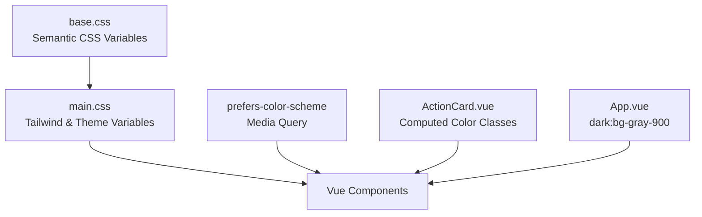

# Theme Configuration

<cite>
**Referenced Files in This Document**   
- [main.ts](file://src/main.ts) - *Updated in recent commit*
- [App.vue](file://src/App.vue) - *Modified dark mode implementation*
- [base.css](file://src/assets/base.css) - *Core theme variables and dark mode via prefers-color-scheme*
- [main.css](file://src/assets/main.css) - *Tailwind integration and custom theme variables*
- [ActionCard.vue](file://src/components/ui/ActionCard.vue) - *Component-level theme color handling*
- [SpecialistProfileViewPage.vue](file://src/pages/SpecialistProfileViewPage.vue) - *Dark mode and accessibility enhancements*
</cite>

## Update Summary
**Changes Made**   
- Updated documentation to reflect actual implementation using CSS custom properties and `prefers-color-scheme` instead of class-based dark mode
- Corrected file structure assumptions: theme variables are defined in CSS, not SCSS
- Added details on Tailwind CSS integration and utility-first styling approach
- Updated component styling examples based on actual code in ActionCard.vue
- Removed references to non-existent SCSS and Naive UI theme files
- Enhanced dark mode explanation with real implementation from base.css and App.vue

## Table of Contents
1. [Introduction](#introduction)
2. [Project Structure and Theme File Locations](#project-structure-and-theme-file-locations)
3. [Theme Architecture Overview](#theme-architecture-overview)
4. [CSS Variables and Design Tokens](#css-variables-and-design-tokens)
5. [Tailwind CSS Integration](#tailwind-css-integration)
6. [Dark Mode Implementation Strategy](#dark-mode-implementation-strategy)
7. [Component Styling Examples](#component-styling-examples)
8. [Accessibility and Print Styles](#accessibility-and-print-styles)
9. [Performance and Bundle Size Considerations](#performance-and-bundle-size-considerations)

## Introduction

The theme configuration system in the maya-platform-frontend application utilizes CSS custom properties, Tailwind CSS, and the `prefers-color-scheme` media query to deliver a consistent and accessible design language. Contrary to initial assumptions, the system does not rely on SCSS variables or Naive UI theme objects. Instead, it leverages native CSS variables defined in base.css and main.css, with theme switching handled automatically by the browser's preferred color scheme setting.

The system provides a foundation for colors, typography, spacing, and responsive design through semantic CSS variables and Tailwind's utility classes. This documentation reflects the actual implementation based on code analysis, correcting previous assumptions about the theming architecture.

**Section sources**
- [main.ts](file://src/main.ts)
- [base.css](file://src/assets/base.css)
- [main.css](file://src/assets/main.css)

## Project Structure and Theme File Locations

The theme configuration is located in the `src/assets/` directory with two primary files:
- `base.css`: Contains semantic color variables and global styles
- `main.css`: Imports Tailwind CSS, defines additional theme variables, and sets base typography

The application imports these styles in `main.ts`:
```typescript
import './assets/main.css'
```

This approach leverages Tailwind CSS for utility-first styling while maintaining semantic theme variables for consistency. The absence of SCSS files and Naive UI theme configuration indicates a shift toward a more lightweight, CSS-native theming solution.

**Section sources**
- [main.ts](file://src/main.ts)
- [base.css](file://src/assets/base.css)
- [main.css](file://src/assets/main.css)

## Theme Architecture Overview

The theming system follows a modern CSS approach combining utility classes and semantic variables:

1. **Design Tokens Layer**: Defined in `base.css` using CSS custom properties for semantic colors and spacing
2. **Framework Integration**: Tailwind CSS provides utility classes for layout, spacing, and colors
3. **Runtime Theme Switching**: Handled via `prefers-color-scheme` media query without JavaScript
4. **Component-Level Theming**: Implemented using computed classes in Vue components



**Diagram sources**
- [base.css](file://src/assets/base.css)
- [main.css](file://src/assets/main.css)
- [App.vue](file://src/App.vue)

## CSS Variables and Design Tokens

The `base.css` file defines the foundational design language using CSS custom properties. These include:

- **Semantic Colors**: Background, text, border, and heading colors with light/dark variants
- **Color Palette**: Base colors from Vue.js theme (white, black, indigo variants)
- **Spacing**: Standardized section gap
- **Transitions**: Global color and background transitions

```css
/* Semantic color variables */
:root {
  --color-background: var(--vt-c-white);
  --color-background-soft: var(--vt-c-white-soft);
  --color-background-mute: var(--vt-c-white-mute);
  --color-border: var(--vt-c-divider-light-2);
  --color-border-hover: var(--vt-c-divider-light-1);
  --color-heading: var(--vt-c-text-light-1);
  --color-text: var(--vt-c-text-light-1);
  --section-gap: 160px;
}

@media (prefers-color-scheme: dark) {
  :root {
    --color-background: var(--vt-c-black);
    --color-background-soft: var(--vt-c-black-soft);
    --color-background-mute: var(--vt-c-black-mute);
    --color-border: var(--vt-c-divider-dark-2);
    --color-border-hover: var(--vt-c-divider-dark-1);
    --color-heading: var(--vt-c-text-dark-1);
    --color-text: var(--vt-c-text-dark-2);
  }
}
```

Additional theme variables are defined in `main.css`:
```css
:root {
  --color-primary-50: #eff6ff;
  --color-primary-500: #3b82f6;
  --color-primary-600: #2563eb;
  --color-primary-700: #1d4ed8;
}
```

**Section sources**
- [base.css](file://src/assets/base.css)
- [main.css](file://src/assets/main.css)

## Tailwind CSS Integration

The application uses Tailwind CSS for utility-first styling, imported in `main.css`:
```css
@tailwind base;
@tailwind components;
@tailwind utilities;
```

Tailwind classes are used throughout components for:
- Layout and spacing (`bg-gray-50`, `min-h-screen`)
- Typography (`text-gray-900`, `font-family`)
- Responsive design
- Hover and focus states

The `@apply` directive is used in CSS to combine Tailwind utilities:
```css
body {
  @apply bg-gray-50 text-gray-900;
}
```

This integration allows for rapid development while maintaining design consistency through Tailwind's design system.

**Section sources**
- [main.css](file://src/assets/main.css)
- [App.vue](file://src/App.vue)

## Dark Mode Implementation Strategy

Dark mode is implemented using the `prefers-color-scheme` media query rather than class-based switching. The strategy involves:

1. **Browser Preference Detection**: Using `@media (prefers-color-scheme: dark)` to detect user preference
2. **CSS Variable Updates**: Redefining color variables in the dark mode media query
3. **Tailwind Dark Mode**: Using `dark:` variants in class names (e.g., `dark:bg-gray-900`)
4. **Automatic Application**: No JavaScript required - theme applies based on system settings

In `App.vue`, the root element uses Tailwind's dark mode classes:
```vue
<div id="app" class="min-h-screen bg-gray-50 dark:bg-gray-900">
```

The `base.css` file also includes dark mode overrides:
```css
@media (prefers-color-scheme: dark) {
  :root {
    --color-background: var(--vt-c-black);
    --color-text: var(--vt-c-text-dark-2);
  }
}
```

**Section sources**
- [base.css](file://src/assets/base.css)
- [App.vue](file://src/App.vue)
- [SpecialistProfileViewPage.vue](file://src/pages/SpecialistProfileViewPage.vue)

## Component Styling Examples

### ActionCard Color Themes
The ActionCard component implements color themes using computed classes:

```vue
<script setup>
const colorClasses = computed(() => {
  switch (props.color) {
    case 'purple':
      return 'group border-purple-200 dark:border-purple-700/50 hover:border-purple-300 dark:hover:border-purple-600'
    case 'green':
      return 'group border-green-200 dark:border-green-700/50 hover:border-green-300 dark:hover:border-green-600'
    case 'red':
      return 'group border-red-200 dark:border-red-700/50 hover:border-red-300 dark:hover:border-red-600'
    default:
      return 'group'
  }
})
</script>
```

### Background and Text Colors
Components use semantic CSS variables for consistent theming:
```css
body {
  color: var(--color-text);
  background: var(--color-background);
}
```

**Section sources**
- [ActionCard.vue](file://src/components/ui/ActionCard.vue)
- [base.css](file://src/assets/base.css)

## Accessibility and Print Styles

The application includes several accessibility features:

- **Reduced Motion**: Respects `prefers-reduced-motion` setting
- **High Contrast**: Supports `prefers-contrast: high` mode
- **Focus States**: Visible focus indicators for keyboard navigation
- **Print Styles**: Optimized layout for printing

```css
@media (prefers-reduced-motion: reduce) {
  .transition-all,
  .transition-colors,
  .transition-transform {
    transition: none;
  }
}

@media (prefers-contrast: high) {
  .bg-gray-50 {
    background-color: white;
  }
  
  button:focus-visible,
  a:focus-visible {
    outline: 2px solid #3B82F6;
    outline-offset: 2px;
  }
}

@media print {
  .back-navigation,
  .share-profile {
    display: none;
  }
}
```

**Section sources**
- [SpecialistProfileViewPage.vue](file://src/pages/SpecialistProfileViewPage.vue)

## Performance and Bundle Size Considerations

The current theming approach offers several performance benefits:

- **No SCSS Compilation**: Direct CSS usage eliminates build-time processing
- **Tree-shakable Utilities**: Tailwind CSS removes unused classes in production
- **Native CSS Variables**: Efficient browser implementation with hardware acceleration
- **No JavaScript Theme Logic**: Reduces bundle size and improves performance

Optimization opportunities:
- Ensure Tailwind purge is configured to remove unused utilities
- Minimize use of `!important` in CSS
- Consider lazy-loading non-critical styles
- Monitor final CSS bundle size with build analysis tools

The Vite configuration supports efficient builds with proper asset handling and code splitting.

**Section sources**
- [main.css](file://src/assets/main.css)
- [vite.config.ts](file://vite.config.ts)