# Support Components

<cite>
**Referenced Files in This Document**   
- [SupportForm.vue](file://src/components/support/SupportForm.vue#L1-L328) - *Updated in recent commit*
- [FAQItem.vue](file://src/components/support/FAQItem.vue#L1-L199) - *Deprecated in commit e6d4694*
- [FAQSection.vue](file://src/components/support/FAQSection.vue#L1-L303) - *Deprecated in commit e6d4694*
- [SimpleFAQSection.vue](file://src/components/support/SimpleFAQSection.vue#L1-L130) - *Updated in commit e6d4694*
- [CompactFAQItem.vue](file://src/components/support/CompactFAQItem.vue#L1-L100) - *Updated in commit e6d4694*
- [SupportHistorySection.vue](file://src/components/support/SupportHistorySection.vue#L1-L155) - *Updated in commit 53f1b04*
- [SupportTicketItem.vue](file://src/components/support/SupportTicketItem.vue#L1-L199)
- [TicketHeader.vue](file://src/components/support/TicketHeader.vue#L1-L172) - *Updated in commit 5d1225d*
- [MessageList.vue](file://src/components/support/MessageList.vue#L1-L29) - *Added in commit ad4e95e*
- [MessageItem.vue](file://src/components/support/MessageItem.vue#L1-L51) - *Added in commit ad4e95e*
- [MessageInput.vue](file://src/components/support/MessageInput.vue#L1-L117) - *Updated in commit 5d1225d*
- [TicketActions.vue](file://src/components/support/TicketActions.vue#L1-L83) - *Updated in commit 5d1225d*
- [ResolutionConfirmModal.vue](file://src/components/support/ResolutionConfirmModal.vue#L1-L83) - *Updated in commit 5d1225d*
- [TicketConversation.vue](file://src/components/support/TicketConversation.vue#L1-L109) - *Added in commit 5d1225d*
- [SupportTicketDialogPage.vue](file://src/pages/SupportTicketDialogPage.vue#L1-L241) - *Added in commit ad4e95e*
- [index.ts](file://src/types/index.ts#L1-L179)
- [useSupportData.ts](file://src/composables/useSupportData.ts#L88-L229) - *Updated in commit ad4e95e*
- [support.ts](file://src/stores/support.ts#L78-L241) - *Updated in commit ad4e95e*
</cite>

## Update Summary
**Changes Made**   
- Updated documentation to reflect the FAQ component redesign
- Marked FAQSection.vue and FAQItem.vue as deprecated
- Added details about the new support ticket dialog page and associated components
- Added new section for Support Ticket Dialog Components
- Updated component hierarchy diagrams to include new messaging components
- Revised dependency analysis to reflect new component relationships
- Added new sequence diagram for message submission flow
- Updated troubleshooting guide with new error scenarios
- Enhanced ticket conversation flow with new TicketConversation component
- Added resolution confirmation modal for ticket status changes
- Improved UI/UX for ticket actions and message input components
- Updated SupportHistorySection documentation to include refresh button functionality
- Added details about the new refresh interaction pattern in support history

## Table of Contents
1. [Introduction](#introduction)
2. [Project Structure](#project-structure)
3. [Core Components](#core-components)
4. [Architecture Overview](#architecture-overview)
5. [Detailed Component Analysis](#detailed-component-analysis)
6. [Dependency Analysis](#dependency-analysis)
7. [Performance Considerations](#performance-considerations)
8. [Troubleshooting Guide](#troubleshooting-guide)
9. [Conclusion](#conclusion)

## Introduction
This document provides comprehensive documentation for the Support Components in the MayaWork frontend application. These components facilitate user interaction with the support system, including submitting inquiries, viewing FAQs, tracking support ticket history, and engaging in ticket-specific conversations. The documentation covers component hierarchy, props, events, interactions, implementation details, API interfaces, integration patterns, practical examples, and troubleshooting guidance.

## Project Structure
The support components are organized within the `src/components/support` directory and are designed to work together to provide a complete user support experience. Recent updates have introduced a simplified FAQ architecture and a new support ticket dialog page with messaging capabilities, replacing the more complex FAQSection and FAQItem components with a streamlined alternative.

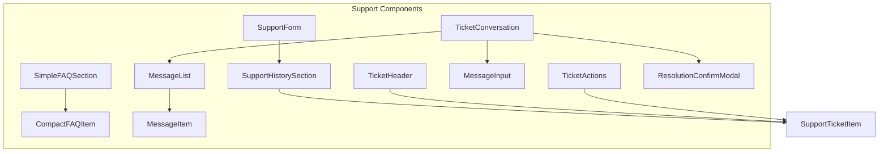

**Diagram sources**
- [SimpleFAQSection.vue](file://src/components/support/SimpleFAQSection.vue#L1-L130) - *Updated in commit e6d4694*
- [CompactFAQItem.vue](file://src/components/support/CompactFAQItem.vue#L1-L100) - *Updated in commit e6d4694*
- [SupportHistorySection.vue](file://src/components/support/SupportHistorySection.vue#L1-L155) - *Updated in commit 53f1b04*
- [TicketHeader.vue](file://src/components/support/TicketHeader.vue#L1-L172) - *Updated in commit 5d1225d*
- [MessageList.vue](file://src/components/support/MessageList.vue#L1-L29) - *Added in commit ad4e95e*
- [MessageInput.vue](file://src/components/support/MessageInput.vue#L1-L117) - *Updated in commit 5d1225d*
- [TicketActions.vue](file://src/components/support/TicketActions.vue#L1-L83) - *Updated in commit 5d1225d*
- [ResolutionConfirmModal.vue](file://src/components/support/ResolutionConfirmModal.vue#L1-L83) - *Updated in commit 5d1225d*
- [TicketConversation.vue](file://src/components/support/TicketConversation.vue#L1-L109) - *Added in commit 5d1225d*

**Section sources**
- [SimpleFAQSection.vue](file://src/components/support/SimpleFAQSection.vue#L1-L130) - *Updated in commit e6d4694*
- [CompactFAQItem.vue](file://src/components/support/CompactFAQItem.vue#L1-L100) - *Updated in commit e6d4694*
- [SupportHistorySection.vue](file://src/components/support/SupportHistorySection.vue#L1-L155) - *Updated in commit 53f1b04*
- [TicketHeader.vue](file://src/components/support/TicketHeader.vue#L1-L172) - *Updated in commit 5d1225d*
- [MessageList.vue](file://src/components/support/MessageList.vue#L1-L29) - *Added in commit ad4e95e*
- [MessageInput.vue](file://src/components/support/MessageInput.vue#L1-L117) - *Updated in commit 5d1225d*
- [TicketActions.vue](file://src/components/support/TicketActions.vue#L1-L83) - *Updated in commit 5d1225d*
- [ResolutionConfirmModal.vue](file://src/components/support/ResolutionConfirmModal.vue#L1-L83) - *Updated in commit 5d1225d*
- [TicketConversation.vue](file://src/components/support/TicketConversation.vue#L1-L109) - *Added in commit 5d1225d*

## Core Components
The support module consists of several core components that provide distinct functionality for user support interactions. Recent updates have introduced a simplified FAQ system with reduced complexity and improved performance, as well as a new support ticket dialog page with messaging capabilities. The new architecture focuses on essential functionality while maintaining accessibility and responsiveness.

**Section sources**
- [SimpleFAQSection.vue](file://src/components/support/SimpleFAQSection.vue#L1-L130) - *Updated in commit e6d4694*
- [CompactFAQItem.vue](file://src/components/support/CompactFAQItem.vue#L1-L100) - *Updated in commit e6d4694*
- [SupportHistorySection.vue](file://src/components/support/SupportHistorySection.vue#L1-L155) - *Updated in commit 53f1b04*
- [TicketHeader.vue](file://src/components/support/TicketHeader.vue#L1-L172) - *Updated in commit 5d1225d*
- [MessageList.vue](file://src/components/support/MessageList.vue#L1-L29) - *Added in commit ad4e95e*
- [MessageInput.vue](file://src/components/support/MessageInput.vue#L1-L117) - *Updated in commit 5d1225d*
- [TicketActions.vue](file://src/components/support/TicketActions.vue#L1-L83) - *Updated in commit 5d1225d*
- [ResolutionConfirmModal.vue](file://src/components/support/ResolutionConfirmModal.vue#L1-L83) - *Updated in commit 5d1225d*
- [TicketConversation.vue](file://src/components/support/TicketConversation.vue#L1-L109) - *Added in commit 5d1225d*

## Architecture Overview
The support components follow a hierarchical structure with parent components managing state and child components handling specific UI elements. The architecture has been enhanced with the introduction of new components for the support ticket dialog page, enabling users to view ticket details, send messages, and resolve tickets.

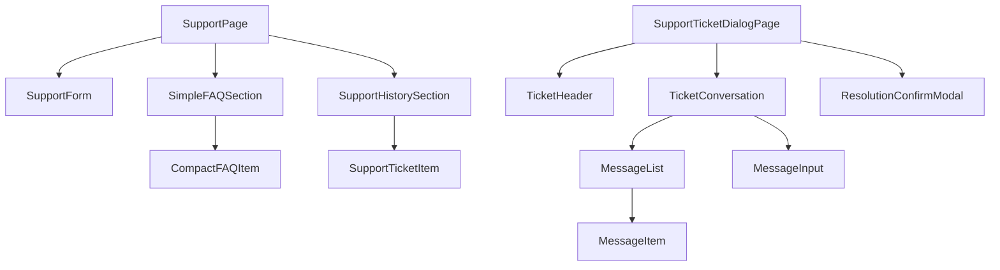

**Diagram sources**
- [SupportTicketDialogPage.vue](file://src/pages/SupportTicketDialogPage.vue#L1-L241) - *Added in commit ad4e95e*
- [TicketHeader.vue](file://src/components/support/TicketHeader.vue#L1-L172) - *Updated in commit 5d1225d*
- [TicketConversation.vue](file://src/components/support/TicketConversation.vue#L1-L109) - *Added in commit 5d1225d*
- [MessageList.vue](file://src/components/support/MessageList.vue#L1-L29) - *Added in commit ad4e95e*
- [MessageInput.vue](file://src/components/support/MessageInput.vue#L1-L117) - *Updated in commit 5d1225d*
- [ResolutionConfirmModal.vue](file://src/components/support/ResolutionConfirmModal.vue#L1-L83) - *Updated in commit 5d1225d*
- [SimpleFAQSection.vue](file://src/components/support/SimpleFAQSection.vue#L1-L130) - *Updated in commit e6d4694*
- [CompactFAQItem.vue](file://src/components/support/CompactFAQItem.vue#L1-L100) - *Updated in commit e6d4694*
- [SupportHistorySection.vue](file://src/components/support/SupportHistorySection.vue#L1-L155) - *Updated in commit 53f1b04*
- [SupportTicketItem.vue](file://src/components/support/SupportTicketItem.vue#L1-L199)

## Detailed Component Analysis

### SupportForm Component
The SupportForm component allows users to submit support requests with validation and feedback mechanisms.

#### Component Properties and Events
```mermaid
classDiagram
class SupportForm {
+visible : boolean
+loading : boolean
+error? : string | null
+formData : { message : string }
+validationErrors : { message : string }
+showSuccessMessage : boolean
+isFormValid : computed
#toggleForm()
#validateMessage()
#clearMessageError()
#handleSubmit()
#handleCancel()
#onEnter()
#onLeave()
}
SupportForm --> FAQItem : "uses"
SupportForm ..> "emit" SupportFormEvents
```

**Diagram sources**
- [SupportForm.vue](file://src/components/support/SupportForm.vue#L1-L328)

#### Event Flow for Form Submission
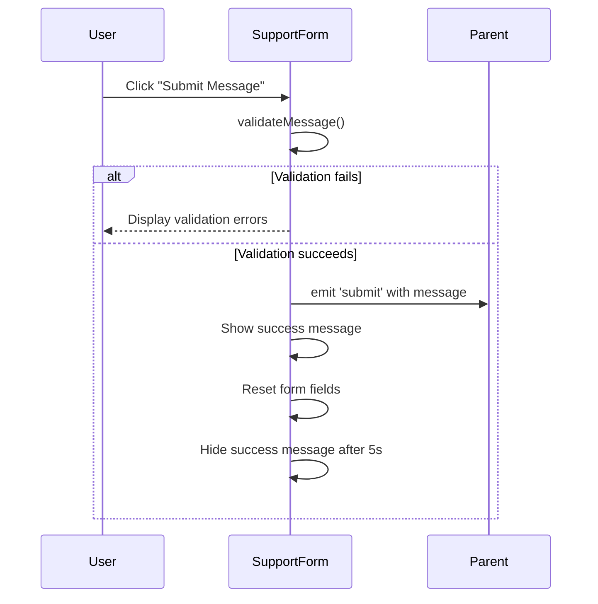

**Diagram sources**
- [SupportForm.vue](file://src/components/support/SupportForm.vue#L1-L328)

**Section sources**
- [SupportForm.vue](file://src/components/support/SupportForm.vue#L1-L328)

### FAQ Components
The FAQ components have been redesigned with a simplified architecture that focuses on essential functionality. The new implementation replaces the complex FAQSection and FAQItem components with a more streamlined approach.

#### CompactFAQItem Component Analysis
The CompactFAQItem component provides a simplified display for FAQ entries with minimal styling and reduced complexity.

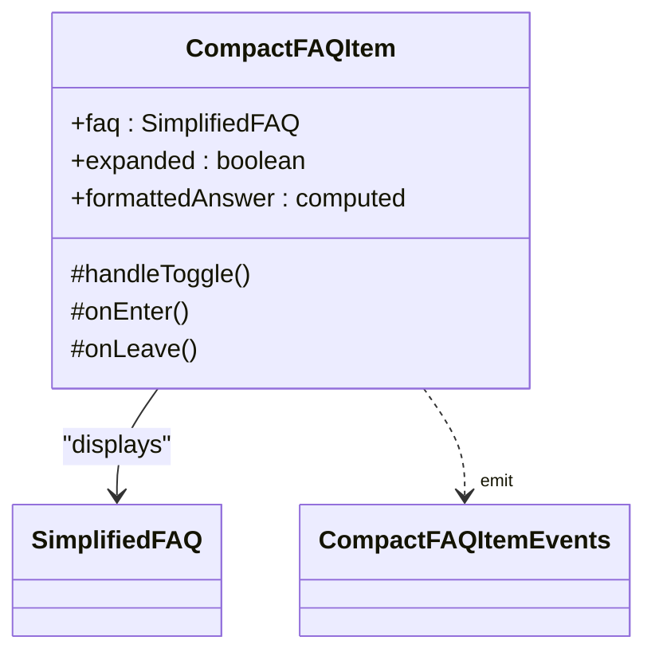

**Diagram sources**
- [CompactFAQItem.vue](file://src/components/support/CompactFAQItem.vue#L1-L100) - *Updated in commit e6d4694*

#### SimpleFAQSection Component Analysis
The SimpleFAQSection component manages a collection of simplified FAQ items with basic filtering and loading states.

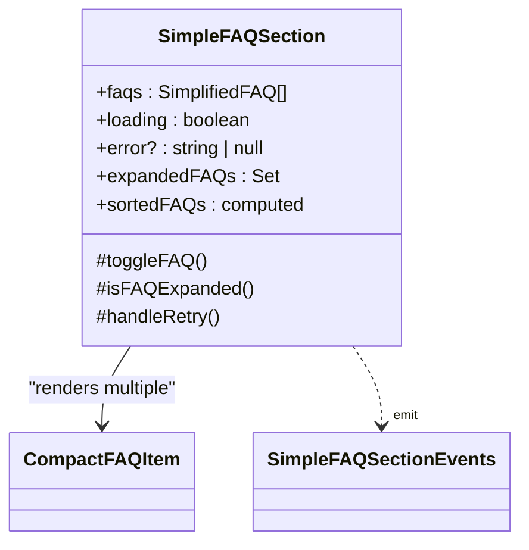

**Diagram sources**
- [SimpleFAQSection.vue](file://src/components/support/SimpleFAQSection.vue#L1-L130) - *Updated in commit e6d4694*

#### FAQ Components Migration
The previous FAQSection and FAQItem components have been deprecated in favor of the simplified implementation. The new components use the SimplifiedFAQ interface which contains only essential fields.

```mermaid
graph TD
Deprecated[FAQSection & FAQItem] --> |Replaced by| New[SimpleFAQSection & CompactFAQItem]
New --> FAQData
classDef deprecated fill:#fdd,stroke:#f66;
classDef current fill:#dfd,stroke:#6f6;
class Deprecated deprecated
class New,current
```

**Diagram sources**
- [FAQSection.vue](file://src/components/support/FAQSection.vue#L1-L303) - *Deprecated in commit e6d4694*
- [FAQItem.vue](file://src/components/support/FAQItem.vue#L1-L199) - *Deprecated in commit e6d4694*
- [SimpleFAQSection.vue](file://src/components/support/SimpleFAQSection.vue#L1-L130) - *Updated in commit e6d4694*
- [CompactFAQItem.vue](file://src/components/support/CompactFAQItem.vue#L1-L100) - *Updated in commit e6d4694*

**Section sources**
- [SimpleFAQSection.vue](file://src/components/support/SimpleFAQSection.vue#L1-L130) - *Updated in commit e6d4694*
- [CompactFAQItem.vue](file://src/components/support/CompactFAQItem.vue#L1-L100) - *Updated in commit e6d4694*
- [index.ts](file://src/types/index.ts#L97-L103) - *Added SimplifiedFAQ interface*

### Support History Components
The support history components display user's past support interactions with filtering and statistics.

#### SupportTicketItem Component Analysis
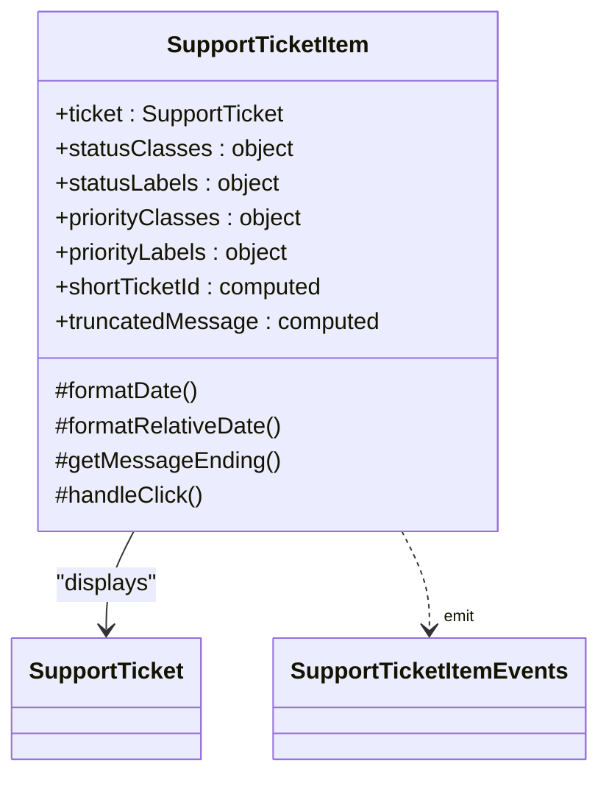

**Diagram sources**
- [SupportTicketItem.vue](file://src/components/support/SupportTicketItem.vue#L1-L199)

#### SupportHistorySection Component Analysis
The SupportHistorySection component has been updated with a refresh button that allows users to manually refresh their ticket history. The component now includes a loading state for the refresh action and exposes a method to reset the refresh loading state.

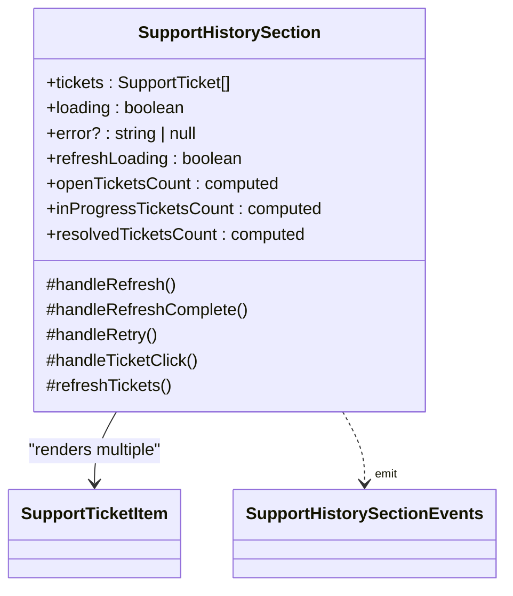

**Diagram sources**
- [SupportHistorySection.vue](file://src/components/support/SupportHistorySection.vue#L1-L155) - *Updated in commit 53f1b04*

**Section sources**
- [SupportTicketItem.vue](file://src/components/support/SupportTicketItem.vue#L1-L199)
- [SupportHistorySection.vue](file://src/components/support/SupportHistorySection.vue#L1-L155) - *Updated in commit 53f1b04*
- [SupportPage.vue](file://src/pages/SupportPage.vue#L30-L175) - *Integration with refresh functionality*

### Support Ticket Dialog Components
The new support ticket dialog components enable users to view detailed ticket information, communicate with support staff, and manage ticket status.

#### TicketHeader Component Analysis
The TicketHeader component displays essential information about a support ticket including its ID, status, creation date, and metadata.

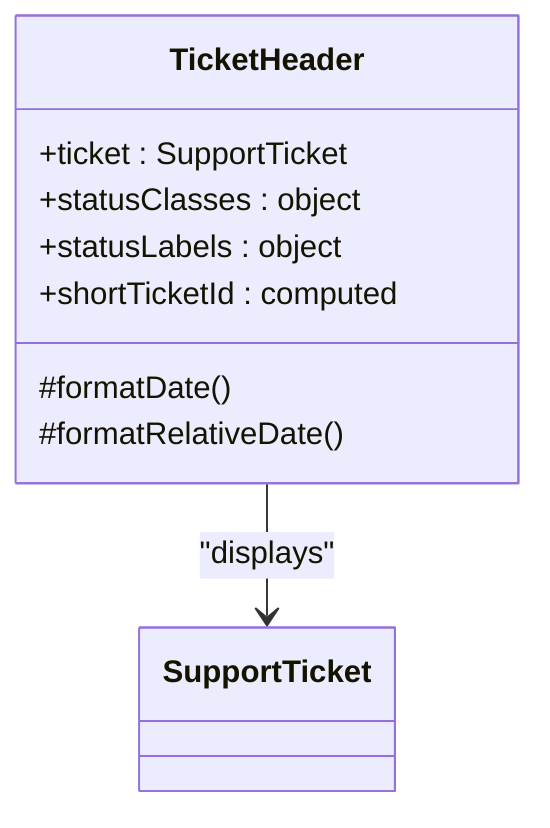

**Diagram sources**
- [TicketHeader.vue](file://src/components/support/TicketHeader.vue#L1-L172) - *Updated in commit 5d1225d*

#### MessageList Component Analysis
The MessageList component renders a chronological list of messages within a support ticket conversation.

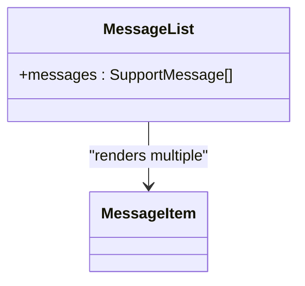

**Diagram sources**
- [MessageList.vue](file://src/components/support/MessageList.vue#L1-L29) - *Added in commit ad4e95e*

#### MessageItem Component Analysis
The MessageItem component displays an individual message in a conversation, with styling that distinguishes between user and support messages.

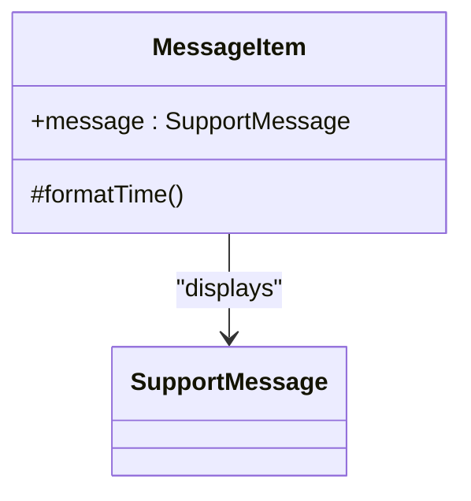

**Diagram sources**
- [MessageItem.vue](file://src/components/support/MessageItem.vue#L1-L51) - *Added in commit ad4e95e*

#### MessageInput Component Analysis
The MessageInput component allows users to compose and send new messages within a support ticket conversation.

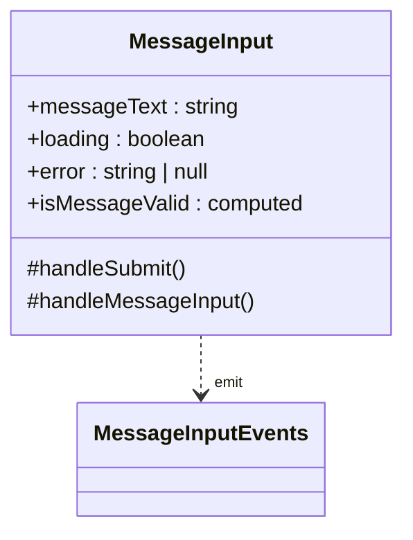

**Diagram sources**
- [MessageInput.vue](file://src/components/support/MessageInput.vue#L1-L117) - *Updated in commit 5d1225d*

#### TicketActions Component Analysis
The TicketActions component provides controls for managing a ticket's status, including resolving the ticket and navigating back to the support dashboard.

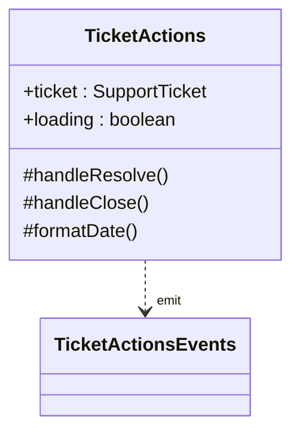

**Diagram sources**
- [TicketActions.vue](file://src/components/support/TicketActions.vue#L1-L83) - *Updated in commit 5d1225d*

#### ResolutionConfirmModal Component Analysis
The ResolutionConfirmModal component provides a confirmation dialog when users attempt to resolve a support ticket.

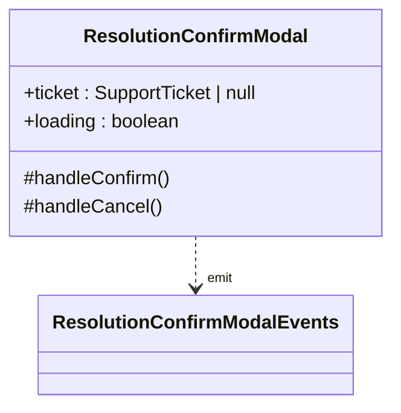

**Diagram sources**
- [ResolutionConfirmModal.vue](file://src/components/support/ResolutionConfirmModal.vue#L1-L83) - *Updated in commit 5d1225d*

#### TicketConversation Component Analysis
The TicketConversation component orchestrates the messaging interface within a support ticket, combining message display, input, and resolution functionality.

```mermaid
classDiagram
class TicketConversation {
+ticket : SupportTicket
+messages : SupportMessage[]
+loading : { messageSubmission : boolean, resolution : boolean }
+messageError : string | null
#handleAddMessage()
#clearMessageError()
#handleSendMessage()
}
TicketConversation --> MessageList : "renders"
TicketConversation --> MessageInput : "renders"
TicketConversation --> ResolutionConfirmModal : "conditionally renders"
TicketConversation ..> "emit" TicketConversationEvents
```

**Diagram sources**
- [TicketConversation.vue](file://src/components/support/TicketConversation.vue#L1-L109) - *Added in commit 5d1225d*

#### SupportTicketDialogPage Component Analysis
The SupportTicketDialogPage component orchestrates the ticket dialog experience, coordinating data loading and component interactions.

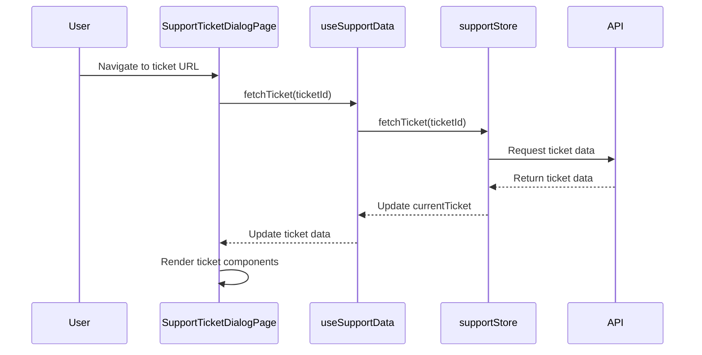

**Diagram sources**
- [SupportTicketDialogPage.vue](file://src/pages/SupportTicketDialogPage.vue#L1-L241) - *Added in commit ad4e95e*
- [useSupportData.ts](file://src/composables/useSupportData.ts#L141-L191) - *Updated in commit ad4e95e*
- [support.ts](file://src/stores/support.ts#L78-L137) - *Updated in commit ad4e95e*

#### Message Submission Flow
The message submission process involves validation, API communication, and local state updates.

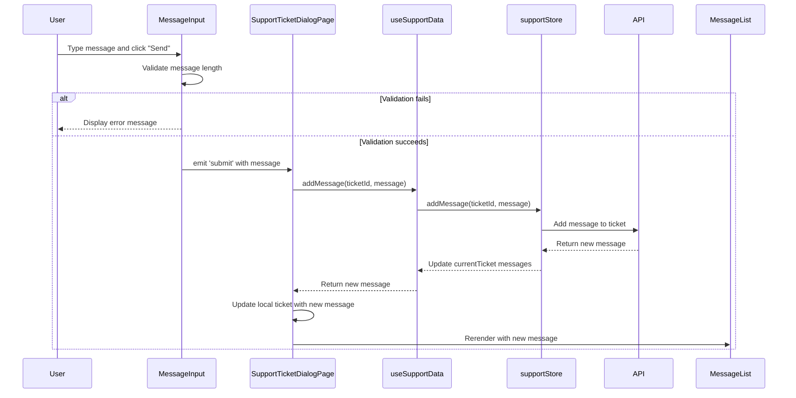

**Diagram sources**
- [MessageInput.vue](file://src/components/support/MessageInput.vue#L1-L117) - *Updated in commit 5d1225d*
- [SupportTicketDialogPage.vue](file://src/pages/SupportTicketDialogPage.vue#L1-L241) - *Added in commit ad4e95e*
- [useSupportData.ts](file://src/composables/useSupportData.ts#L141-L191) - *Updated in commit ad4e95e*
- [support.ts](file://src/stores/support.ts#L139-L167) - *Updated in commit ad4e95e*
- [TicketConversation.vue](file://src/components/support/TicketConversation.vue#L1-L109) - *Added in commit 5d1225d*

#### Ticket Resolution Flow
The ticket resolution process involves confirmation, API communication, and state updates.

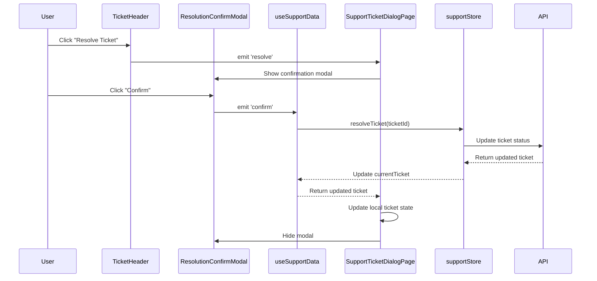

**Diagram sources**
- [TicketHeader.vue](file://src/components/support/TicketHeader.vue#L1-L172) - *Updated in commit 5d1225d*
- [ResolutionConfirmModal.vue](file://src/components/support/ResolutionConfirmModal.vue#L1-L83) - *Updated in commit 5d1225d*
- [SupportTicketDialogPage.vue](file://src/pages/SupportTicketDialogPage.vue#L1-L241) - *Added in commit ad4e95e*
- [useSupportData.ts](file://src/composables/useSupportData.ts#L191-L229) - *Updated in commit ad4e95e*
- [support.ts](file://src/stores/support.ts#L208-L241) - *Updated in commit ad4e95e*

**Section sources**
- [TicketHeader.vue](file://src/components/support/TicketHeader.vue#L1-L172) - *Updated in commit 5d1225d*
- [MessageList.vue](file://src/components/support/MessageList.vue#L1-L29) - *Added in commit ad4e95e*
- [MessageItem.vue](file://src/components/support/MessageItem.vue#L1-L51) - *Added in commit ad4e95e*
- [MessageInput.vue](file://src/components/support/MessageInput.vue#L1-L117) - *Updated in commit 5d1225d*
- [TicketActions.vue](file://src/components/support/TicketActions.vue#L1-L83) - *Updated in commit 5d1225d*
- [ResolutionConfirmModal.vue](file://src/components/support/ResolutionConfirmModal.vue#L1-L83) - *Updated in commit 5d1225d*
- [TicketConversation.vue](file://src/components/support/TicketConversation.vue#L1-L109) - *Added in commit 5d1225d*
- [SupportTicketDialogPage.vue](file://src/pages/SupportTicketDialogPage.vue#L1-L241) - *Added in commit ad4e95e*
- [useSupportData.ts](file://src/composables/useSupportData.ts#L88-L229) - *Updated in commit ad4e95e*
- [support.ts](file://src/stores/support.ts#L78-L241) - *Updated in commit ad4e95e*
- [index.ts](file://src/types/index.ts#L130-L168) - *SupportMessage and SupportTicket interfaces*

## Dependency Analysis
The support components have a clear dependency hierarchy with specialized components depending on shared types and parent components managing state and data flow. The recent changes have introduced new components for the ticket dialog page with well-defined relationships.

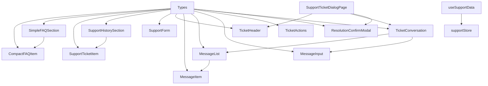

**Diagram sources**
- [index.ts](file://src/types/index.ts#L1-L179)
- [CompactFAQItem.vue](file://src/components/support/CompactFAQItem.vue#L1-L100) - *Updated in commit e6d4694*
- [SimpleFAQSection.vue](file://src/components/support/SimpleFAQSection.vue#L1-L130) - *Updated in commit e6d4694*
- [SupportTicketItem.vue](file://src/components/support/SupportTicketItem.vue#L1-L199)
- [SupportHistorySection.vue](file://src/components/support/SupportHistorySection.vue#L1-L155) - *Updated in commit 53f1b04*
- [SupportForm.vue](file://src/components/support/SupportForm.vue#L1-L328)
- [TicketHeader.vue](file://src/components/support/TicketHeader.vue#L1-L172) - *Updated in commit 5d1225d*
- [MessageItem.vue](file://src/components/support/MessageItem.vue#L1-L51) - *Added in commit ad4e95e*
- [MessageList.vue](file://src/components/support/MessageList.vue#L1-L29) - *Added in commit ad4e95e*
- [MessageInput.vue](file://src/components/support/MessageInput.vue#L1-L117) - *Updated in commit 5d1225d*
- [TicketActions.vue](file://src/components/support/TicketActions.vue#L1-L83) - *Updated in commit 5d1225d*
- [ResolutionConfirmModal.vue](file://src/components/support/ResolutionConfirmModal.vue#L1-L83) - *Updated in commit 5d1225d*
- [TicketConversation.vue](file://src/components/support/TicketConversation.vue#L1-L109) - *Added in commit 5d1225d*
- [SupportTicketDialogPage.vue](file://src/pages/SupportTicketDialogPage.vue#L1-L241) - *Added in commit ad4e95e*
- [useSupportData.ts](file://src/composables/useSupportData.ts#L88-L229) - *Updated in commit ad4e95e*
- [support.ts](file://src/stores/support.ts#L78-L241) - *Updated in commit ad4e95e*

**Section sources**
- [index.ts](file://src/types/index.ts#L1-L179)

## Performance Considerations
The support components implement several performance optimizations:

1. **Computed Properties**: Used extensively for derived data (filtered FAQs, ticket counts, formatted text)
2. **Efficient Rendering**: The simplified FAQ components reduce DOM complexity
3. **Animation Optimization**: CSS transitions for smooth expand/collapse effects
4. **Event Delegation**: Proper event handling to minimize listeners
5. **Conditional Rendering**: Using v-if/v-show appropriately to manage DOM complexity
6. **Lazy Loading**: The SupportTicketDialogPage only loads ticket data when needed
7. **State Management**: Centralized state in the support store prevents redundant API calls

The new simplified FAQ architecture reduces bundle size and improves rendering performance by eliminating unnecessary features and complexity from the previous implementation. The ticket dialog components use efficient data binding and minimal re-renders to maintain responsiveness during conversations.

## Troubleshooting Guide
Common issues and solutions for the support components:

### Form Submission Issues
**Symptoms**: Form not submitting, validation errors persisting
**Solutions**:
- Ensure message is at least 10 characters
- Check for network connectivity issues
- Verify the parent component handles the 'submit' event
- Clear any existing error states

**Section sources**
- [SupportForm.vue](file://src/components/support/SupportForm.vue#L1-L328)

### FAQ Display Problems
**Symptoms**: FAQs not displaying, expansion not working
**Solutions**:
- Verify FAQ data structure matches the SimplifiedFAQ interface
- Check that the parent component provides updated FAQ data
- Ensure the SimpleFAQSection component is properly imported and used
- Validate that computed properties are correctly implemented

**Section sources**
- [SimpleFAQSection.vue](file://src/components/support/SimpleFAQSection.vue#L1-L130) - *Updated in commit e6d4694*
- [CompactFAQItem.vue](file://src/components/support/CompactFAQItem.vue#L1-L100) - *Updated in commit e6d4694*
- [index.ts](file://src/types/index.ts#L97-L103) - *SimplifiedFAQ interface*

### Ticket History Display Issues
**Symptoms**: Incorrect ticket counts, missing data
**Solutions**:
- Verify ticket data conforms to SupportTicket interface
- Check that loading and error states are properly handled
- Ensure date formatting functions receive valid date strings
- Validate that computed properties for ticket counts are correct

**Section sources**
- [SupportHistorySection.vue](file://src/components/support/SupportHistorySection.vue#L1-L155) - *Updated in commit 53f1b04*
- [SupportTicketItem.vue](file://src/components/support/SupportTicketItem.vue#L1-L199)

### Ticket Dialog Issues
**Symptoms**: Ticket not loading, messages not sending, resolution failing
**Solutions**:
- Verify the route parameter contains a valid ticket ID
- Check that the useSupportData composable is properly initialized
- Ensure message text meets length requirements (5-1000 characters)
- Validate that the support store has the necessary actions implemented
- Confirm the API endpoints are accessible and returning expected data

**Section sources**
- [SupportTicketDialogPage.vue](file://src/pages/SupportTicketDialogPage.vue#L1-L241) - *Added in commit ad4e95e*
- [TicketHeader.vue](file://src/components/support/TicketHeader.vue#L1-L172) - *Updated in commit 5d1225d*
- [MessageInput.vue](file://src/components/support/MessageInput.vue#L1-L117) - *Updated in commit 5d1225d*
- [useSupportData.ts](file://src/composables/useSupportData.ts#L141-L229) - *Updated in commit ad4e95e*
- [support.ts](file://src/stores/support.ts#L78-L241) - *Updated in commit ad4e95e*
- [index.ts](file://src/types/index.ts#L130-L168) - *SupportMessage and SupportTicket interfaces*

## Conclusion
The Support Components provide a comprehensive solution for user support interactions within the MayaWork. Recent updates have simplified the FAQ component architecture, replacing the complex FAQSection and FAQItem components with a more streamlined implementation using SimpleFAQSection and CompactFAQItem. Additionally, new components have been introduced for the support ticket dialog page, enabling rich interactions including message exchange and ticket resolution. The components are well-structured, accessible, and follow modern Vue 3 practices with TypeScript. They offer a consistent user experience across different support scenarios, from submitting new requests to reviewing past interactions and engaging in detailed ticket conversations. The modular design allows for easy customization and extension, while the clear event-driven architecture ensures seamless integration with parent components and state management systems.