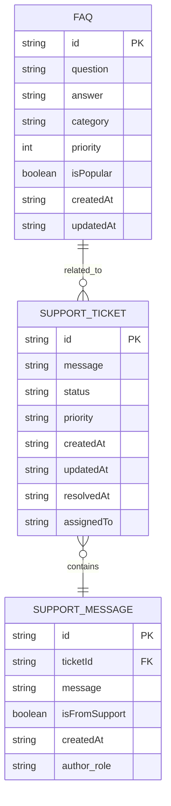
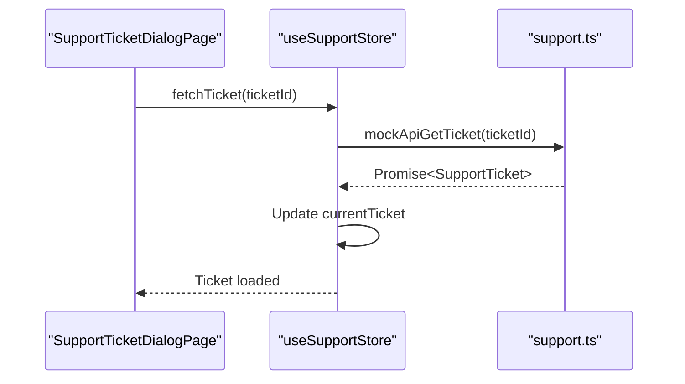
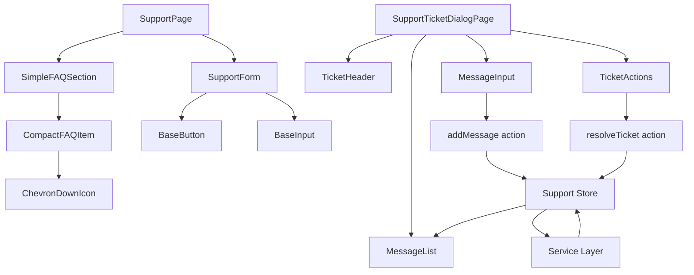
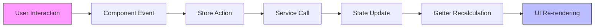

# Support Data Models

<cite>
**Referenced Files in This Document**   
- [index.ts](file://src/types/index.ts#L1-L168) - *Updated in recent commit*
- [support.ts](file://src/stores/support.ts#L1-L241) - *Updated in recent commit*
- [support.ts](file://src/services/support.ts#L1-L423) - *Updated in recent commit*
- [SupportForm.vue](file://src/components/support/SupportForm.vue#L1-L327)
- [FAQItem.vue](file://src/components/support/FAQItem.vue#L1-L198)
- [SimpleFAQSection.vue](file://src/components/support/SimpleFAQSection.vue#L1-L130) - *Added in recent commit*
- [CompactFAQItem.vue](file://src/components/support/CompactFAQItem.vue#L1-L100) - *Added in recent commit*
- [SupportTicketDialogPage.vue](file://src/pages/SupportTicketDialogPage.vue#L1-L223) - *Added in recent commit*
- [useSupportData.ts](file://src/composables/useSupportData.ts#L1-L105) - *Added in recent commit*
</cite>

## Update Summary
**Changes Made**   
- Updated Core Data Models section to reflect new message threading and ticket resolution capabilities
- Added new section for SupportTicketDialogPage functionality
- Enhanced SupportTicket interface documentation with message threading details
- Updated Support Store Architecture with new actions and loading states
- Added Service Layer functions for ticket retrieval, message addition, and resolution
- Updated Component Integration diagram and description to include dialog page flow
- Added sources for new components and updated type definitions

## Table of Contents
1. [Introduction](#introduction)
2. [Core Data Models](#core-data-models)
3. [Support Store Architecture](#support-store-architecture)
4. [Service Layer Implementation](#service-layer-implementation)
5. [Component Integration](#component-integration)
6. [Data Flow Analysis](#data-flow-analysis)
7. [Usage Patterns and Examples](#usage-patterns-and-examples)
8. [Extension Guidelines](#extension-guidelines)

## Introduction
This document provides comprehensive documentation for the Support Data Models in the MayaWork frontend application. It details the structure, relationships, and usage patterns of the FAQ, SupportTicket, and related interfaces that power the support functionality. The analysis covers type definitions, store implementation, service layer, and component integration to provide a complete understanding of the support system architecture.

## Core Data Models

The support system is built around two primary data models: FAQ and SupportTicket, along with their associated entities. These models are defined in the type system and form the foundation of the support functionality.



**Diagram sources**
- [index.ts](file://src/types/index.ts#L1-L168)

**Section sources**
- [index.ts](file://src/types/index.ts#L1-L168)

### FAQ Interface
The FAQ interface represents frequently asked questions with rich metadata for categorization and display:

**:Structure**
- **id**: Unique identifier for the FAQ
- **question**: The question text
- **answer**: The detailed answer with support for basic formatting
- **category**: Classification type ('general' | 'technical' | 'billing' | 'account')
- **priority**: Numeric value for sorting (lower = higher priority)
- **isPopular**: Boolean flag indicating frequently accessed FAQs
- **createdAt**: Timestamp of creation
- **updatedAt**: Timestamp of last modification

The category field enables organizational grouping, while the priority field allows for custom sorting independent of creation date. The isPopular flag is used to highlight commonly accessed questions in UI components.

### SimplifiedFAQ Interface
The SimplifiedFAQ interface represents a streamlined version of the FAQ model for use in compact UI components:

**:Structure**
- **id**: Unique identifier for the FAQ
- **question**: The question text
- **answer**: The detailed answer
- **priority**: Numeric value for sorting (lower = higher priority)
- **isPopular**: Optional boolean flag for internal sorting purposes

This simplified interface removes the category and timestamp fields to reduce complexity in components that only need basic FAQ information. It is used in the new compact FAQ components to improve performance and simplify data binding.

### SupportTicket Interface
The SupportTicket interface models user support requests with full lifecycle tracking:

**:Structure**
- **id**: Unique identifier for the ticket
- **message**: Initial message or subject of the ticket
- **status**: Lifecycle state ('open' | 'in-progress' | 'resolved' | 'closed')
- **priority**: Urgency level ('low' | 'medium' | 'high' | 'urgent')
- **createdAt**: Timestamp of ticket creation
- **updatedAt**: Timestamp of last update
- **resolvedAt**: Timestamp when ticket was resolved (optional)
- **assignedTo**: Name of support agent handling the ticket (optional)
- **hasUnreadMessages**: Boolean indicating if there are unread messages
- **messages**: Array of SupportMessage objects representing the conversation thread

The status field implements a finite state machine for ticket progression, while the messages array enables threaded conversations within a single ticket.

### SupportMessage Interface
The SupportMessage interface represents individual messages within a support ticket conversation:

**:Structure**
- **id**: Unique identifier for the message
- **ticketId**: Foreign key linking to the parent ticket
- **message**: Content of the message
- **isFromSupport**: Boolean indicating if the message is from support staff
- **createdAt**: Timestamp of message creation
- **author**: Object containing role of the message sender ('user' | 'support' | 'admin')

This structure enables bidirectional communication between users and support staff, with clear attribution of message sources.

## Support Store Architecture

The support functionality is managed through a Pinia store that provides centralized state management for all support-related data. The store follows Vue 3's composition API pattern and implements reactive state with computed getters and actions.

```mermaid
classDiagram
class SupportStoreState {
+faqs : FAQ[]
+supportTickets : SupportTicket[]
+currentTicket : SupportTicket | null
+expandedFAQs : Set<string>
+loading : {faqs : boolean, tickets : boolean, submission : boolean, ticket : boolean, messageSubmission : boolean, resolution : boolean}
+error : string | null
}
class SupportStoreGetters {
+recentTickets : ComputedRef<SupportTicket[]>
+popularFAQs : ComputedRef<FAQ[]>
+openTicketsCount : ComputedRef<number>
+inProgressTicketsCount : ComputedRef<number>
}
class SupportStoreActions {
+fetchFAQs() : Promise<void>
+fetchSupportTickets() : Promise<void>
+submitSupportRequest(message : string) : Promise<void>
+toggleFAQ(faqId : string) : void
+isFAQExpanded(faqId : string) : boolean
+clearErrors() : void
+setCurrentTicket(ticket : SupportTicket | null) : void
+getTicketsByStatus(status : string) : SupportTicket[]
+initialize() : Promise<void>
+fetchTicket(ticketId : string) : Promise<void>
+addMessage(ticketId : string, message : string) : Promise<SupportMessage>
+resolveTicket(ticketId : string) : Promise<SupportTicket>
}
SupportStoreState --> SupportStoreGetters : "provides data to"
SupportStoreState --> SupportStoreActions : "modified by"
SupportStoreActions --> SupportStoreGetters : "may trigger updates"
```

**Diagram sources**
- [support.ts](file://src/stores/support.ts#L1-L241)

**Section sources**
- [support.ts](file://src/stores/support.ts#L1-L241)

### State Management
The store maintains several key state properties:

**:State Properties**
- **faqs**: Reactive array of FAQ objects loaded from the service layer
- **supportTickets**: Reactive array of SupportTicket objects representing user requests
- **currentTicket**: Reference to the currently selected ticket for detailed view
- **expandedFAQs**: Set of FAQ IDs that are currently expanded in the UI
- **loading**: Object tracking loading states for different operations including ticket retrieval, message submission, and resolution
- **error**: String reference for error messages to display in the UI

The use of reactive references (ref) ensures that UI components automatically update when the state changes, following Vue's reactivity system.

### Getters
Computed properties provide derived data without modifying the original state:

**:Getters**
- **recentTickets**: Returns the first 5 tickets from the supportTickets array
- **popularFAQs**: Filters and sorts FAQs marked as popular by priority
- **openTicketsCount**: Counts tickets with 'open' status
- **inProgressTicketsCount**: Counts tickets with 'in-progress' status

These getters enable efficient data transformation and filtering while maintaining reactivity.

### Actions
Asynchronous and synchronous methods handle all business logic:

**:Actions**
- **fetchFAQs**: Retrieves FAQ data from the service layer with error handling
- **fetchSupportTickets**: Loads support tickets with loading state management
- **submitSupportRequest**: Creates a new support ticket and updates state
- **toggleFAQ**: Toggles the expansion state of a specific FAQ
- **initialize**: Parallel loading of FAQs and support tickets on store creation
- **fetchTicket**: Retrieves a specific ticket by ID for detailed view
- **addMessage**: Adds a new message to an existing ticket thread
- **resolveTicket**: Updates ticket status to resolved with timestamp

The actions implement proper error handling with try-catch blocks and update loading states to provide feedback during asynchronous operations.

## Service Layer Implementation

The service layer provides mock API implementations that simulate real backend interactions. These services return Promise-wrapped data to mimic network requests with artificial delays.



**Diagram sources**
- [support.ts](file://src/services/support.ts#L1-L423)

**Section sources**
- [support.ts](file://src/services/support.ts#L1-L423)

### Mock Data Structure
The service layer contains comprehensive mock data for both FAQs and support tickets:

**:FAQ Mock Data**
- 8 sample FAQ entries across all categories
- Realistic Russian-language content for question and answer fields
- Varied priority values (1-8) for sorting
- Popular FAQs marked with isPopular: true
- Proper ISO timestamp formatting

**:Support Ticket Mock Data**
- 6 sample tickets with different statuses
- Full message threads with user and support agent interactions
- Realistic timestamps showing chronological progression
- Assigned support agents with names
- Various priority levels

### API Functions
The service exports several functions that simulate REST API endpoints:

**:API Functions**
- **mockApiFAQs**: Returns all FAQ data with 800ms delay
- **mockApiSupportTickets**: Returns last 5 tickets with 600ms delay
- **mockApiSubmitTicket**: Creates new ticket with 1200ms delay
- **mockApiGetTicket**: Retrieves specific ticket by ID with 800ms delay
- **mockApiAddMessage**: Adds message to ticket thread with 600ms delay
- **mockApiResolveTicket**: Resolves ticket with 600ms delay
- **getFAQsByCategory**: Filters FAQs by category parameter
- **searchFAQs**: Full-text search across questions and answers
- **getPopularFAQs**: Returns only popular FAQs sorted by priority

These functions maintain data consistency by modifying the same mock data arrays, enabling persistence during the user session.

## Component Integration

The data models are integrated into the UI through specialized components that handle presentation and user interaction. The primary components are SupportForm and FAQItem, which demonstrate different patterns of data binding and event handling.



**Diagram sources**
- [SupportForm.vue](file://src/components/support/SupportForm.vue#L1-L327)
- [CompactFAQItem.vue](file://src/components/support/CompactFAQItem.vue#L1-L100)
- [SimpleFAQSection.vue](file://src/components/support/SimpleFAQSection.vue#L1-L130)
- [SupportTicketDialogPage.vue](file://src/pages/SupportTicketDialogPage.vue#L1-L223)

**Section sources**
- [SupportForm.vue](file://src/components/support/SupportForm.vue#L1-L327)
- [CompactFAQItem.vue](file://src/components/support/CompactFAQItem.vue#L1-L100)
- [SimpleFAQSection.vue](file://src/components/support/SimpleFAQSection.vue#L1-L130)
- [SupportTicketDialogPage.vue](file://src/pages/SupportTicketDialogPage.vue#L1-L223)

### SupportForm Component
The SupportForm component provides a user interface for submitting new support requests:

**:Key Features**
- **Reactive Form State**: Uses ref for formData and validationErrors
- **Client-side Validation**: Validates message length (10-1000 characters)
- **Loading States**: Shows spinner during submission
- **Success Feedback**: Displays confirmation message for 5 seconds
- **Accessibility**: Proper ARIA attributes and keyboard navigation
- **Animation**: Smooth slide transitions using Vue's Transition component

The component emits events (submit, toggle, cancel) rather than directly calling store actions, following the Vue best practice of separating presentation from business logic.

### CompactFAQItem Component
The CompactFAQItem component displays individual FAQ entries in a simplified, compact layout:

**:Key Features**
- **Expandable Content**: Toggle answer visibility with smooth animations
- **Priority-Based Sorting**: Sorted by priority value in parent component
- **Minimalist Design**: Streamlined UI without category badges
- **Accessibility**: Proper ARIA attributes for screen readers
- **Animation**: Smooth height transitions using Vue's Transition component

This component uses the SimplifiedFAQ interface and is designed for use in dense FAQ listings where space efficiency is important.

### SimpleFAQSection Component
The SimpleFAQSection component manages a collection of CompactFAQItem components:

**:Key Features**
- **State Management**: Maintains local state for expanded FAQs
- **Error Handling**: Displays user-friendly error messages with retry option
- **Loading States**: Shows skeleton loading animation
- **Empty State**: Handles cases where no FAQs are available
- **Event Propagation**: Emits toggle and refresh events to parent components

This component serves as a container for compact FAQ items and handles the presentation logic for the simplified FAQ section.

### SupportTicketDialogPage Component
The SupportTicketDialogPage component provides a detailed view of individual support tickets with full message threading:

**:Key Features**
- **Ticket Retrieval**: Loads specific ticket by ID from route parameter
- **Message Thread Display**: Shows chronological conversation with proper author attribution
- **Message Input**: Allows users to add new messages to open tickets
- **Ticket Resolution**: Enables users to resolve their tickets
- **Loading States**: Shows spinner during initial ticket load
- **Error Handling**: Provides retry mechanism for failed requests
- **Navigation**: Includes back button to return to main support page

This component uses the useSupportData composable to access store functionality and manages its own local state for message input validation.

## Data Flow Analysis

The support system implements a unidirectional data flow pattern where user actions trigger events that update centralized state, which then propagates changes to all interested components.



**Diagram sources**
- [support.ts](file://src/stores/support.ts#L1-L241)
- [SupportForm.vue](file://src/components/support/SupportForm.vue#L1-L327)
- [SupportTicketDialogPage.vue](file://src/pages/SupportTicketDialogPage.vue#L1-L223)

**Section sources**
- [support.ts](file://src/stores/support.ts#L1-L241)
- [SupportForm.vue](file://src/components/support/SupportForm.vue#L1-L327)
- [SupportTicketDialogPage.vue](file://src/pages/SupportTicketDialogPage.vue#L1-L223)

### Request Submission Flow
The process of submitting a new support request follows this sequence:

1. User fills out the message in SupportForm and clicks "Submit"
2. Component validates the input and emits a submit event with the message
3. Parent component or page calls submitSupportRequest action on the store
4. Store action calls mockApiSubmitTicket service function
5. Service creates new ticket object with current timestamp and unique ID
6. Service adds ticket to the beginning of mockSupportTicketsData array
7. Store updates supportTickets state with the new ticket
8. Store sets the new ticket as currentTicket
9. UI automatically re-renders to show the new ticket in the list

### Ticket Detail Flow
The process of viewing and interacting with a specific ticket:

1. User navigates to SupportTicketDialogPage with ticket ID parameter
2. Component calls fetchTicket action on store
3. Store action calls mockApiGetTicket service function
4. Service returns specific ticket data from mock array
5. Store updates currentTicket state with retrieved ticket
6. UI renders ticket header, message list, and action buttons
7. User can add messages or resolve ticket through respective actions
8. Actions update both local ticket and store state

### Data Loading Flow
Initial data loading occurs through the store's initialize method:

1. Store's initialize action is called during setup
2. Promise.all executes fetchFAQs and fetchSupportTickets concurrently
3. Each fetch action sets loading flags and calls respective service functions
4. Service functions return Promise-wrapped data with artificial delays
5. Success handler updates the corresponding state arrays
6. Error handler captures any issues and sets the error state
7. Finally block resets loading flags regardless of outcome
8. Computed getters automatically recalculate based on new data

## Usage Patterns and Examples

The support data models are designed for flexible usage patterns across different components and scenarios.

### Basic Usage Example
```typescript
// In a component setup function
import { useSupportStore } from '@/stores/support'

const supportStore = useSupportStore()

// Load data on component mount
await supportStore.initialize()

// Access data
const { faqs, supportTickets } = supportStore

// Submit new request
try {
  await supportStore.submitSupportRequest('My account has been locked')
} catch (error) {
  console.error('Submission failed:', error)
}
```

### Computed Property Usage
```typescript
// In a component that needs filtered data
const openTickets = computed(() => {
  return supportStore.getTicketsByStatus('open')
})

const technicalFAQs = computed(() => {
  return supportStore.faqs.filter(faq => faq.category === 'technical')
})
```

### Template Usage
```vue
<!-- In a template displaying FAQ list -->
<div v-for="faq in supportStore.faqs" :key="faq.id">
  <CompactFAQItem 
    :faq="faq" 
    :expanded="supportStore.isFAQExpanded(faq.id)"
    @toggle="() => supportStore.toggleFAQ(faq.id)"
  />
</div>
```

### Dialog Page Usage
```vue
<!-- In SupportTicketDialogPage template -->
<TicketHeader :ticket="ticket" />
<MessageList :messages="ticket.messages" />
<MessageInput
  v-if="ticket.status === 'open' || ticket.status === 'in-progress'"
  :loading="loading.messageSubmission"
  :error="messageError"
  @submit="handleAddMessage"
  @clear-error="clearMessageError"
/>
<TicketActions
  :ticket="ticket"
  :loading="loading.resolution"
  @resolve="handleResolveTicket"
/>
```

## Extension Guidelines

The support data models can be extended to accommodate additional functionality while maintaining the existing architecture.

### Adding New FAQ Categories
To introduce a new category:
1. Update the FAQ interface category union type
2. Add corresponding entry to categoryClasses and categoryLabels in FAQItem
3. Create new mock data entries with the new category
4. Update any category-specific filtering logic

### Enhancing Ticket Functionality
Potential enhancements include:
- Adding custom fields to SupportTicket interface
- Implementing file attachment support
- Adding ticket tagging system
- Integrating with external support platforms
- Adding SLA tracking fields

### Performance Optimization
For large datasets, consider:
- Implementing pagination for FAQs and tickets
- Adding search indexing for faster FAQ searches
- Implementing lazy loading for message threads
- Adding caching layer for frequently accessed data
- Optimizing animation performance for large lists

The current architecture supports these extensions through its modular design, with clear separation between type definitions, state management, service layer, and presentation components.