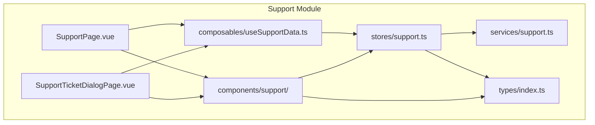
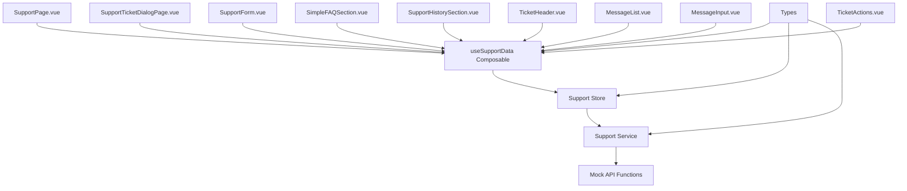
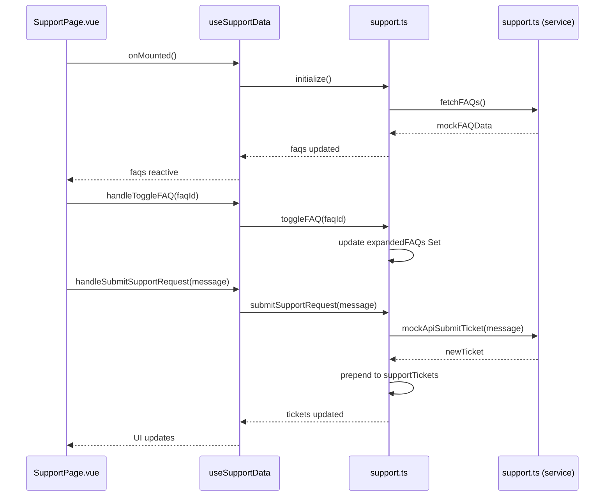
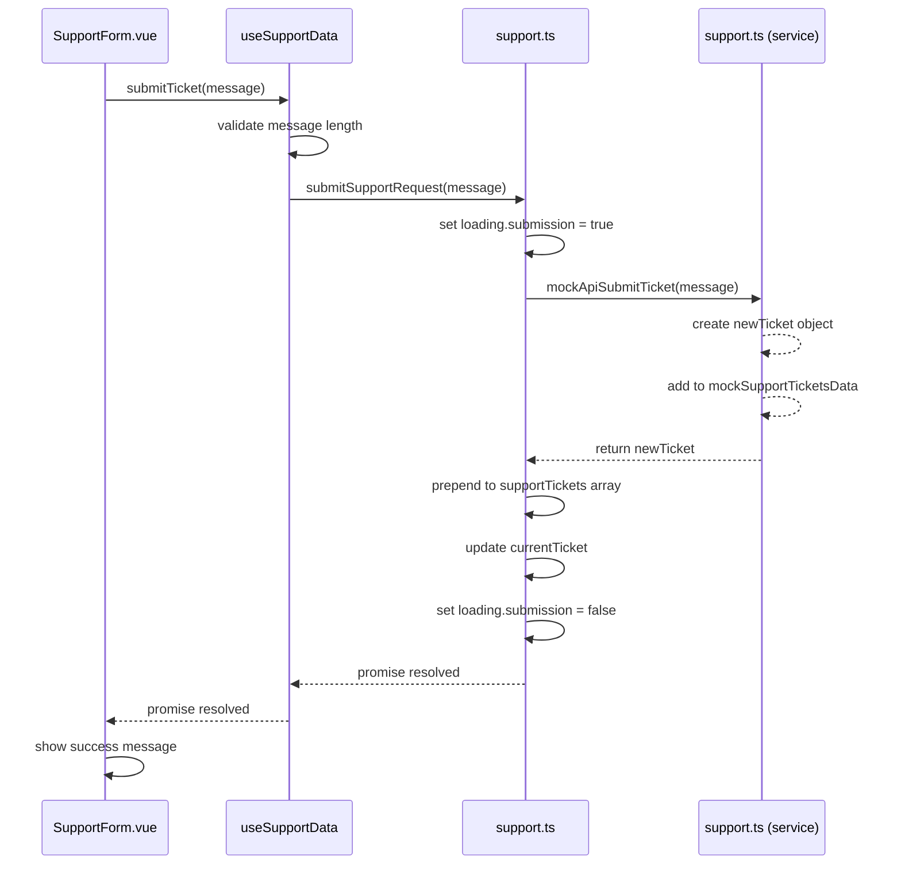
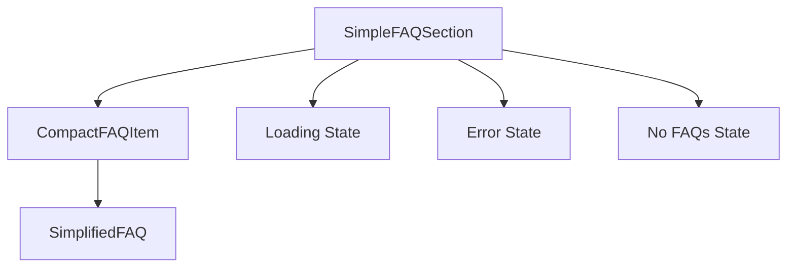
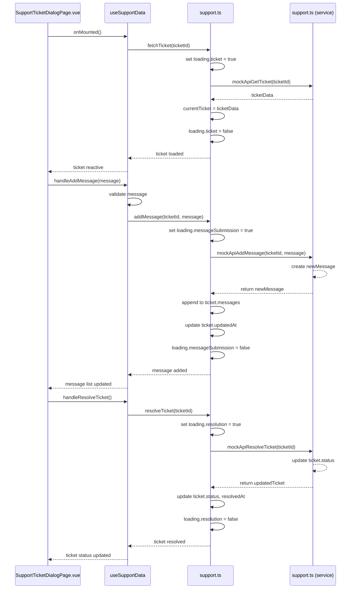
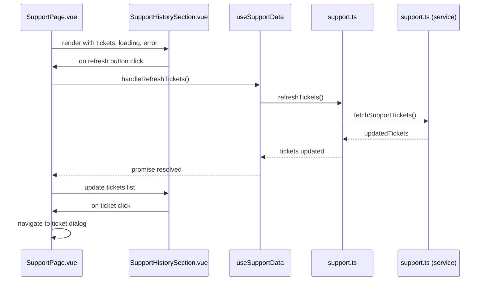
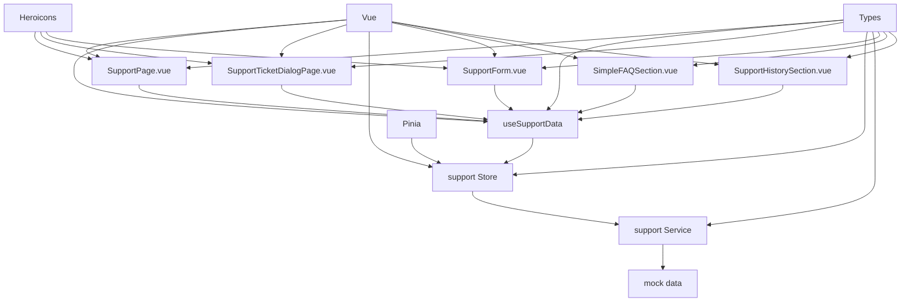

# Support Module

<cite>
**Referenced Files in This Document**   
- [SupportPage.vue](file://src/pages/SupportPage.vue#L1-L233)
- [support.ts](file://src/services/support.ts#L1-L342)
- [support.ts](file://src/stores/support.ts#L1-L241)
- [useSupportData.ts](file://src/composables/useSupportData.ts#L1-L175)
- [index.ts](file://src/types/index.ts#L1-L169)
- [SupportForm.vue](file://src/components/support/SupportForm.vue#L1-L328)
- [SimpleFAQSection.vue](file://src/components/support/SimpleFAQSection.vue) - *Updated in commit e6d4694*
- [CompactFAQItem.vue](file://src/components/support/CompactFAQItem.vue) - *Added in commit e6d4694*
- [FAQSection.vue](file://src/components/support/FAQSection.vue) - *Removed in commit e6d4694*
- [SupportHistorySection.vue](file://src/components/support/SupportHistorySection.vue) - *Updated in commit 53f1b04*
- [SupportTicketDialogPage.vue](file://src/pages/SupportTicketDialogPage.vue#L1-L223) - *Added in commit ad4e95e*
- [TicketHeader.vue](file://src/components/support/TicketHeader.vue#L1-L118) - *Added in commit ad4e95e*
- [MessageList.vue](file://src/components/support/MessageList.vue#L1-L29) - *Added in commit ad4e95e*
- [MessageItem.vue](file://src/components/support/MessageItem.vue#L1-L51) - *Added in commit ad4e95e*
- [MessageInput.vue](file://src/components/support/MessageInput.vue#L1-L115) - *Added in commit ad4e95e*
- [TicketActions.vue](file://src/components/support/TicketActions.vue#L1-L93) - *Added in commit ad4e95e*
</cite>

## Update Summary
**Changes Made**   
- Updated documentation to reflect removal of ticket status counters and navigation elements in SupportHistorySection
- Added documentation for new refresh functionality in support history section
- Updated component analysis to include refresh button implementation and behavior
- Enhanced dependency analysis to reflect updated event flow for refresh operations
- Updated troubleshooting guide to include refresh-related issues
- Added new sequence diagram for refresh operation flow

## Table of Contents
1. [Introduction](#introduction)
2. [Project Structure](#project-structure)
3. [Core Components](#core-components)
4. [Architecture Overview](#architecture-overview)
5. [Detailed Component Analysis](#detailed-component-analysis)
6. [Dependency Analysis](#dependency-analysis)
7. [Performance Considerations](#performance-considerations)
8. [Troubleshooting Guide](#troubleshooting-guide)
9. [Conclusion](#conclusion)

## Introduction
The Support Module is a comprehensive frontend solution designed to provide users with self-service support options and direct communication channels with the support team. It integrates Frequently Asked Questions (FAQs), support ticket history, and a submission form within a unified interface. Built using Vue 3 with TypeScript, the module leverages the Composition API and Pinia for state management, ensuring reactivity and maintainability. The module is accessible via the `/support` route and serves as the central hub for user assistance, combining immediate knowledge base access with formal ticket submission capabilities. Recent updates have simplified the FAQ section with a more compact layout, introduced a dedicated ticket dialog page for viewing and interacting with individual support tickets, and enhanced the support history section with a refresh button for manual data updates.

## Project Structure
The Support Module is organized following a feature-based architecture within the larger MayaWork frontend application. Components, services, and composables are grouped under dedicated directories to promote separation of concerns and ease of maintenance. The recent update has added a new SupportTicketDialogPage.vue and associated components for detailed ticket interaction, while refactoring the SupportHistorySection to remove status counters and add refresh functionality.



**Diagram sources**
- [SupportPage.vue](file://src/pages/SupportPage.vue#L1-L233)
- [SupportTicketDialogPage.vue](file://src/pages/SupportTicketDialogPage.vue#L1-L223)
- [useSupportData.ts](file://src/composables/useSupportData.ts#L1-L175)
- [support.ts](file://src/stores/support.ts#L1-L241)
- [support.ts](file://src/services/support.ts#L1-L342)

**Section sources**
- [SupportPage.vue](file://src/pages/SupportPage.vue#L1-L233)
- [support.ts](file://src/services/support.ts#L1-L342)

## Core Components
The Support Module consists of three primary UI components: SimpleFAQSection for displaying frequently asked questions in a simplified format, SupportHistorySection for showing the user's ticket history, and SupportForm for submitting new support requests. These components are orchestrated by the SupportPage.vue, which manages their integration and data flow. The module uses a composable (useSupportData) to abstract data operations and a Pinia store (support.ts) to manage global state. All data structures are defined in the shared types/index.ts file, ensuring consistency across the application. The implementation uses mock API functions in services/support.ts, which can be replaced with real HTTP calls in production. Recent updates have introduced a new SupportTicketDialogPage.vue with supporting components (TicketHeader, MessageList, MessageItem, MessageInput, TicketActions) that enable detailed interaction with individual support tickets, including message threading and resolution functionality. The SupportHistorySection has been refactored to remove ticket status counters and navigation elements, focusing on a cleaner presentation of ticket history with the addition of a refresh button for manual data updates.

**Section sources**
- [SupportPage.vue](file://src/pages/SupportPage.vue#L1-L233)
- [support.ts](file://src/services/support.ts#L1-L342)
- [support.ts](file://src/stores/support.ts#L1-L241)
- [useSupportData.ts](file://src/composables/useSupportData.ts#L1-L175)
- [SimpleFAQSection.vue](file://src/components/support/SimpleFAQSection.vue#L1-L130)
- [CompactFAQItem.vue](file://src/components/support/CompactFAQItem.vue#L1-L100)
- [SupportTicketDialogPage.vue](file://src/pages/SupportTicketDialogPage.vue#L1-L223)
- [TicketHeader.vue](file://src/components/support/TicketHeader.vue#L1-L118)
- [MessageList.vue](file://src/components/support/MessageList.vue#L1-L29)
- [MessageItem.vue](file://src/components/support/MessageItem.vue#L1-L51)
- [MessageInput.vue](file://src/components/support/MessageInput.vue#L1-L115)
- [TicketActions.vue](file://src/components/support/TicketActions.vue#L1-L93)
- [SupportHistorySection.vue](file://src/components/support/SupportHistorySection.vue#L1-L155)

## Architecture Overview
The Support Module follows a layered architecture with clear separation between presentation, logic, and data layers. The top layer consists of Vue components that render the UI and handle user interactions. The middle layer is composed of composables that encapsulate business logic and provide reactive data to components. The bottom layer includes the Pinia store for state management and service functions for data access. This architecture enables reusability, testability, and maintainability. Data flows unidirectionally from services to store to composables to components, while user actions trigger events that propagate back through the same layers to update state and trigger side effects. The recent redesign has simplified the FAQ component hierarchy by removing the FAQSection and FAQItem components in favor of SimpleFAQSection and CompactFAQItem, reducing complexity and improving performance. Additionally, a new ticket dialog feature has been introduced with dedicated components for viewing and interacting with individual tickets, and the support history section has been enhanced with a refresh button for manual data updates.



**Diagram sources**
- [SupportPage.vue](file://src/pages/SupportPage.vue#L1-L233)
- [SupportTicketDialogPage.vue](file://src/pages/SupportTicketDialogPage.vue#L1-L223)
- [useSupportData.ts](file://src/composables/useSupportData.ts#L1-L175)
- [support.ts](file://src/stores/support.ts#L1-L241)
- [support.ts](file://src/services/support.ts#L1-L342)
- [index.ts](file://src/types/index.ts#L1-L169)

## Detailed Component Analysis

### SupportPage Analysis
The SupportPage.vue component serves as the main container for the support module, integrating all subcomponents and managing their coordination. It uses the useSupportData composable to access reactive data and actions, eliminating the need for direct store manipulation. The page is structured into four main sections: header, FAQ display, ticket history, and support form, each wrapped in a card-style container. The component handles lifecycle events through onMounted, where it initializes data loading via the composable. Event handlers are defined for user interactions such as toggling the FAQ accordion, refreshing data, and handling ticket submissions. The component now uses SimpleFAQSection instead of the deprecated FAQSection, reflecting the simplified FAQ design. The page also provides navigation to the new SupportTicketDialogPage for detailed ticket interaction. The SupportHistorySection now includes a refresh button that allows users to manually update their ticket history without requiring a full page reload.



**Diagram sources**
- [SupportPage.vue](file://src/pages/SupportPage.vue#L1-L233)
- [useSupportData.ts](file://src/composables/useSupportData.ts#L1-L175)
- [support.ts](file://src/stores/support.ts#L1-L241)
- [support.ts](file://src/services/support.ts#L1-L342)

**Section sources**
- [SupportPage.vue](file://src/pages/SupportPage.vue#L1-L233)
- [useSupportData.ts](file://src/composables/useSupportData.ts#L1-L175)

### SupportForm Analysis
The SupportForm.vue component provides a user interface for submitting support requests with comprehensive validation and feedback mechanisms. It implements a toggleable form with smooth slide animations using Vue's Transition component. The form includes client-side validation for message length (10-1000 characters), real-time error feedback, and visual indicators for input state. Upon successful submission, a success message is displayed for 5 seconds before auto-hiding. The component uses props to receive visibility, loading, and error states from the parent, and emits events for toggle, submit, and cancel actions, following Vue's event-driven communication pattern.

#### For Object-Oriented Components:
```mermaid
classDiagram
class SupportForm {
+formData : {message : string}
+validationErrors : {message : string}
+showSuccessMessage : boolean
+isFormValid : boolean
+props : {visible, loading, error}
+emits : {toggle, submit, cancel}
+validateMessage() : void
+clearMessageError() : void
+handleSubmit() : Promise~void~
+handleCancel() : void
+onEnter(el) : void
+onLeave(el) : void
}
SupportForm --> "1" useSupportData : "uses for validation"
SupportForm --> "1" SupportStore : "indirectly updates via emit"
SupportForm --> "1" SupportService : "data eventually reaches via store"
```

**Diagram sources**
- [SupportForm.vue](file://src/components/support/SupportForm.vue#L1-L328)

**Section sources**
- [SupportForm.vue](file://src/components/support/SupportForm.vue#L1-L328)

### Data Management Analysis
The data management layer of the Support Module is built around a Pinia store (support.ts) that maintains the application state for FAQs, support tickets, and user interactions. The store uses reactive references (ref) for primitive values and objects, with computed properties for derived data such as recentTickets and popularFAQs. Actions are defined for all data operations, with proper error handling and loading state management. The store initializes data on creation through the initialize action, which runs both FAQ and ticket fetching in parallel. The useSupportData composable wraps the store, providing a cleaner interface for components and handling additional business logic like input validation. The FAQ data structure has been simplified with the introduction of the SimplifiedFAQ interface, which removes category and feedback fields to support the streamlined UI. The store has been extended with new actions (fetchTicket, addMessage, resolveTicket) to support the ticket dialog functionality. The composable also exposes refreshTickets and refreshFAQs actions that allow components to manually refresh data without reinitializing the entire state.

#### For API/Service Components:


**Diagram sources**
- [useSupportData.ts](file://src/composables/useSupportData.ts#L1-L175)
- [support.ts](file://src/stores/support.ts#L1-L241)
- [support.ts](file://src/services/support.ts#L1-L342)

**Section sources**
- [useSupportData.ts](file://src/composables/useSupportData.ts#L1-L175)
- [support.ts](file://src/stores/support.ts#L1-L241)

### FAQ Components Analysis
The FAQ component system has been redesigned with a simplified architecture. The SimpleFAQSection component replaces the deprecated FAQSection, providing a clean interface for displaying frequently asked questions without search or filtering capabilities. It uses the CompactFAQItem component to display individual FAQ entries in a space-efficient format. The SimpleFAQSection handles loading and error states, while delegating individual FAQ expansion state to CompactFAQItem components. The data model has been simplified with the SimplifiedFAQ interface, which includes only essential fields (id, question, answer, priority) and an optional isPopular flag for internal sorting purposes.



**Diagram sources**
- [SimpleFAQSection.vue](file://src/components/support/SimpleFAQSection.vue#L1-L130)
- [CompactFAQItem.vue](file://src/components/support/CompactFAQItem.vue#L1-L100)
- [index.ts](file://src/types/index.ts#L97-L103)

**Section sources**
- [SimpleFAQSection.vue](file://src/components/support/SimpleFAQSection.vue#L1-L130)
- [CompactFAQItem.vue](file://src/components/support/CompactFAQItem.vue#L1-L100)
- [index.ts](file://src/types/index.ts#L97-L103)

### Support Ticket Dialog Analysis
The Support Ticket Dialog feature enables users to view and interact with individual support tickets through a dedicated page (SupportTicketDialogPage.vue). The implementation consists of several components that work together to display ticket details, message history, and provide interaction capabilities. The TicketHeader component displays ticket metadata including ID, status, creation date, and assignment information. The MessageList component renders the conversation thread with messages from both the user and support team, using MessageItem components for individual messages. The MessageInput component allows users to add new messages to open tickets, with validation and error handling. The TicketActions component provides resolution functionality for open tickets. The entire dialog uses the useSupportData composable to access ticket data and perform actions.



**Diagram sources**
- [SupportTicketDialogPage.vue](file://src/pages/SupportTicketDialogPage.vue#L1-L223)
- [useSupportData.ts](file://src/composables/useSupportData.ts#L1-L175)
- [support.ts](file://src/stores/support.ts#L1-L241)
- [support.ts](file://src/services/support.ts#L1-L342)

**Section sources**
- [SupportTicketDialogPage.vue](file://src/pages/SupportTicketDialogPage.vue#L1-L223)
- [useSupportData.ts](file://src/composables/useSupportData.ts#L1-L175)
- [support.ts](file://src/stores/support.ts#L1-L241)

### Support History Section Analysis
The SupportHistorySection component displays the user's support ticket history with a clean, focused interface. The component has been refactored to remove ticket status counters and navigation elements, simplifying the UI and focusing on the core functionality of displaying recent tickets. A refresh button has been added to the section header, allowing users to manually update their ticket list without requiring a full page reload. The component handles loading, error, and empty states appropriately, providing clear feedback to users. When the refresh button is clicked, it emits a refresh event that is handled by the parent SupportPage component, which calls the refreshTickets action from the useSupportData composable. The component also emits a retry event when the user clicks the retry button in the error state, allowing the parent to attempt data loading again.



**Diagram sources**
- [SupportHistorySection.vue](file://src/components/support/SupportHistorySection.vue#L1-L155)
- [SupportPage.vue](file://src/pages/SupportPage.vue#L1-L233)
- [useSupportData.ts](file://src/composables/useSupportData.ts#L1-L175)
- [support.ts](file://src/stores/support.ts#L1-L241)
- [support.ts](file://src/services/support.ts#L1-L342)

**Section sources**
- [SupportHistorySection.vue](file://src/components/support/SupportHistorySection.vue#L1-L155)
- [SupportPage.vue](file://src/pages/SupportPage.vue#L1-L233)
- [useSupportData.ts](file://src/composables/useSupportData.ts#L1-L175)

## Dependency Analysis
The Support Module exhibits a well-defined dependency graph with minimal coupling between components. The dependency chain flows from top-level components down to services, with composables acting as intermediaries. The module depends on several external libraries: Vue 3 for reactivity and component system, Pinia for state management, and Heroicons for UI icons. Within the module, components depend on the useSupportData composable rather than directly on the store, creating a clean abstraction layer. The types are shared across all layers, ensuring type safety throughout the application. There are no circular dependencies in the module, and all imports follow a unidirectional flow from presentation to data layers. The recent redesign has reduced dependencies by removing the FAQSection and FAQItem components, while adding new dependencies for the ticket dialog functionality and enhancing the event flow for the refresh operation in the support history section.



**Diagram sources**
- [SupportPage.vue](file://src/pages/SupportPage.vue#L1-L233)
- [SupportTicketDialogPage.vue](file://src/pages/SupportTicketDialogPage.vue#L1-L223)
- [useSupportData.ts](file://src/composables/useSupportData.ts#L1-L175)
- [support.ts](file://src/stores/support.ts#L1-L241)
- [support.ts](file://src/services/support.ts#L1-L342)
- [index.ts](file://src/types/index.ts#L1-L169)

**Section sources**
- [SupportPage.vue](file://src/pages/SupportPage.vue#L1-L233)
- [useSupportData.ts](file://src/composables/useSupportData.ts#L1-L175)
- [support.ts](file://src/stores/support.ts#L1-L241)

## Performance Considerations
The Support Module is optimized for performance through several key strategies. Data fetching operations are debounced and cached within the Pinia store, preventing unnecessary re-fetching. The use of computed properties ensures that derived data (like recentTickets) is only recalculated when dependencies change. The component structure minimizes re-renders by using props and events for communication rather than direct state manipulation. The mock API functions include simulated network delays to test loading states, which can be adjusted or removed in production. For large FAQ datasets, the simplified design with CompactFAQItem components reduces rendering overhead compared to the previous implementation. The module could be further optimized by implementing pagination for ticket history and lazy loading for FAQ content. The new ticket dialog feature loads ticket data on demand, reducing initial page load time for the main support page. The addition of the refresh button in the support history section allows for targeted data updates without requiring a full page reload, improving perceived performance and reducing unnecessary network requests.

## Troubleshooting Guide
Common issues with the Support Module typically involve state synchronization, form validation, or data loading. If FAQs or tickets fail to load, check the browser console for errors and verify that the initialize function in useSupportData is being called. For form submission issues, ensure the message meets validation criteria (10-1000 characters). If the success message doesn't appear after submission, verify that the submit event is properly handled by the parent component. For animation issues with the SupportForm, check that the CSS transitions are not being overridden by global styles. When debugging the ticket dialog, ensure the ticket ID is present in the route parameters and that fetchTicket is called correctly. If messages cannot be added to a ticket, verify the ticket status is 'open' or 'in-progress' and the message length is between 5-1000 characters. For resolution issues, confirm the ticket hasn't already been resolved. Use Vue DevTools to inspect the support store state and track data flow between components and the store. Clear any existing errors by calling clearErrors() from the composable. Note that the FAQ section no longer supports search, filtering, or feedback functionality, so related issues should be addressed by referring to the simplified design requirements. For refresh functionality issues, ensure that the refresh button click event is properly handled by the parent component and that the refreshTickets action is correctly implemented in the useSupportData composable. If the refresh spinner does not stop, verify that the handleRefreshComplete method is called after the refresh operation completes, whether successful or not.

**Section sources**
- [SupportForm.vue](file://src/components/support/SupportForm.vue#L1-L328)
- [useSupportData.ts](file://src/composables/useSupportData.ts#L1-L175)
- [support.ts](file://src/stores/support.ts#L1-L241)
- [SupportTicketDialogPage.vue](file://src/pages/SupportTicketDialogPage.vue#L1-L223)
- [MessageInput.vue](file://src/components/support/MessageInput.vue#L1-L115)
- [TicketActions.vue](file://src/components/support/TicketActions.vue#L1-L93)
- [SupportHistorySection.vue](file://src/components/support/SupportHistorySection.vue#L1-L155)

## Conclusion
The Support Module provides a robust, user-friendly interface for accessing support resources and submitting help requests. Its layered architecture with clear separation of concerns makes it maintainable and extensible. The use of Vue 3's Composition API and Pinia enables reactive data management while keeping components focused on presentation. The module is well-structured with comprehensive error handling and user feedback mechanisms. Recent updates have simplified the FAQ section with a more compact layout, removing search, filtering, and feedback functionality to streamline the user experience. Additionally, a new ticket dialog feature has been implemented, allowing users to view and interact with individual support tickets through message threading and resolution capabilities. The support history section has been enhanced with a refresh button for manual data updates, improving user control over data freshness. To enhance the module, consider replacing mock services with actual API calls, implementing server-side search for FAQs, and adding file attachment capabilities to the support form. The current implementation serves as a solid foundation for a production-ready support system.