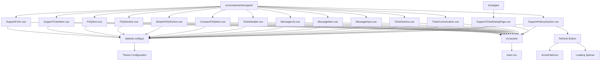
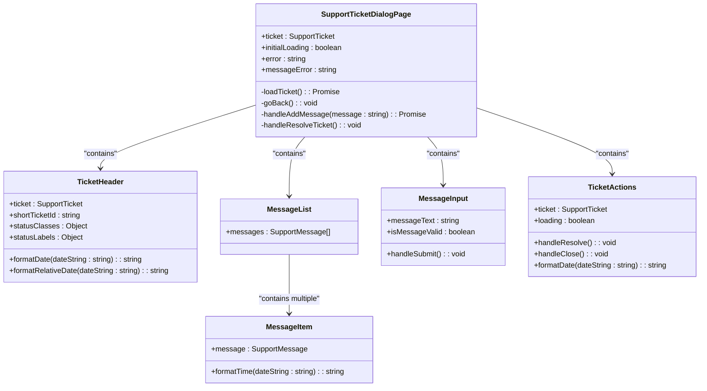
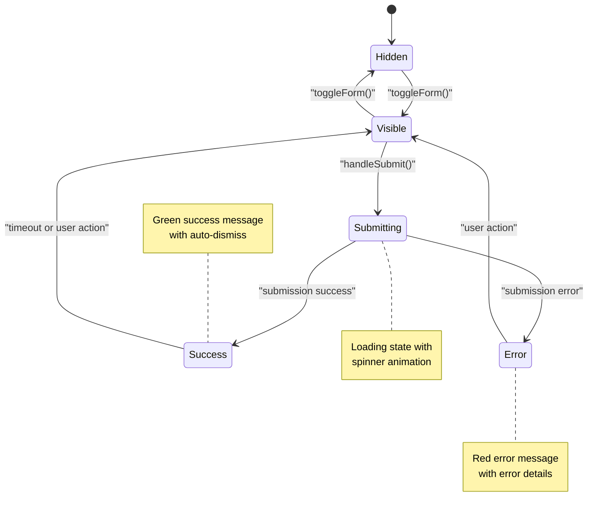

# Support Styling

<cite>
**Referenced Files in This Document**   
- [tailwind.config.js](file://tailwind.config.js)
- [main.css](file://src/assets/main.css)
- [SupportForm.vue](file://src/components/support/SupportForm.vue)
- [SupportTicketItem.vue](file://src/components/support/SupportTicketItem.vue)
- [FAQItem.vue](file://src/components/support/FAQItem.vue)
- [FAQSection.vue](file://src/components/support/FAQSection.vue)
- [SimpleFAQSection.vue](file://src/components/support/SimpleFAQSection.vue) - *Updated in recent commit*
- [CompactFAQItem.vue](file://src/components/support/CompactFAQItem.vue) - *Updated in recent commit*
- [index.ts](file://src/types/index.ts) - *Added SimplifiedFAQ interface*
- [SupportTicketDialogPage.vue](file://src/pages/SupportTicketDialogPage.vue) - *Added in recent commit*
- [TicketHeader.vue](file://src/components/support/TicketHeader.vue) - *Updated in recent commit*
- [MessageList.vue](file://src/components/support/MessageList.vue) - *Added in recent commit*
- [MessageItem.vue](file://src/components/support/MessageItem.vue) - *Added in recent commit*
- [MessageInput.vue](file://src/components/support/MessageInput.vue) - *Updated in recent commit*
- [TicketActions.vue](file://src/components/support/TicketActions.vue) - *Updated in recent commit*
- [TicketConversation.vue](file://src/components/support/TicketConversation.vue) - *Updated in recent commit*
- [SupportHistorySection.vue](file://src/components/support/SupportHistorySection.vue) - *Updated in recent commit with refresh button*
- [useSupportData.ts](file://src/composables/useSupportData.ts) - *Contains refreshTickets functionality*
- [SupportPage.vue](file://src/pages/SupportPage.vue) - *Uses SupportHistorySection with refresh functionality*
</cite>

## Update Summary
**Changes Made**   
- Updated documentation to reflect the redesigned FAQ components with simplified layout
- Added information about new `SimplifiedFAQ` interface and its usage
- Added comprehensive documentation for the new support ticket dialog page and related components
- Updated component architecture diagrams to reflect new ticket dialog hierarchy
- Corrected outdated information about FAQ component variants
- Enhanced source tracking with annotations for updated files
- Added new section for ticket dialog styling patterns and interactive elements
- Updated styling documentation for enhanced support ticket components with new visual design patterns
- Added documentation for refresh button functionality in SupportHistorySection
- Updated project structure diagram to include refresh button implementation
- Added new section for interactive refresh patterns and loading states
- Updated source references to include useSupportData composable and SupportPage integration

## Table of Contents
1. [Introduction](#introduction)
2. [Project Structure](#project-structure)
3. [Tailwind CSS Configuration](#tailwind-css-configuration)
4. [Design Tokens and Theme Variables](#design-tokens-and-theme-variables)
5. [Styling Patterns and Component Architecture](#styling-patterns-and-component-architecture)
6. [Form Styling and Validation States](#form-styling-and-validation-states)
7. [Interactive Elements and State Management](#interactive-elements-and-state-management)
8. [Accessibility and Responsive Design](#accessibility-and-responsive-design)
9. [Best Practices for Extending the Styling System](#best-practices-for-extending-the-styling-system)
10. [Conclusion](#conclusion)

## Introduction

This document provides comprehensive documentation for the Support Styling system in the Maya Platform frontend application. It covers the Tailwind CSS configuration, design tokens, styling patterns, and component architecture used across support-related components. The goal is to ensure visual consistency, accessibility, and maintainability while providing guidance for extending the styling system.

The support components include FAQ sections, support ticket items, and contact forms, all styled using a combination of Tailwind CSS utility classes and custom CSS variables. This documentation analyzes the implementation details and provides recommendations for maintaining and extending the styling system.

Recent updates have introduced a redesigned FAQ system with a simplified and compact layout, improving user experience and accessibility. Additionally, a new support ticket dialog page has been implemented with message and resolution features, requiring updates to the styling documentation. The new design emphasizes clarity and responsiveness while maintaining visual consistency with the overall design system. A recent refactoring has also added a refresh button to the support history section, enhancing user control over data updates.

## Project Structure

The support-related components are organized under the `src/components/support` directory, which contains reusable UI components for handling user support interactions. These components follow a modular structure that separates concerns between presentation, logic, and styling.



**Section sources**
- [tailwind.config.js](file://tailwind.config.js)
- [main.css](file://src/assets/main.css)
- [SupportHistorySection.vue](file://src/components/support/SupportHistorySection.vue) - *Updated with refresh button*

## Tailwind CSS Configuration

The Tailwind CSS configuration defines the design system's foundation, including color palette, typography, and plugins. The configuration extends the default theme with custom primary colors and sets Inter as the default sans-serif font.

```javascript
/** @type {import('tailwindcss').Config} */
export default {
  content: ['./index.html', './src/**/*.{vue,js,ts,jsx,tsx}'],
  theme: {
    extend: {
      colors: {
        primary: {
          50: '#eff6ff',
          500: '#3b82f6',
          600: '#2563eb',
          700: '#1d4ed8',
        },
      },
      fontFamily: {
        sans: ['Inter', 'sans-serif'],
      },
    },
  },
  plugins: [require('@tailwindcss/forms'), require('@tailwindcss/typography')],
}
```

The configuration includes two important plugins:
- `@tailwindcss/forms`: Normalizes form element styling across browsers
- `@tailwindcss/typography`: Provides typographic defaults for content

The content configuration ensures all Vue, JavaScript, and TypeScript files are scanned for Tailwind class usage, enabling proper tree-shaking and optimization.

**Section sources**
- [tailwind.config.js](file://tailwind.config.js#L1-L21)

## Design Tokens and Theme Variables

The styling system uses both Tailwind's theme extension and CSS custom properties to define design tokens. This dual approach allows for consistent theming across utility classes and custom CSS.

### CSS Custom Properties

The `main.css` file defines CSS variables that mirror the Tailwind theme configuration:

```css
:root {
  --color-primary-50: #eff6ff;
  --color-primary-500: #3b82f6;
  --color-primary-600: #2563eb;
  --color-primary-700: #1d4ed8;
}
```

These variables provide a fallback mechanism and enable dynamic theme switching. They are used in conjunction with Tailwind's `@apply` directive to create reusable component styles.

### Font Configuration

The Inter font family is imported from Google Fonts and set as the default font for the application:

```css
@import url('https://fonts.googleapis.com/css2?family=Inter:wght@400;500;600;700&display=swap');

html {
  font-family: 'Inter', sans-serif;
}
```

This ensures consistent typography across different devices and platforms.

### Base Styles

The base styles apply global resets and defaults using Tailwind's `@apply` directive:

```css
body {
  margin: 0;
  min-height: 100vh;
  @apply bg-gray-50 text-gray-900;
}
```

This establishes a consistent foundation for all components, with a light gray background and dark text color by default.

**Section sources**
- [main.css](file://src/assets/main.css#L1-L30)

## Styling Patterns and Component Architecture

The support components follow a consistent architectural pattern that combines Tailwind utility classes with semantic HTML structure. This section analyzes the key styling patterns used across components.

### FAQ Components Hierarchy

The FAQ components have been redesigned with a simplified architecture focusing on a compact and responsive layout. The new system uses `SimpleFAQSection` and `CompactFAQItem` components for a streamlined user experience:

```mermaid
classDiagram
class SimpleFAQSection {
+faqs : SimplifiedFAQ[]
+loading : boolean
+error? : string
-expandedFAQs : Set<string>
-sortedFAQs : Computed<SimplifiedFAQ[]>
}
class CompactFAQItem {
+faq : SimplifiedFAQ
+expanded : boolean
-handleToggle() : void
-onEnter(el : Element) : void
-onLeave(el : Element) : void
}
class FAQSection {
+faqs : FAQ[]
+loading : boolean
+error? : string
}
class FAQItem {
+faq : FAQ
+expanded : boolean
}
SimpleFAQSection --> CompactFAQItem : "contains"
FAQSection --> FAQItem : "contains"
CompactFAQItem --> "animation" : "faq-answer-enter, faq-answer-leave"
```

**Diagram sources**
- [SimpleFAQSection.vue](file://src/components/support/SimpleFAQSection.vue#L1-L130) - *Updated architecture*
- [CompactFAQItem.vue](file://src/components/support/CompactFAQItem.vue#L1-L100) - *New compact design*
- [index.ts](file://src/types/index.ts#L97-L103) - *SimplifiedFAQ interface*

**Section sources**
- [SimpleFAQSection.vue](file://src/components/support/SimpleFAQSection.vue)
- [CompactFAQItem.vue](file://src/components/support/CompactFAQItem.vue)
- [index.ts](file://src/types/index.ts)

### Support Components Structure

The support components include form elements and ticket displays that follow consistent styling patterns:

```mermaid
classDiagram
class SupportForm {
+visible : boolean
+loading : boolean
+error? : string
-formData : {message : string}
-validationErrors : {message : string}
-showSuccessMessage : boolean
-isFormValid : boolean
}
class SupportTicketItem {
+ticket : SupportTicket
+statusClasses : Object
+statusLabels : Object
+priorityClasses : Object
+priorityLabels : Object
+shortTicketId : string
+truncatedMessage : string
}
SupportForm --> "icons" : "PlusCircleIcon, CheckCircleIcon, ExclamationTriangleIcon"
SupportTicketItem --> "icons" : "TicketIcon, ChatBubbleLeftRightIcon, UserIcon, ClockIcon, CheckCircleIcon"
SupportForm --> "animation" : "slide-enter, slide-leave"
```

**Diagram sources**
- [SupportForm.vue](file://src/components/support/SupportForm.vue#L1-L328)
- [SupportTicketItem.vue](file://src/components/support/SupportTicketItem.vue#L1-L199)

**Section sources**
- [SupportForm.vue](file://src/components/support/SupportForm.vue)
- [SupportTicketItem.vue](file://src/components/support/SupportTicketItem.vue)

### Support Ticket Dialog Architecture

The new support ticket dialog page implements a comprehensive ticket management interface with message exchange and resolution capabilities. The architecture follows a container-component pattern with clear separation of concerns:



**Diagram sources**
- [SupportTicketDialogPage.vue](file://src/pages/SupportTicketDialogPage.vue#L1-L241) - *New ticket dialog implementation*
- [TicketHeader.vue](file://src/components/support/TicketHeader.vue#L1-L172) - *Updated component with enhanced styling*
- [MessageList.vue](file://src/components/support/MessageList.vue#L1-L29) - *New component*
- [MessageItem.vue](file://src/components/support/MessageItem.vue#L1-L51) - *New component*
- [MessageInput.vue](file://src/components/support/MessageInput.vue#L1-L117) - *Updated component with visual enhancements*
- [TicketActions.vue](file://src/components/support/TicketActions.vue#L1-L83) - *Updated component with visual enhancements*
- [TicketConversation.vue](file://src/components/support/TicketConversation.vue#L1-L109) - *Updated component with visual enhancements*

**Section sources**
- [SupportTicketDialogPage.vue](file://src/pages/SupportTicketDialogPage.vue)
- [TicketHeader.vue](file://src/components/support/TicketHeader.vue)
- [MessageList.vue](file://src/components/support/MessageList.vue)
- [MessageItem.vue](file://src/components/support/MessageItem.vue)
- [MessageInput.vue](file://src/components/support/MessageInput.vue)
- [TicketActions.vue](file://src/components/support/TicketActions.vue)
- [TicketConversation.vue](file://src/components/support/TicketConversation.vue)

### Support History Section with Refresh Functionality

The SupportHistorySection component has been updated with a refresh button that allows users to manually refresh their support ticket history. The component implements a loading state for the refresh operation with a spinner animation:

```mermaid
classDiagram
class SupportHistorySection {
+tickets : SupportTicket[]
+loading : boolean
+error? : string
+refreshLoading : boolean
-getTicketsEnding(count : number) : string
-handleTicketClick(ticket : SupportTicket) : void
-handleRefresh() : void
-handleRetry() : void
-handleRefreshComplete() : void
}
class SupportPage {
+supportHistoryRef : Ref<SupportHistorySection>
+handleRefreshTickets() : Promise<void>
}
SupportPage --> SupportHistorySection : "ref"
SupportHistorySection --> "events" : "refresh, retry, ticket-click"
SupportHistorySection --> "icons" : "ClockIcon, TicketIcon, ExclamationTriangleIcon, ArrowPathIcon"
SupportHistorySection --> "loading" : "animate-spin"
```

**Diagram sources**
- [SupportHistorySection.vue](file://src/components/support/SupportHistorySection.vue#L1-L155) - *Updated with refresh button functionality*
- [SupportPage.vue](file://src/pages/SupportPage.vue#L1-L176) - *Uses SupportHistorySection with refresh integration*
- [useSupportData.ts](file://src/composables/useSupportData.ts#L1-L229) - *Provides refreshTickets composable function*

**Section sources**
- [SupportHistorySection.vue](file://src/components/support/SupportHistorySection.vue)
- [SupportPage.vue](file://src/pages/SupportPage.vue)
- [useSupportData.ts](file://src/composables/useSupportData.ts)

## Form Styling and Validation States

The SupportForm component demonstrates a comprehensive approach to form styling, including various states and validation feedback.

### Form States and Styling

The form implements multiple visual states using Tailwind utility classes:



**Diagram sources**
- [SupportForm.vue](file://src/components/support/SupportForm.vue#L1-L328)

### Validation Styling Pattern

The form implements client-side validation with visual feedback using conditional class binding:

```vue
<textarea
  :class="[
    validationErrors.message 
      ? 'border-red-300 dark:border-red-600 bg-red-50 dark:bg-red-900/20' 
      : 'border-gray-300 dark:border-gray-600 bg-white dark:bg-gray-700',
    'text-gray-900 dark:text-white placeholder-gray-500 dark:placeholder-gray-400'
  ]"
/>
```

This pattern applies different border colors, background colors, and text colors based on validation state, providing clear visual feedback to users.

### Success and Error Messages

The form displays success and error messages using consistent styling patterns:

```vue
<!-- Success Message -->
<div class="mb-6 bg-green-50 dark:bg-green-900/20 border border-green-200 dark:border-green-800 rounded-lg p-4">
  <div class="flex">
    <CheckCircleIcon class="h-5 w-5 text-green-400 mt-0.5" />
    <div class="ml-3">
      <h4 class="text-sm font-medium text-green-800 dark:text-green-200">
        Message sent!
      </h4>
      <p class="mt-1 text-sm text-green-700 dark:text-green-300">
        Your request has been received. We'll respond within 24 hours.
      </p>
    </div>
  </div>
</div>

<!-- Error Message -->
<div class="mb-6 bg-red-50 dark:bg-red-900/20 border border-red-200 dark:border-red-800 rounded-lg p-4">
  <div class="flex">
    <ExclamationTriangleIcon class="h-5 w-5 text-red-400 mt-0.5" />
    <div class="ml-3">
      <h4 class="text-sm font-medium text-red-800 dark:text-red-200">
        Submission error
      </h4>
      <p class="mt-1 text-sm text-red-700 dark:text-red-300">
        {{ error }}
      </p>
    </div>
  </div>
</div>
```

Both message types follow the same structure with appropriate color schemes for their purpose.

**Section sources**
- [SupportForm.vue](file://src/components/support/SupportForm.vue)

### Message Input Validation

The MessageInput component implements client-side validation with real-time feedback:

```vue
<textarea
  v-model="messageText"
  :class="[
    'block w-full px-3 py-2 border rounded-md shadow-sm focus:outline-none focus:ring-blue-500 focus:border-blue-500',
    'dark:bg-gray-700 dark:text-white dark:placeholder-gray-400',
    error ? 'border-red-300 dark:border-red-600' : 'border-gray-300 dark:border-gray-600'
  ]"
/>
```

The component validates message length (5-1000 characters) and provides immediate visual feedback when validation fails.

**Section sources**
- [MessageInput.vue](file://src/components/support/MessageInput.vue)

## Interactive Elements and State Management

The components implement various interactive elements with smooth transitions and state management.

### Transition Animations

The components use Vue's built-in Transition component with custom CSS for smooth animations:

```css
.slide-enter-active,
.slide-leave-active {
  transition: height 0.4s ease-out;
}

.slide-enter-from,
.slide-leave-to {
  height: 0;
}
```

```css
.faq-answer-enter-active,
.faq-answer-leave-active {
  transition: height 0.3s ease-in-out;
}

.faq-answer-enter-from,
.faq-answer-leave-to {
  height: 0;
}
```

The animation handlers use JavaScript to set the exact height for smooth expanding/collapsing:

```javascript
const onEnter = (el: Element): void => {
  const htmlEl = el as HTMLElement
  htmlEl.style.height = '0'
  htmlEl.offsetHeight // trigger reflow
  htmlEl.style.height = htmlEl.scrollHeight + 'px'
}

const onLeave = (el: Element): void => {
  const htmlEl = el as HTMLElement
  htmlEl.style.height = htmlEl.scrollHeight + 'px'
  htmlEl.offsetHeight // trigger reflow
  htmlEl.style.height = '0'
}
```

### Status and Priority Indicators

The SupportTicketItem component uses color-coded badges to indicate status and priority:

```vue
<span 
  class="px-2 py-1 text-xs font-medium rounded-full"
  :class="statusClasses[ticket.status]"
>
  {{ statusLabels[ticket.status] }}
</span>
```

The statusClasses object defines color schemes for different states:

```javascript
const statusClasses = {
  open: 'bg-blue-100 text-blue-800 dark:bg-blue-900 dark:text-blue-200',
  'in-progress': 'bg-yellow-100 text-yellow-800 dark:bg-yellow-900 dark:text-yellow-200',
  resolved: 'bg-green-100 text-green-800 dark:bg-green-900 dark:text-green-200',
  closed: 'bg-gray-100 text-gray-800 dark:bg-gray-900 dark:text-gray-200',
}
```

### Message Styling and Alignment

The MessageItem component uses different styling based on message origin:

```vue
<div 
  class="max-w-[85%] sm:max-w-[75%] rounded-lg p-4"
  :class="message.isFromSupport 
    ? 'bg-gray-100 dark:bg-gray-700 rounded-tl-none' 
    : 'bg-blue-100 dark:bg-blue-900 rounded-tr-none'"
>
```

Messages from support are aligned to the left with gray styling, while user messages are aligned to the right with blue styling, creating a clear visual distinction in the conversation flow.

### Refresh Button Styling and States

The SupportHistorySection component implements a refresh button with distinct visual states:

```vue
<button
  type="button"
  class="p-2 rounded-full hover:bg-gray-100 dark:hover:bg-gray-700 focus:outline-none focus:ring-2 focus:ring-blue-500"
  @click="handleRefresh"
  title="Refresh"
  :disabled="refreshLoading"
>
  <ArrowPathIcon 
    v-if="!refreshLoading"
    class="h-5 w-5 text-gray-600 dark:text-gray-400" 
  />
  <div 
    v-else
    class="h-5 w-5 animate-spin rounded-full border-b-2 border-gray-600 dark:border-gray-400"
  ></div>
</button>
```

The button has two states:
- **Default state**: ArrowPathIcon is displayed with gray color
- **Loading state**: Animated spinner with border-bottom rotation

The button is disabled during loading and has hover and focus states for accessibility.

**Section sources**
- [SupportTicketItem.vue](file://src/components/support/SupportTicketItem.vue)
- [FAQItem.vue](file://src/components/support/FAQItem.vue)
- [MessageItem.vue](file://src/components/support/MessageItem.vue)
- [SupportHistorySection.vue](file://src/components/support/SupportHistorySection.vue)

## Accessibility and Responsive Design

The components implement several accessibility features and responsive design patterns.

### Keyboard Navigation

All interactive elements support keyboard navigation:

```vue
<button
  @click="handleClick"
  role="button"
  tabindex="0"
  @keydown.enter="handleClick"
  @keydown.space.prevent="handleClick"
>
```

This ensures that users can interact with components using only the keyboard, meeting WCAG accessibility requirements.

### ARIA Attributes

The components use appropriate ARIA attributes for screen readers:

```vue
<button
  :aria-expanded="expanded"
  :aria-controls="`faq-answer-${faq.id}`"
>
```

```vue
<div
  role="region"
  :aria-labelledby="`faq-question-${faq.id}`"
>
```

These attributes provide context to assistive technologies, improving the experience for users with disabilities.

### Responsive Layouts

The components use responsive grid layouts that adapt to different screen sizes:

```vue
<div class="grid grid-cols-1 md:grid-cols-2 gap-4">
```

This ensures that the interface remains usable and visually appealing across various device sizes, from mobile phones to desktop computers.

### Loading States

The components implement skeleton loading states for better perceived performance:

```vue
<div v-if="loading" class="space-y-4">
  <div v-for="i in 5" :key="i" class="animate-pulse">
    <div class="bg-gray-200 dark:bg-gray-700 h-20 rounded-lg"></div>
  </div>
</div>
```

The `animate-pulse` class creates a subtle animation that indicates content is loading.

**Section sources**
- [FAQSection.vue](file://src/components/support/FAQSection.vue)
- [SimpleFAQSection.vue](file://src/components/support/SimpleFAQSection.vue)
- [SupportTicketDialogPage.vue](file://src/pages/SupportTicketDialogPage.vue)
- [SupportHistorySection.vue](file://src/components/support/SupportHistorySection.vue)

## Best Practices for Extending the Styling System

This section provides guidance for maintaining visual consistency and extending the styling system.

### Adding New Components

When creating new support components, follow these guidelines:

1. Use the existing color palette and typography
2. Implement consistent spacing using Tailwind's spacing scale
3. Follow the same pattern for interactive states (hover, focus, active)
4. Include accessibility attributes for interactive elements
5. Implement responsive layouts using Tailwind's responsive prefixes

### Extending the Color System

To extend the color system, update both the Tailwind configuration and CSS variables:

```javascript
// tailwind.config.js
theme: {
  extend: {
    colors: {
      primary: {
        50: '#eff6ff',
        500: '#3b82f6',
        600: '#2563eb',
        700: '#1d4ed8',
      },
      // Add new color categories here
      support: {
        500: '#8b5cf6', // purple
        600: '#7c3aed',
      }
    },
  },
}
```

```css
/* main.css */
:root {
  --color-primary-50: #eff6ff;
  --color-primary-500: #3b82f6;
  --color-primary-600: #2563eb;
  --color-primary-700: #1d4ed8;
  /* Add new CSS variables here */
  --color-support-500: #8b5cf6;
  --color-support-600: #7c3aed;
}
```

### Creating New Status Types

When adding new status or priority types, follow the existing pattern:

```javascript
// In component files
const statusClasses = {
  open: 'bg-blue-100 text-blue-800 dark:bg-blue-900 dark:text-blue-200',
  'in-progress': 'bg-yellow-100 text-yellow-800 dark:bg-yellow-900 dark:text-yellow-200',
  resolved: 'bg-green-100 text-green-800 dark:bg-green-900 dark:text-green-200',
  closed: 'bg-gray-100 text-gray-800 dark:bg-gray-900 dark:text-gray-200',
  // Add new status types with appropriate colors
  pending: 'bg-orange-100 text-orange-800 dark:bg-orange-900 dark:text-orange-200',
}
```

Use color semantics consistently:
- Blue: Informational, neutral states
- Green: Positive, completed states
- Red: Errors, critical states
- Yellow/Orange: Warnings, in-progress states
- Gray: Disabled, inactive states

### Animation Guidelines

When adding new animations, follow these principles:

1. Use consistent durations:
   - 200ms for simple hover transitions
   - 300-400ms for expand/collapse animations
2. Use appropriate easing functions:
   - `ease-in-out` for expand/collapse
   - `ease-out` for entrance animations
3. Ensure animations are subtle and don't distract from content
4. Test animations with reduced motion preferences

### Refresh Button Implementation Pattern

When implementing refresh functionality in new components, follow the pattern established in SupportHistorySection:

1. Use the ArrowPathIcon from Heroicons for visual consistency
2. Implement a loading state with the `animate-spin` class
3. Disable the button during loading to prevent multiple requests
4. Use consistent hover and focus states
5. Provide clear visual feedback during the loading state
6. Integrate with the composable pattern for data fetching operations

**Section sources**
- [tailwind.config.js](file://tailwind.config.js)
- [main.css](file://src/assets/main.css)
- [SupportForm.vue](file://src/components/support/SupportForm.vue)
- [SupportTicketItem.vue](file://src/components/support/SupportTicketItem.vue)
- [FAQItem.vue](file://src/components/support/FAQItem.vue)
- [SupportHistorySection.vue](file://src/components/support/SupportHistorySection.vue)
- [useSupportData.ts](file://src/composables/useSupportData.ts)

## Conclusion

The Support Styling system in the Maya Platform frontend application provides a comprehensive and consistent approach to UI design. By leveraging Tailwind CSS with custom configuration and CSS variables, the system ensures visual consistency across support components while remaining flexible and maintainable.

Key strengths of the styling system include:
- Consistent use of design tokens and color semantics
- Comprehensive accessibility features
- Smooth animations and transitions
- Responsive design patterns
- Clear separation of concerns between utility classes and custom CSS

To maintain and extend the system, developers should follow the established patterns for colors, typography, spacing, and component architecture. When introducing new elements, they should align with the existing design language and ensure accessibility requirements are met.

The modular component structure allows for reuse across different contexts, with variants like FAQSection and SimpleFAQSection serving different use cases while maintaining visual consistency. Recent updates have improved the FAQ system with a simplified and compact design that enhances user experience and accessibility. Additionally, the new support ticket dialog page with message and resolution features extends the styling system with consistent patterns for conversation interfaces and action components. This approach enables rapid development of new features while preserving a cohesive user experience.

The recent addition of the refresh button in the SupportHistorySection demonstrates the system's extensibility and provides users with better control over their data. The implementation follows established patterns for interactive elements, loading states, and accessibility, ensuring consistency across the application. This enhancement improves the user experience by allowing manual data refresh while maintaining visual harmony with the overall design system.