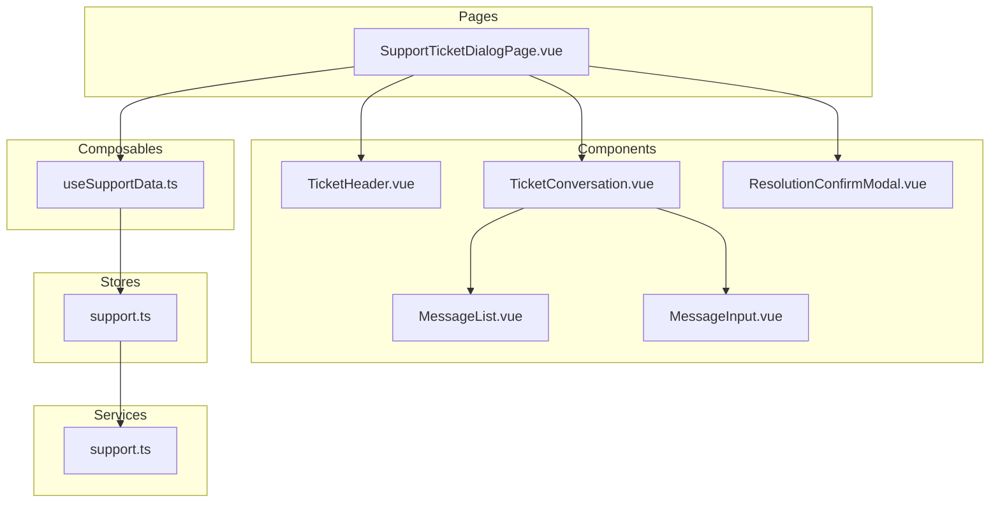
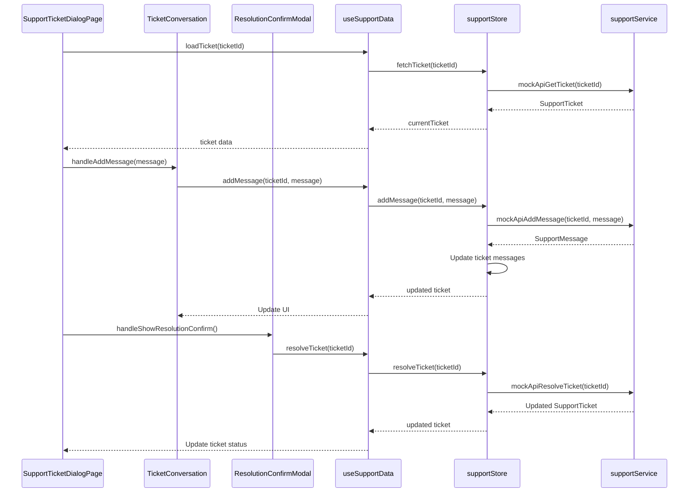
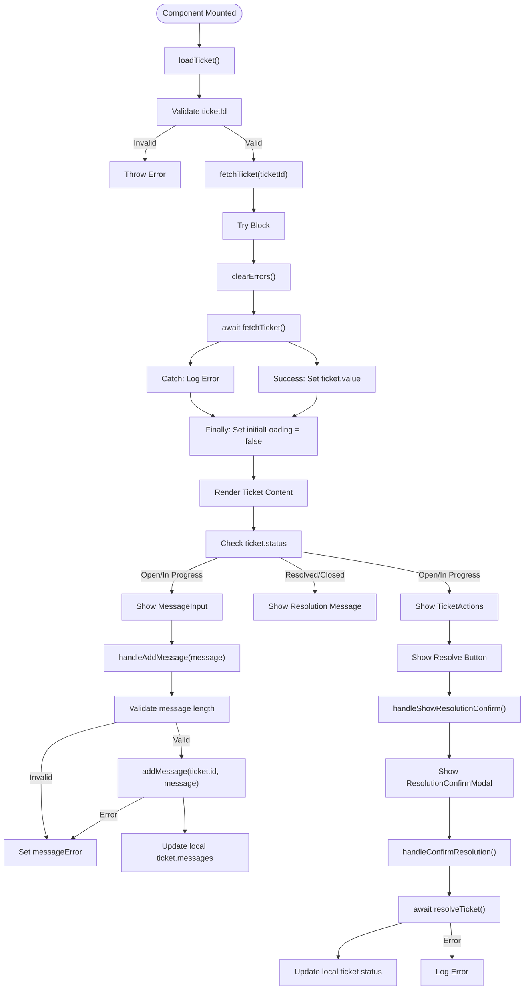
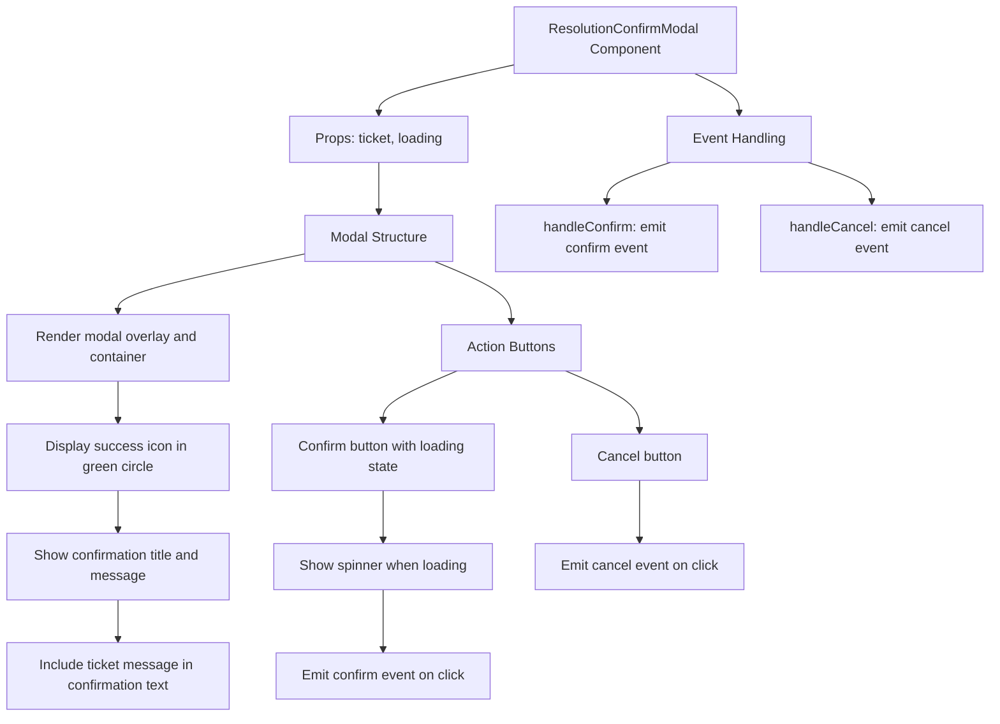
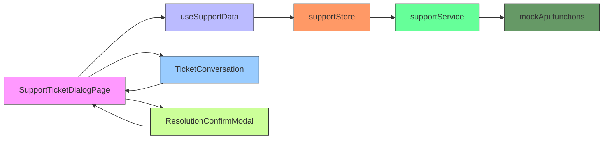

# Support Ticket Dialog

<cite>
**Referenced Files in This Document**   
- [SupportTicketDialogPage.vue](file://src/pages/SupportTicketDialogPage.vue#L1-L240) - *Updated in commit 5d1225dc*
- [TicketConversation.vue](file://src/components/support/TicketConversation.vue#L1-L108) - *New component introduced*
- [ResolutionConfirmModal.vue](file://src/components/support/ResolutionConfirmModal.vue#L1-L82) - *Updated in commit 5d1225dc*
- [useSupportData.ts](file://src/composables/useSupportData.ts#L1-L228)
- [support.ts](file://src/stores/support.ts#L1-L240)
- [support.ts](file://src/services/support.ts#L1-L422)
- [TicketHeader.vue](file://src/components/support/TicketHeader.vue#L1-L117)
</cite>

## Update Summary
**Changes Made**   
- Updated architecture overview to reflect new component hierarchy
- Added detailed analysis of new TicketConversation component
- Updated user interaction flow with resolution confirmation workflow
- Revised dependency analysis to include new component relationships
- Added troubleshooting guidance for resolution confirmation modal
- Updated all interface text from Russian to English

## Table of Contents
1. [Introduction](#introduction)
2. [Project Structure](#project-structure)
3. [Core Components](#core-components)
4. [Architecture Overview](#architecture-overview)
5. [Detailed Component Analysis](#detailed-component-analysis)
6. [Dependency Analysis](#dependency-analysis)
7. [Performance Considerations](#performance-considerations)
8. [Troubleshooting Guide](#troubleshooting-guide)
9. [Conclusion](#conclusion)

## Introduction
The Support Ticket Dialog is a key user interface component within the MayaWork frontend application, designed to allow users to view, interact with, and manage their support tickets. This feature enables users to read ticket details, view message history, add new messages, and resolve tickets when appropriate. The dialog is implemented as a dedicated page that loads a specific ticket by ID from the route parameters and displays its full conversation history.

The component leverages a composable pattern for state management and API interaction, using Pinia for global state and Vue 3's Composition API for reactivity. It supports multiple states including loading, error, not found, and normal operation. The design follows accessibility best practices and provides clear feedback for user actions.

**Section sources**
- [SupportTicketDialogPage.vue](file://src/pages/SupportTicketDialogPage.vue#L1-L240)

## Project Structure
The Support Ticket Dialog feature is organized across several directories in the frontend codebase, following a modular and feature-based architecture. The main entry point is a dedicated page component, with supporting components, composables, services, and store modules.



**Diagram sources**
- [SupportTicketDialogPage.vue](file://src/pages/SupportTicketDialogPage.vue)
- [TicketConversation.vue](file://src/components/support/TicketConversation.vue)
- [useSupportData.ts](file://src/composables/useSupportData.ts)
- [support.ts](file://src/stores/support.ts)
- [support.ts](file://src/services/support.ts)

**Section sources**
- [SupportTicketDialogPage.vue](file://src/pages/SupportTicketDialogPage.vue#L1-L240)
- [TicketConversation.vue](file://src/components/support/TicketConversation.vue#L1-L108)
- [useSupportData.ts](file://src/composables/useSupportData.ts#L1-L228)
- [support.ts](file://src/stores/support.ts#L1-L240)
- [support.ts](file://src/services/support.ts#L1-L422)

## Core Components
The Support Ticket Dialog consists of several core components that work together to provide a complete user experience. The main page component orchestrates the display of ticket information and user interactions, while specialized components handle specific aspects of the UI.

The `SupportTicketDialogPage.vue` serves as the container component, managing the lifecycle of ticket loading and state transitions. It uses the `useSupportData` composable to access ticket data and perform operations. The page renders different states including loading, error, not found, and the main ticket view with header, conversation, and actions.

Supporting components include `TicketHeader.vue` for displaying ticket metadata, `TicketConversation.vue` for managing the message list and input interface, `MessageList.vue` for showing the conversation history, `MessageInput.vue` for adding new messages, and `ResolutionConfirmModal.vue` for confirming ticket resolution. These components are decoupled and reusable across the application.

**Section sources**
- [SupportTicketDialogPage.vue](file://src/pages/SupportTicketDialogPage.vue#L1-L240)
- [TicketConversation.vue](file://src/components/support/TicketConversation.vue#L1-L108)
- [TicketHeader.vue](file://src/components/support/TicketHeader.vue#L1-L117)

## Architecture Overview
The Support Ticket Dialog follows a layered architecture with clear separation of concerns between presentation, business logic, and data access layers. The component uses the Composition API pattern with a custom composable that abstracts away the complexity of state management and API calls.



**Diagram sources**
- [SupportTicketDialogPage.vue](file://src/pages/SupportTicketDialogPage.vue#L1-L240)
- [TicketConversation.vue](file://src/components/support/TicketConversation.vue#L1-L108)
- [ResolutionConfirmModal.vue](file://src/components/support/ResolutionConfirmModal.vue#L1-L82)
- [useSupportData.ts](file://src/composables/useSupportData.ts#L1-L228)
- [support.ts](file://src/stores/support.ts#L1-L240)
- [support.ts](file://src/services/support.ts#L1-L422)

## Detailed Component Analysis

### Support Ticket Dialog Page Analysis
The `SupportTicketDialogPage.vue` component is the main entry point for viewing a specific support ticket. It handles route parameters, manages loading states, and coordinates interactions between UI components and the data layer.

The component uses Vue Router's `useRoute` and `useRouter` hooks to access the ticket ID from the URL and navigate back to the support page. It leverages the `useSupportData` composable for all data operations, maintaining a clean separation between presentation and logic.



**Diagram sources**
- [SupportTicketDialogPage.vue](file://src/pages/SupportTicketDialogPage.vue#L1-L240)

**Section sources**
- [SupportTicketDialogPage.vue](file://src/pages/SupportTicketDialogPage.vue#L1-L240)

### Ticket Conversation Component Analysis
The `TicketConversation.vue` component manages the message display and input interface for support tickets. It consolidates the message list, input field, and action buttons into a single cohesive unit, improving the user experience and simplifying the parent component's responsibilities.

```mermaid
flowchart TD
A[TicketConversation Component] --> B[Props: ticket, messages, loading, messageError]
B --> C[Message Display Logic]
C --> D[Render MessageList with messages]
D --> E[Show closed ticket message if status is resolved/closed]
E --> F[Display success icon and resolution message]
C --> G[Show message input if status is open/in-progress]
G --> H[Render MessageInput with loading and error states]
H --> I[Handle message submission via emit]
I --> J[Validate message input through ref]
J --> K[Expose isMessageValid computed property]
K --> L[Enable/disable send button accordingly]
G --> M[Render send button with loading state]
M --> N[Handle click to trigger message submission]
N --> O[Call messageInputRef.submit()]
A --> P[Event Handling]
P --> Q[Listen for add-message event]
Q --> R[Emit add-message to parent]
P --> S[Listen for clear-message-error event]
S --> T[Emit clear-message-error to parent]
```

**Diagram sources**
- [TicketConversation.vue](file://src/components/support/TicketConversation.vue#L1-L108)

**Section sources**
- [TicketConversation.vue](file://src/components/support/TicketConversation.vue#L1-L108)

### Resolution Confirm Modal Analysis
The `ResolutionConfirmModal.vue` component provides a confirmation dialog when users attempt to resolve a support ticket. This prevents accidental resolution and ensures users are aware of the action's consequences.



**Diagram sources**
- [ResolutionConfirmModal.vue](file://src/components/support/ResolutionConfirmModal.vue#L1-L82)

**Section sources**
- [ResolutionConfirmModal.vue](file://src/components/support/ResolutionConfirmModal.vue#L1-L82)

## Dependency Analysis
The Support Ticket Dialog feature has a well-defined dependency chain that follows the dependency inversion principle. Higher-level components depend on abstractions rather than concrete implementations, making the system more maintainable and testable.



**Diagram sources**
- [SupportTicketDialogPage.vue](file://src/pages/SupportTicketDialogPage.vue#L1-L240)
- [TicketConversation.vue](file://src/components/support/TicketConversation.vue#L1-L108)
- [ResolutionConfirmModal.vue](file://src/components/support/ResolutionConfirmModal.vue#L1-L82)
- [useSupportData.ts](file://src/composables/useSupportData.ts#L1-L228)
- [support.ts](file://src/stores/support.ts#L1-L240)
- [support.ts](file://src/services/support.ts#L1-L422)

**Section sources**
- [SupportTicketDialogPage.vue](file://src/pages/SupportTicketDialogPage.vue#L1-L240)
- [TicketConversation.vue](file://src/components/support/TicketConversation.vue#L1-L108)
- [ResolutionConfirmModal.vue](file://src/components/support/ResolutionConfirmModal.vue#L1-L82)
- [useSupportData.ts](file://src/composables/useSupportData.ts#L1-L228)
- [support.ts](file://src/stores/support.ts#L1-L240)
- [support.ts](file://src/services/support.ts#L1-L422)

## Performance Considerations
The Support Ticket Dialog implementation includes several performance optimizations to ensure a smooth user experience. The composable pattern reduces redundant API calls by centralizing data access, and computed properties ensure efficient reactivity.

The component uses lazy loading for ticket data, only fetching the specific ticket when the page is mounted. Error boundaries and loading states prevent UI blocking during network requests. The use of refs and computed properties in Vue 3 ensures minimal re-renders when data changes.

For large message histories, the MessageList component could implement virtual scrolling in the future to maintain performance. Currently, the mock data size is small enough that this optimization is not necessary.

The implementation includes simulated network delays in the mock API functions (600-1200ms), which helps developers test loading states and identify potential performance issues during development.

**Section sources**
- [support.ts](file://src/services/support.ts#L1-L422)
- [useSupportData.ts](file://src/composables/useSupportData.ts#L1-L228)

## Troubleshooting Guide
When encountering issues with the Support Ticket Dialog, consider the following common problems and solutions:

**Ticket fails to load**
- Verify the ticket ID exists in the route parameters
- Check the network tab for failed API requests
- Ensure the support store is properly initialized
- Confirm the mock API function `mockApiGetTicket` returns valid data

**Message submission fails**
- Verify message length is between 5-1000 characters
- Check that the ticket status is "open" or "in-progress"
- Ensure the `addMessage` method in the store updates both currentTicket and supportTickets arrays
- Validate that the mock API function `mockApiAddMessage` properly updates the ticket in mock data

**Resolution confirmation not working**
- Verify the `handleShowResolutionConfirm` method is properly bound to the TicketHeader component
- Check that the `showResolutionConfirm` ref is reactive and properly updated
- Ensure the `resolveTicket` method in the store updates the ticket status correctly
- Confirm the `mockApiResolveTicket` function returns the updated ticket with resolved status

**State not updating**
- Confirm that refs are properly updated in the store
- Check that computed properties are correctly derived from state
- Verify that the composable returns reactive references
- Ensure Vue's reactivity system can detect changes to nested objects

**Visual issues**
- Check that Tailwind CSS classes are correctly applied
- Verify that dark mode classes work with the theme
- Confirm that status color classes match the design system
- Validate responsive layout on different screen sizes

**Section sources**
- [SupportTicketDialogPage.vue](file://src/pages/SupportTicketDialogPage.vue#L1-L240)
- [TicketConversation.vue](file://src/components/support/TicketConversation.vue#L1-L108)
- [ResolutionConfirmModal.vue](file://src/components/support/ResolutionConfirmModal.vue#L1-L82)
- [useSupportData.ts](file://src/composables/useSupportData.ts#L1-L228)
- [support.ts](file://src/stores/support.ts#L1-L240)
- [support.ts](file://src/services/support.ts#L1-L422)

## Conclusion
The Support Ticket Dialog is a well-structured feature that demonstrates effective use of Vue 3's Composition API, Pinia for state management, and a clean separation of concerns. The component architecture allows for maintainable and testable code, with clear dependencies and well-defined interfaces.

The implementation effectively handles various user scenarios including loading, error, and normal operation states. The use of composables abstracts away complexity from components, promoting reusability across the application. The mock API layer enables development without backend dependencies while maintaining a realistic data flow.

The recent updates have improved the conversation interface by introducing the `TicketConversation` component, which consolidates message display and input functionality. The addition of the `ResolutionConfirmModal` provides a better user experience when resolving tickets. These changes have enhanced the overall usability and maintainability of the feature.

Future improvements could include real API integration, message threading, file attachments, and enhanced accessibility features. The current foundation provides a solid base for these enhancements while maintaining a high-quality user experience.