# User Profile Integration

<cite>
**Referenced Files in This Document**   
- [user.ts](file://src/stores/user.ts#L1-L76) - *Updated in recent commit*
- [UserProfileSection.vue](file://src/components/common/UserProfileSection.vue#L1-L185) - *Enhanced with dropdown menu and keyboard support*
- [TopNavbar.vue](file://src/components/common/TopNavbar.vue#L1-L129)
- [index.ts](file://src/types/index.ts#L1-L75)
- [MobileNavigationMenu.vue](file://src/components/common/MobileNavigationMenu.vue#L1-L160)
- [PageHeader.vue](file://src/components/common/PageHeader.vue#L1-L28) - *Modified in recent commit*
- [ProfilePage.vue](file://src/pages/ProfilePage.vue#L1-L387) - *Redesigned with new layout and enhanced avatar display, added My Vacancies card*
- [ActionCard.vue](file://src/components/ui/ActionCard.vue#L1-L295) - *Added for profile actions*
- [neural-network-profile.ts](file://src/stores/neural-network-profile.ts#L1-L718) - *Added for specialist questionnaire management*
- [SpecialistProfileViewPage.vue](file://src/pages/SpecialistProfileViewPage.vue#L1-L402) - *Added comprehensive profile view page*
- [specialist-profile-view.ts](file://src/stores/specialist-profile-view.ts#L1-L345) - *Added for specialist profile view state management*
- [specialist-profile-view.ts](file://src/types/specialist-profile-view.ts#L1-L283) - *Added types for specialist profile view*
- [ProfileHeader.vue](file://src/components/profile/ProfileHeader.vue#L1-L259) - *Added for profile header component*
- [ContactSection.vue](file://src/components/profile/ContactSection.vue#L1-L245) - *Added for contact section component*
- [ExperienceSection.vue](file://src/components/profile/ExperienceSection.vue#L1-L142) - *Added for experience section component*
- [PortfolioSection.vue](file://src/components/profile/PortfolioSection.vue#L1-L189) - *Added for portfolio section component*
- [ProfileOverview.vue](file://src/components/profile/ProfileOverview.vue#L1-L178) - *Added for profile overview component*
- [ServicesSection.vue](file://src/components/profile/ServicesSection.vue#L1-L167) - *Added for services section component*
- [SpecializationsSection.vue](file://src/components/profile/SpecializationsSection.vue#L1-L156) - *Added for specializations section component*
- [TestimonialsSection.vue](file://src/components/profile/TestimonialsSection.vue#L1-L198) - *Added for testimonials section component*
- [MyVacanciesPage.vue](file://src/pages/MyVacanciesPage.vue#L1-L190) - *Added for client vacancy management*
- [VacancyList.vue](file://src/components/vacancies/VacancyList.vue#L1-L69) - *Added for displaying vacancy list*
- [VacancyCard.vue](file://src/components/vacancies/VacancyCard.vue#L1-L104) - *Added for individual vacancy display*
- [vacancy.ts](file://src/stores/vacancy.ts#L1-L184) - *Added for vacancy state management*
- [vacancy.ts](file://src/types/vacancy.ts#L1-L20) - *Added types for vacancy*
- [VacancyForm.vue](file://src/components/vacancies/VacancyForm.vue#L1-L237) - *Added for vacancy creation and editing*
- [VacancyDetailPage.vue](file://src/pages/VacancyDetailPage.vue#L1-L280) - *Added for detailed vacancy view*
</cite>

## Update Summary
**Changes Made**   
- Updated documentation to reflect enhanced user profile dropdown functionality
- Added documentation for new "Change Password" feature in user profile menu
- Updated accessibility and keyboard navigation details
- Enhanced logout functionality description with updated flow
- Added details about event listeners for click outside and escape key handling
- Removed outdated Russian text references and clarified internationalization needs
- Added new section for Profile Actions and ActionCard component
- Integrated documentation for specialist questionnaire status and moderation workflow
- Updated user type labeling section to reflect new requirements
- Added comprehensive documentation for the new Specialist Profile View feature
- Documented new components for profile sections (Contact, Experience, Portfolio, etc.)
- Added details about profile completion percentage and moderation status
- Documented new profile sharing and contact functionality
- Updated ProfilePage documentation to reflect layout redesign and enhanced avatar display
- Added documentation for the new "My Vacancies" feature for clients on the ProfilePage
- Documented the vacancy management system including MyVacanciesPage, VacancyList, VacancyCard, VacancyForm, and VacancyDetailPage components
- Added details about vacancy store state management and vacancy data model
- Updated profile actions section to include the new My Vacancies card for clients

## Table of Contents
1. [Introduction](#introduction)
2. [Project Structure](#project-structure)
3. [Core Components](#core-components)
4. [Architecture Overview](#architecture-overview)
5. [Detailed Component Analysis](#detailed-component-analysis)
6. [Data Flow and User State Management](#data-flow-and-user-state-management)
7. [Avatar Handling and Display Logic](#avatar-handling-and-display-logic)
8. [Logout Functionality](#logout-functionality)
9. [User Type Labeling](#user-type-labeling)
10. [Profile Actions and User Cards](#profile-actions-and-user-cards)
11. [Specialist Profile View](#specialist-profile-view)
12. [Vacancy Management System](#vacancy-management-system)
13. [Conclusion](#conclusion)

## Introduction
This document provides comprehensive documentation for user profile integration within navigation components in the Maya Platform frontend application. It details the data flow from the user store, display logic for authenticated versus unauthenticated states, logout functionality, avatar handling, and user type labeling. The analysis is based on actual source code files and their interactions, with updates reflecting recent enhancements to the user profile menu with accessible dropdown and keyboard support.

The documentation has been updated to include the new Specialist Profile View feature, which provides a comprehensive view of specialist profiles with multiple sections including specializations, services, portfolio, experience, and testimonials. This feature includes a responsive layout with a two-column design on larger screens and a single column on mobile devices.

Additionally, this update documents the new vacancy management system that allows clients to manage their vacancies directly from their profile page. This system includes a dedicated "My Vacancies" card on the ProfilePage for clients, a full vacancy management interface in MyVacanciesPage, and detailed vacancy views in VacancyDetailPage.

## Project Structure
The project follows a feature-based organization with clear separation of concerns. Key directories include:
- `src/components/common`: Contains reusable UI components including navigation and user profile elements
- `src/stores`: Houses Pinia stores for state management, particularly user and navigation state
- `src/types`: Defines TypeScript interfaces for consistent data typing across the application
- `src/pages`: Contains page-level components that utilize the shared components and stores
- `src/components/profile`: Contains components for displaying specialist profile information
- `src/components/vacancies`: Contains components for managing and displaying vacancies
- `src/pages/vacancies`: Contains pages for vacancy management

The user profile integration primarily involves components in the `common` directory and state management via the `user` store, while the specialist profile view feature utilizes components in the `profile` directory and state management via the `specialist-profile-view` store. The new vacancy management system uses components in the `vacancies` directory and state management via the `vacancy` store.

```mermaid
graph TB
subgraph "Components"
TopNavbar[TopNavbar.vue]
UserProfileSection[UserProfileSection.vue]
MobileNavigationMenu[MobileNavigationMenu.vue]
SpecialistProfileView[SpecialistProfileViewPage.vue]
ProfileHeader[ProfileHeader.vue]
ProfileOverview[ProfileOverview.vue]
SpecializationsSection[SpecializationsSection.vue]
ServicesSection[ServicesSection.vue]
PortfolioSection[PortfolioSection.vue]
ExperienceSection[ExperienceSection.vue]
TestimonialsSection[TestimonialsSection.vue]
ContactSection[ContactSection.vue]
MyVacanciesPage[MyVacanciesPage.vue]
VacancyList[VacancyList.vue]
VacancyCard[VacancyCard.vue]
VacancyForm[VacancyForm.vue]
VacancyDetail[VacancyDetailPage.vue]
end
subgraph "State Management"
UserStore[user.ts]
SpecialistProfileStore[specialist-profile-view.ts]
VacancyStore[vacancy.ts]
end
subgraph "Types"
Types[index.ts]
SpecialistProfileTypes[specialist-profile-view.ts]
VacancyTypes[vacancy.ts]
end
TopNavbar --> UserProfileSection
TopNavbar --> MobileNavigationMenu
UserProfileSection --> UserStore
MobileNavigationMenu --> UserStore
SpecialistProfileView --> SpecialistProfileStore
SpecialistProfileStore --> SpecialistProfileTypes
UserStore --> Types
MyVacanciesPage --> VacancyStore
VacancyList --> VacancyStore
VacancyCard --> VacancyStore
VacancyForm --> VacancyStore
VacancyDetail --> VacancyStore
VacancyStore --> VacancyTypes
```

**Diagram sources**
- [TopNavbar.vue](file://src/components/common/TopNavbar.vue#L1-L129)
- [UserProfileSection.vue](file://src/components/common/UserProfileSection.vue#L1-L185)
- [MobileNavigationMenu.vue](file://src/components/common/MobileNavigationMenu.vue#L1-L160)
- [user.ts](file://src/stores/user.ts#L1-L76)
- [index.ts](file://src/types/index.ts#L1-L75)
- [SpecialistProfileViewPage.vue](file://src/pages/SpecialistProfileViewPage.vue#L1-L402)
- [specialist-profile-view.ts](file://src/stores/specialist-profile-view.ts#L1-L345)
- [specialist-profile-view.ts](file://src/types/specialist-profile-view.ts#L1-L283)
- [ProfileHeader.vue](file://src/components/profile/ProfileHeader.vue#L1-L259)
- [ProfileOverview.vue](file://src/components/profile/ProfileOverview.vue#L1-L178)
- [SpecializationsSection.vue](file://src/components/profile/SpecializationsSection.vue#L1-L156)
- [ServicesSection.vue](file://src/components/profile/ServicesSection.vue#L1-L167)
- [PortfolioSection.vue](file://src/components/profile/PortfolioSection.vue#L1-L189)
- [ExperienceSection.vue](file://src/components/profile/ExperienceSection.vue#L1-L142)
- [TestimonialsSection.vue](file://src/components/profile/TestimonialsSection.vue#L1-L198)
- [ContactSection.vue](file://src/components/profile/ContactSection.vue#L1-L245)
- [MyVacanciesPage.vue](file://src/pages/MyVacanciesPage.vue#L1-L190)
- [VacancyList.vue](file://src/components/vacancies/VacancyList.vue#L1-L69)
- [VacancyCard.vue](file://src/components/vacancies/VacancyCard.vue#L1-L104)
- [vacancy.ts](file://src/stores/vacancy.ts#L1-L184)
- [vacancy.ts](file://src/types/vacancy.ts#L1-L20)
- [VacancyForm.vue](file://src/components/vacancies/VacancyForm.vue#L1-L237)
- [VacancyDetailPage.vue](file://src/pages/VacancyDetailPage.vue#L1-L280)

**Section sources**
- [TopNavbar.vue](file://src/components/common/TopNavbar.vue#L1-L129)
- [UserProfileSection.vue](file://src/components/common/UserProfileSection.vue#L1-L185)
- [MobileNavigationMenu.vue](file://src/components/common/MobileNavigationMenu.vue#L1-L160)
- [user.ts](file://src/stores/user.ts#L1-L76)
- [index.ts](file://src/types/index.ts#L1-L75)
- [SpecialistProfileViewPage.vue](file://src/pages/SpecialistProfileViewPage.vue#L1-L402)
- [specialist-profile-view.ts](file://src/stores/specialist-profile-view.ts#L1-L345)
- [specialist-profile-view.ts](file://src/types/specialist-profile-view.ts#L1-L283)
- [MyVacanciesPage.vue](file://src/pages/MyVacanciesPage.vue#L1-L190)
- [VacancyList.vue](file://src/components/vacancies/VacancyList.vue#L1-L69)
- [VacancyCard.vue](file://src/components/vacancies/VacancyCard.vue#L1-L104)
- [vacancy.ts](file://src/stores/vacancy.ts#L1-L184)
- [vacancy.ts](file://src/types/vacancy.ts#L1-L20)
- [VacancyForm.vue](file://src/components/vacancies/VacancyForm.vue#L1-L237)
- [VacancyDetailPage.vue](file://src/pages/VacancyDetailPage.vue#L1-L280)

## Core Components
The user profile integration system consists of several core components that work together to display user information and manage authentication state:

1. **User Store**: Central state management for user data and authentication status
2. **UserProfileSection**: Component responsible for rendering user profile information in navigation with enhanced dropdown menu
3. **TopNavbar**: Main navigation bar that conditionally renders user profile or login link
4. **MobileNavigationMenu**: Responsive mobile menu that includes user profile and logout functionality

Additionally, the Specialist Profile View feature introduces a new set of components for displaying comprehensive specialist profiles:

1. **SpecialistProfileViewStore**: State management for specialist profile data and loading state
2. **SpecialistProfileViewPage**: Main page component for displaying specialist profiles
3. **ProfileHeader**: Component for displaying the specialist's header information including avatar, name, and status
4. **ProfileOverview**: Component for displaying a summary of the specialist's profile
5. **SpecializationsSection**: Component for displaying the specialist's specializations and abilities
6. **ServicesSection**: Component for displaying the specialist's services and pricing
7. **PortfolioSection**: Component for displaying the specialist's portfolio cases
8. **ExperienceSection**: Component for displaying the specialist's work experience
9. **TestimonialsSection**: Component for displaying client testimonials
10. **ContactSection**: Component for displaying contact information and quick contact buttons

The new vacancy management system includes the following components:

1. **VacancyStore**: State management for vacancy data and operations
2. **MyVacanciesPage**: Page component for clients to manage their vacancies
3. **VacancyList**: Component for displaying a list of vacancies
4. **VacancyCard**: Component for displaying individual vacancy information
5. **VacancyForm**: Component for creating and editing vacancies
6. **VacancyDetailPage**: Page component for viewing detailed vacancy information

These components follow the Vue 3 Composition API pattern and leverage Pinia for state management.

**Section sources**
- [user.ts](file://src/stores/user.ts#L1-L76)
- [UserProfileSection.vue](file://src/components/common/UserProfileSection.vue#L1-L185)
- [TopNavbar.vue](file://src/components/common/TopNavbar.vue#L1-L129)
- [SpecialistProfileViewPage.vue](file://src/pages/SpecialistProfileViewPage.vue#L1-L402)
- [specialist-profile-view.ts](file://src/stores/specialist-profile-view.ts#L1-L345)
- [ProfileHeader.vue](file://src/components/profile/ProfileHeader.vue#L1-L259)
- [ProfileOverview.vue](file://src/components/profile/ProfileOverview.vue#L1-L178)
- [SpecializationsSection.vue](file://src/components/profile/SpecializationsSection.vue#L1-L156)
- [ServicesSection.vue](file://src/components/profile/ServicesSection.vue#L1-L167)
- [PortfolioSection.vue](file://src/components/profile/PortfolioSection.vue#L1-L189)
- [ExperienceSection.vue](file://src/components/profile/ExperienceSection.vue#L1-L142)
- [TestimonialsSection.vue](file://src/components/profile/TestimonialsSection.vue#L1-L198)
- [ContactSection.vue](file://src/components/profile/ContactSection.vue#L1-L245)
- [MyVacanciesPage.vue](file://src/pages/MyVacanciesPage.vue#L1-L190)
- [VacancyList.vue](file://src/components/vacancies/VacancyList.vue#L1-L69)
- [VacancyCard.vue](file://src/components/vacancies/VacancyCard.vue#L1-L104)
- [vacancy.ts](file://src/stores/vacancy.ts#L1-L184)
- [vacancy.ts](file://src/types/vacancy.ts#L1-L20)
- [VacancyForm.vue](file://src/components/vacancies/VacancyForm.vue#L1-L237)
- [VacancyDetailPage.vue](file://src/pages/VacancyDetailPage.vue#L1-L280)

## Architecture Overview
The user profile integration follows a unidirectional data flow architecture where the user store serves as the single source of truth for authentication state. Components subscribe to this state and update their rendering accordingly.

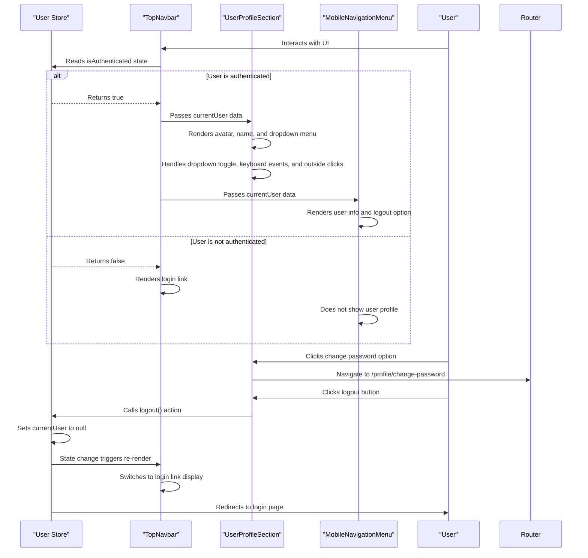

**Diagram sources**
- [user.ts](file://src/stores/user.ts#L1-L76)
- [TopNavbar.vue](file://src/components/common/TopNavbar.vue#L1-L129)
- [UserProfileSection.vue](file://src/components/common/UserProfileSection.vue#L1-L185)
- [MobileNavigationMenu.vue](file://src/components/common/MobileNavigationMenu.vue#L1-L160)

## Detailed Component Analysis

### User Store Analysis
The user store is the central component for managing user authentication state and related data.

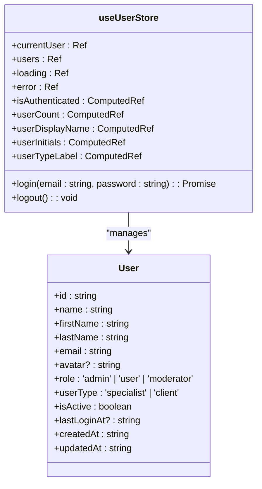

**Diagram sources**
- [user.ts](file://src/stores/user.ts#L1-L76)
- [index.ts](file://src/types/index.ts#L1-L75)

**Section sources**
- [user.ts](file://src/stores/user.ts#L1-L76)
- [index.ts](file://src/types/index.ts#L1-L75)

### UserProfileSection Component Analysis
The UserProfileSection component handles the display of user profile information in both desktop and mobile views with enhanced accessibility features.

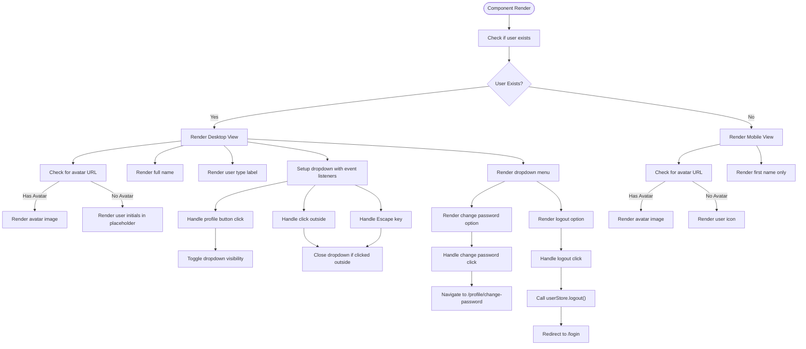

**Diagram sources**
- [UserProfileSection.vue](file://src/components/common/UserProfileSection.vue#L1-L185)

**Section sources**
- [UserProfileSection.vue](file://src/components/common/UserProfileSection.vue#L1-L185)

## Data Flow and User State Management
The data flow for user profile integration begins with the user store, which maintains the current authentication state. When a user logs in, the store updates its state, which triggers reactivity in all components that depend on this state.

The TopNavbar component reads the `isAuthenticated` computed property from the user store to determine whether to display the user profile section or a login link. This creates a clean separation between state management and presentation logic.

When the authentication state changes (either through login or logout), all dependent components automatically update their rendering without requiring manual DOM manipulation.

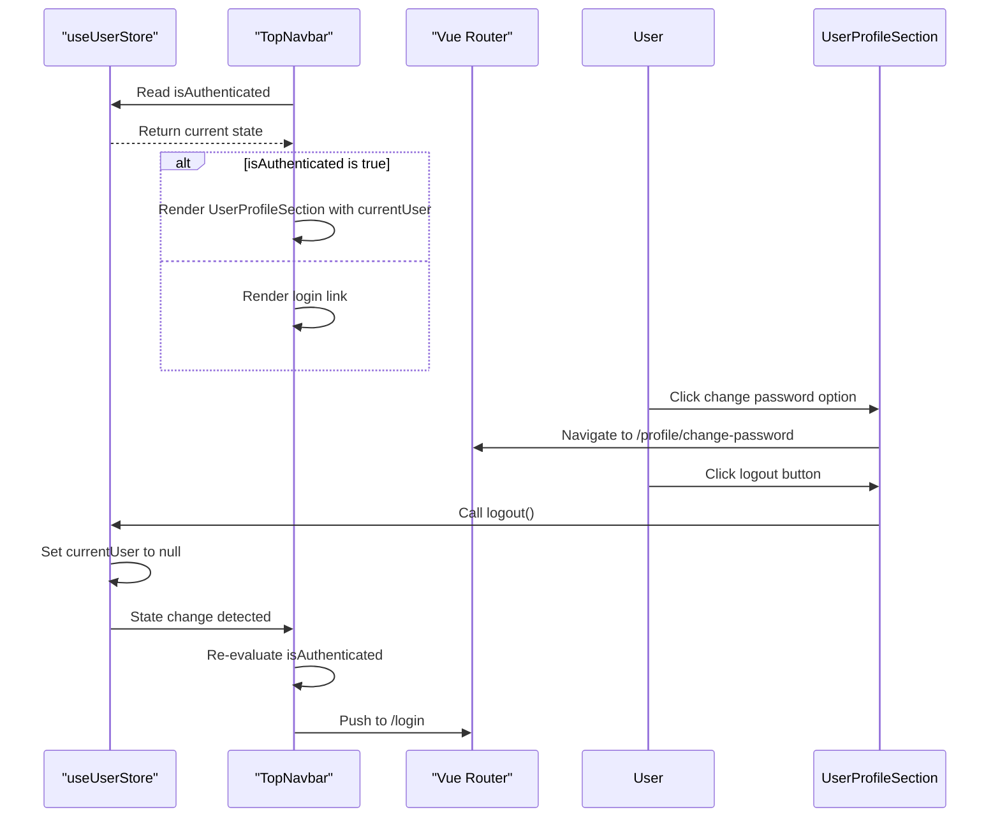

**Diagram sources**
- [user.ts](file://src/stores/user.ts#L1-L76)
- [TopNavbar.vue](file://src/components/common/TopNavbar.vue#L1-L129)
- [UserProfileSection.vue](file://src/components/common/UserProfileSection.vue#L1-L185)

**Section sources**
- [user.ts](file://src/stores/user.ts#L1-L76)
- [TopNavbar.vue](file://src/components/common/TopNavbar.vue#L1-L129)
- [UserProfileSection.vue](file://src/components/common/UserProfileSection.vue#L1-L185)

## Avatar Handling and Display Logic
The avatar handling system provides a graceful fallback mechanism when no avatar image is available. The system follows these rules:

1. If the user has an avatar URL, display the image in a circular frame with a ring border
2. If no avatar is available, display the user's initials in a colored placeholder circle
3. The placeholder uses a light gray background with dark text in light mode, and dark gray background with light text in dark mode

The desktop version shows a larger avatar (8x8 units) with full name and user type label, while the mobile version uses a smaller avatar (6x6 units) and only shows the first name to conserve space.

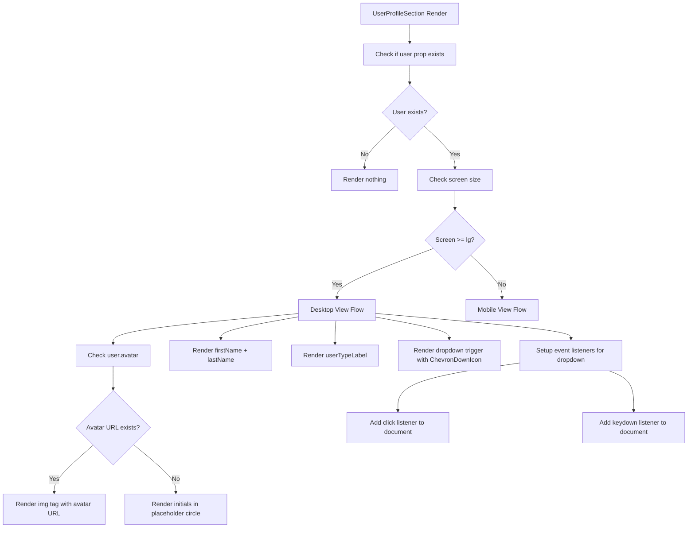

**Diagram sources**
- [UserProfileSection.vue](file://src/components/common/UserProfileSection.vue#L1-L185)

**Section sources**
- [UserProfileSection.vue](file://src/components/common/UserProfileSection.vue#L1-L185)

## Logout Functionality
The logout functionality is implemented consistently across both desktop and mobile interfaces. When the user clicks the logout button, the following sequence occurs:

1. The `handleLogout` method in UserProfileSection is triggered
2. The method calls `userStore.logout()` to clear the authentication state
3. The router is instructed to navigate to the login page
4. The navigation components automatically update to reflect the logged-out state

The logout process is designed to be atomic and reliable, ensuring that the user cannot remain in a partially authenticated state.

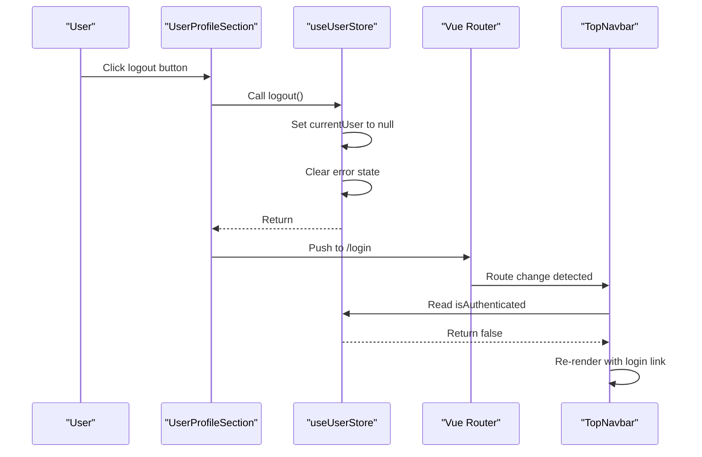

**Diagram sources**
- [UserProfileSection.vue](file://src/components/common/UserProfileSection.vue#L1-L185)
- [user.ts](file://src/stores/user.ts#L1-L76)

**Section sources**
- [UserProfileSection.vue](file://src/components/common/UserProfileSection.vue#L1-L185)
- [user.ts](file://src/stores/user.ts#L1-L76)

## User Type Labeling
The user type labeling system displays the user's role in the interface using localized labels. The system supports two user types:

- **specialist**: Displayed as "Specialist" 
- **client**: Displayed as "Client"

The labeling is implemented through a computed property that transforms the internal userType value into the appropriate display label. This computed property is used in both the UserProfileSection and MobileNavigationMenu components to maintain consistency across the interface.

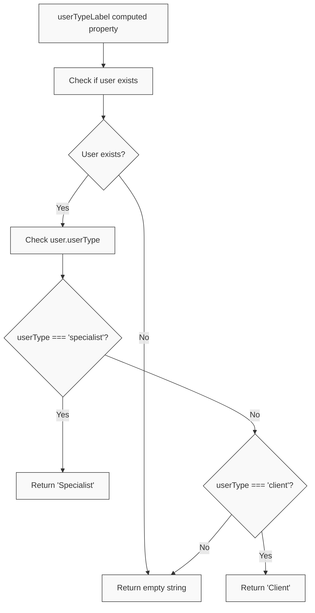

**Diagram sources**
- [UserProfileSection.vue](file://src/components/common/UserProfileSection.vue#L1-L185)
- [user.ts](file://src/stores/user.ts#L1-L76)
- [MobileNavigationMenu.vue](file://src/components/common/MobileNavigationMenu.vue#L1-L160)

**Section sources**
- [UserProfileSection.vue](file://src/components/common/UserProfileSection.vue#L1-L185)
- [user.ts](file://src/stores/user.ts#L1-L76)
- [MobileNavigationMenu.vue](file://src/components/common/MobileNavigationMenu.vue#L1-L160)

## Profile Actions and User Cards
The ProfilePage component has been enhanced with user action cards that provide quick access to key profile management features. These cards are implemented using the ActionCard component and are organized in a responsive grid layout.

The profile actions section includes several cards:
1. **Questionnaire Access Card**: Available only to specialists, this card provides access to the neural network specialist questionnaire with status indicators
2. **My Vacancies Card**: Available only to clients, this card provides access to manage their vacancies
3. **Password Change Card**: Allows users to change their account password with appropriate security guidance
4. **Logout Card**: Provides a prominent logout option with confirmation handling

The ActionCard component supports various customization options including color themes, icons, badges, and progress indicators. For specialist users, the questionnaire card displays moderation status (Draft, Pending Review, Approved, Rejected) and completion percentage.

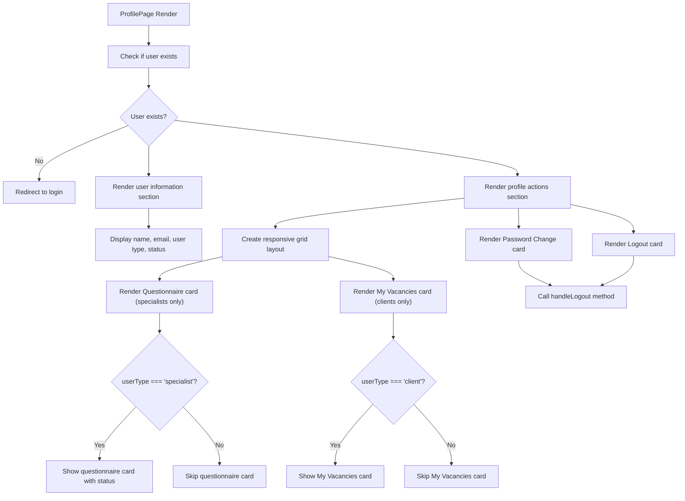

**Diagram sources**
- [ProfilePage.vue](file://src/pages/ProfilePage.vue#L1-L387)
- [ActionCard.vue](file://src/components/ui/ActionCard.vue#L1-L295)
- [neural-network-profile.ts](file://src/stores/neural-network-profile.ts#L1-L718)
- [vacancy.ts](file://src/stores/vacancy.ts#L1-L184)

**Section sources**
- [ProfilePage.vue](file://src/pages/ProfilePage.vue#L1-L387)
- [ActionCard.vue](file://src/components/ui/ActionCard.vue#L1-L295)
- [neural-network-profile.ts](file://src/stores/neural-network-profile.ts#L1-L718)
- [vacancy.ts](file://src/stores/vacancy.ts#L1-L184)

## Specialist Profile View
The Specialist Profile View feature provides a comprehensive view of specialist profiles with multiple sections of information. This feature is implemented as a dedicated page component that fetches and displays detailed information about a specialist.

### Specialist Profile View Page
The SpecialistProfileViewPage component is the main entry point for viewing specialist profiles. It handles the following responsibilities:
- Loading the specialist profile data from the API
- Managing loading and error states
- Rendering the profile content with a responsive layout
- Providing navigation controls
- Supporting both regular page view and modal view modes

The component uses a two-column layout on larger screens, with the main content (overview, specializations, services, etc.) in the left column and sidebar content (quick contact, profile stats, share options) in the right column. On mobile devices, the layout switches to a single column with the sidebar content appearing below the main content.

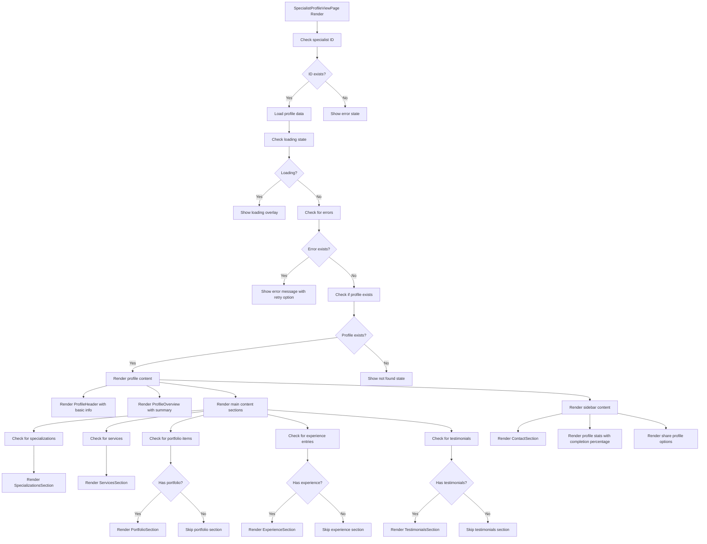

**Diagram sources**
- [SpecialistProfileViewPage.vue](file://src/pages/SpecialistProfileViewPage.vue#L1-L402)

**Section sources**
- [SpecialistProfileViewPage.vue](file://src/pages/SpecialistProfileViewPage.vue#L1-L402)

### Specialist Profile Store
The specialist-profile-view store manages the state for the Specialist Profile View feature. It contains the following state properties:
- `currentProfile`: The currently loaded specialist profile data
- `isLoading`: Boolean indicating whether profile data is being loaded
- `error`: Error message if profile loading failed
- `isModalOpen`: Boolean indicating whether the profile is being displayed in modal mode

The store also provides computed properties for derived data:
- `isProfileLoaded`: Whether a profile has been successfully loaded
- `hasPortfolio`: Whether the profile has portfolio items
- `hasExperience`: Whether the profile has experience entries
- `hasTestimonials`: Whether the profile has testimonials
- `profileCompletionPercentage`: The percentage completion of the profile (0-100)
- `isProfileApproved`: Whether the profile has been approved by moderation

The store includes actions for:
- `loadProfile(id)`: Load a specialist profile by ID
- `clearProfile()`: Clear the current profile data
- `openModal()`: Open the profile in modal mode
- `closeModal()`: Close the profile modal
- `refreshProfile()`: Refresh the current profile data
- `shareProfile()`: Share the profile via browser share API or clipboard
- `copyProfileLink()`: Copy the profile URL to clipboard

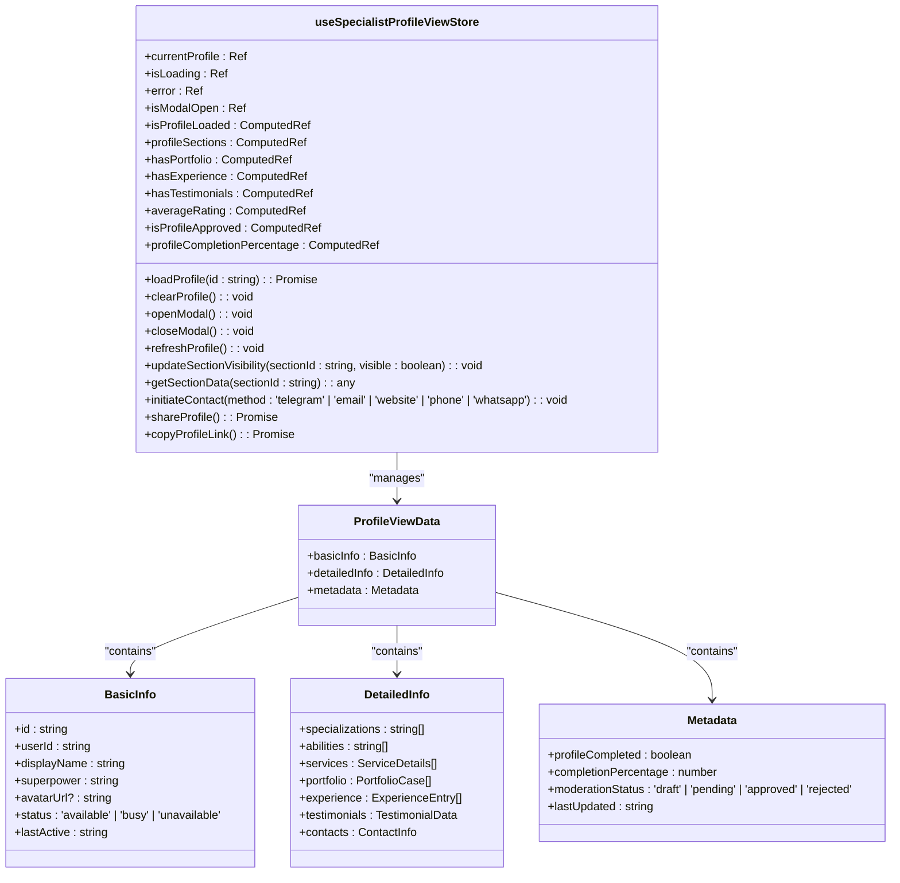

**Diagram sources**
- [specialist-profile-view.ts](file://src/stores/specialist-profile-view.ts#L1-L345)
- [specialist-profile-view.ts](file://src/types/specialist-profile-view.ts#L1-L283)

**Section sources**
- [specialist-profile-view.ts](file://src/stores/specialist-profile-view.ts#L1-L345)
- [specialist-profile-view.ts](file://src/types/specialist-profile-view.ts#L1-L283)

### Profile Sections
The Specialist Profile View feature includes several section components that display specific aspects of a specialist's profile:

#### ProfileHeader
The ProfileHeader component displays the specialist's basic information at the top of the profile page. It shows:
- The specialist's avatar (or initials if no avatar is available)
- The specialist's name and superpower
- Status indicator showing availability (available, busy, unavailable)
- Last active time
- Contact buttons for quick communication

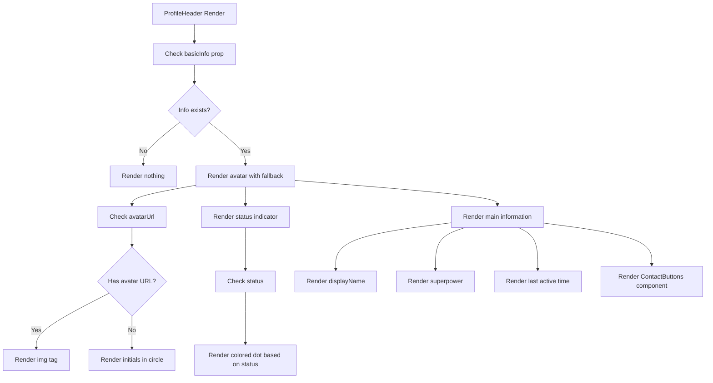

**Diagram sources**
- [ProfileHeader.vue](file://src/components/profile/ProfileHeader.vue#L1-L259)

**Section sources**
- [ProfileHeader.vue](file://src/components/profile/ProfileHeader.vue#L1-L259)

#### ProfileOverview
The ProfileOverview component provides a summary of the specialist's profile, including their specializations, abilities, and services. This component gives users a quick overview of the specialist's expertise.

#### SpecializationsSection
The SpecializationsSection component displays the specialist's areas of expertise and their specific abilities. It shows both predefined specializations and any custom specializations the specialist has added.

#### ServicesSection
The ServicesSection component lists the services the specialist offers along with their pricing. Each service includes the name, description, price, and price type (fixed, hourly, project, negotiable).

#### PortfolioSection
The PortfolioSection component displays examples of the specialist's work. Each portfolio case includes a title, description, type (text, link, visual, bot, landing), content, result, tools used, and creation date.

#### ExperienceSection
The ExperienceSection component shows the specialist's work history, including client names, tasks performed, tools used, results achieved, duration, and year.

#### TestimonialsSection
The TestimonialsSection component displays client testimonials, which can be text testimonials, external links to review platforms, or file attachments. Text testimonials include the client's name, position, testimonial text, rating, project type, and date.

#### ContactSection
The ContactSection component provides the specialist's contact information and quick contact buttons for various communication methods (Telegram, email, website, phone, WhatsApp, Discord, LinkedIn).

**Section sources**
- [ProfileOverview.vue](file://src/components/profile/ProfileOverview.vue#L1-L178)
- [SpecializationsSection.vue](file://src/components/profile/SpecializationsSection.vue#L1-L156)
- [ServicesSection.vue](file://src/components/profile/ServicesSection.vue#L1-L167)
- [PortfolioSection.vue](file://src/components/profile/PortfolioSection.vue#L1-L189)
- [ExperienceSection.vue](file://src/components/profile/ExperienceSection.vue#L1-L142)
- [TestimonialsSection.vue](file://src/components/profile/TestimonialsSection.vue#L1-L198)
- [ContactSection.vue](file://src/components/profile/ContactSection.vue#L1-L245)

## Vacancy Management System
The vacancy management system allows clients to create, manage, and track their vacancies. This system is accessible from the ProfilePage through a dedicated "My Vacancies" card and provides a comprehensive interface for vacancy management.

### My Vacancies Page
The MyVacanciesPage component is the main interface for clients to manage their vacancies. It provides the following features:
- Displaying a list of all vacancies with filtering capabilities
- Creating new vacancies through a form interface
- Editing existing vacancies
- Deleting vacancies with confirmation
- Viewing detailed information about individual vacancies
- Searching for vacancies by title or description

The page uses a responsive layout with a search component at the top, followed by the vacancy list. On mobile devices, the layout adapts to show a single column of vacancy cards.

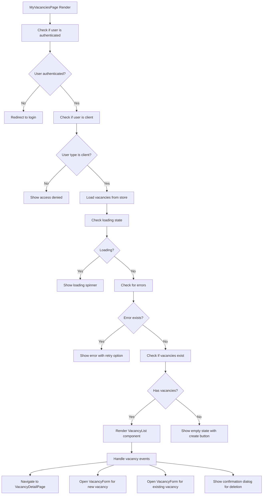

**Diagram sources**
- [MyVacanciesPage.vue](file://src/pages/MyVacanciesPage.vue#L1-L190)

**Section sources**
- [MyVacanciesPage.vue](file://src/pages/MyVacanciesPage.vue#L1-L190)

### Vacancy Store
The vacancy store manages the state for the vacancy management system. It contains the following state properties:
- `vacancies`: Array of all vacancies for the current user
- `loading`: Boolean indicating whether vacancies are being loaded
- `error`: Error message if loading failed
- `searchQuery`: Current search query for filtering vacancies
- `showVacancyForm`: Boolean indicating whether the vacancy form modal is open
- `showContactModal`: Boolean indicating whether the contact modal is open
- `selectedVacancy`: The currently selected vacancy for editing or viewing

The store provides computed properties for filtered vacancies based on the search query and for grouping vacancies by status (published, draft, closed).

The store includes actions for:
- `fetchVacancies()`: Load all vacancies for the current user
- `createVacancy(vacancyData)`: Create a new vacancy
- `updateVacancy(id, vacancyData)`: Update an existing vacancy
- `deleteVacancy(id)`: Delete a vacancy
- `setSearchQuery(query)`: Update the search query
- `openVacancyForm(vacancy)`: Open the vacancy form modal for creating or editing
- `closeVacancyForm()`: Close the vacancy form modal

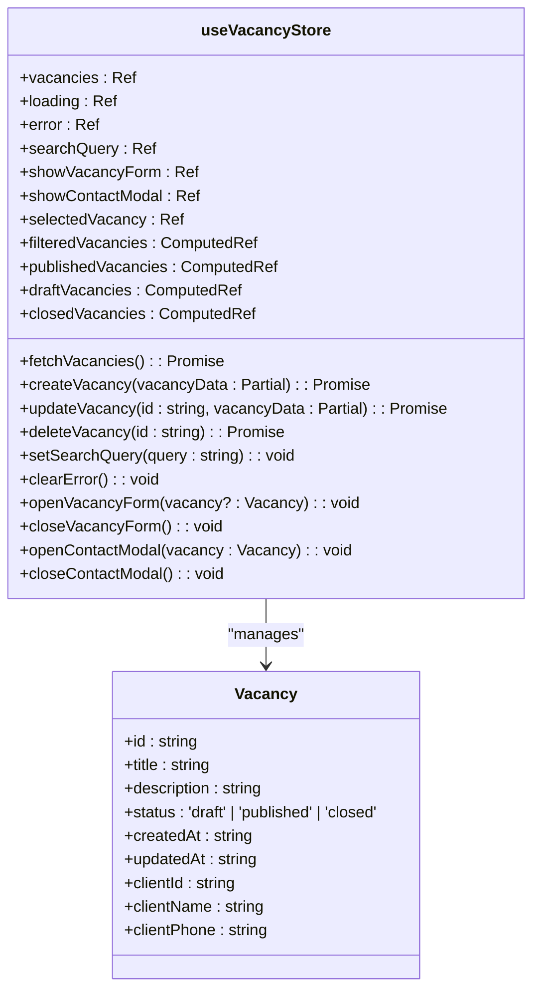

**Diagram sources**
- [vacancy.ts](file://src/stores/vacancy.ts#L1-L184)
- [vacancy.ts](file://src/types/vacancy.ts#L1-L20)

**Section sources**
- [vacancy.ts](file://src/stores/vacancy.ts#L1-L184)
- [vacancy.ts](file://src/types/vacancy.ts#L1-L20)

### Vacancy Components
The vacancy management system includes several components for displaying and managing vacancies:

#### VacancyList
The VacancyList component displays a grid of vacancy cards. It handles the following responsibilities:
- Displaying a loading skeleton while vacancies are loading
- Showing an empty state when no vacancies exist
- Rendering a grid of VacancyCard components for each vacancy
- Emitting events when a user interacts with a vacancy (view, edit, delete)

#### VacancyCard
The VacancyCard component displays information about a single vacancy. It shows:
- The vacancy title
- A truncated description
- The vacancy status with appropriate styling
- The creation date
- Edit and delete buttons for management

The card is clickable to view the full vacancy details.

#### VacancyForm
The VacancyForm component provides a modal interface for creating and editing vacancies. It includes:
- Input fields for the vacancy title and description
- A dropdown for selecting the vacancy status
- Form validation with character limits and error messages
- Save and cancel buttons
- Loading state during submission

#### VacancyDetailPage
The VacancyDetailPage component provides a detailed view of a single vacancy. It includes:
- Breadcrumbs for navigation
- The vacancy title and description
- Status information and creation date
- Action buttons for editing, publishing, closing, and contacting
- A contact modal that reveals the client's phone number

**Section sources**
- [VacancyList.vue](file://src/components/vacancies/VacancyList.vue#L1-L69)
- [VacancyCard.vue](file://src/components/vacancies/VacancyCard.vue#L1-L104)
- [VacancyForm.vue](file://src/components/vacancies/VacancyForm.vue#L1-L237)
- [VacancyDetailPage.vue](file://src/pages/VacancyDetailPage.vue#L1-L280)

## Conclusion
The user profile integration in the Maya Platform frontend application demonstrates a well-structured approach to authentication state management and user interface presentation. By leveraging Vue 3's Composition API and Pinia for state management, the system provides a reactive and maintainable solution for displaying user information across different navigation components.

Key strengths of the implementation include:
- Clear separation of concerns between state management and presentation
- Consistent user experience across desktop and mobile interfaces
- Graceful handling of avatar display with appropriate fallbacks
- Reliable logout functionality that properly clears state
- Computed properties for derived data like display names and labels
- Enhanced accessibility with keyboard support and proper ARIA attributes
- New "Change Password" feature integrated into user profile dropdown
- Comprehensive profile actions with user-friendly ActionCard components
- Specialist-specific workflow with questionnaire status tracking
- Comprehensive Specialist Profile View feature with multiple sections of information
- Responsive layout that adapts to different screen sizes
- Profile completion tracking and moderation status indicators
- Quick contact functionality for easy communication with specialists
- Profile sharing capabilities via browser share API and clipboard
- New vacancy management system for clients with MyVacanciesPage, VacancyList, VacancyCard, VacancyForm, and VacancyDetailPage components
- Complete state management for vacancies through the vacancy store
- Proper user type-based access control for vacancy management features

The system could be enhanced by adding proper internationalization support for all user-facing text rather than using hardcoded labels, and by implementing proper error handling for avatar loading failures.