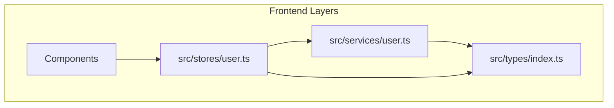
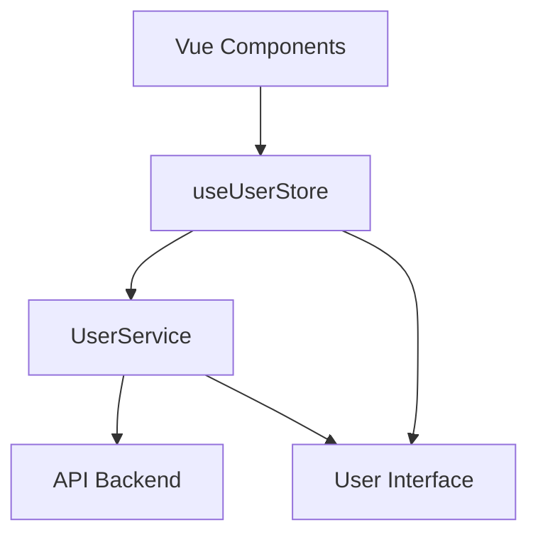
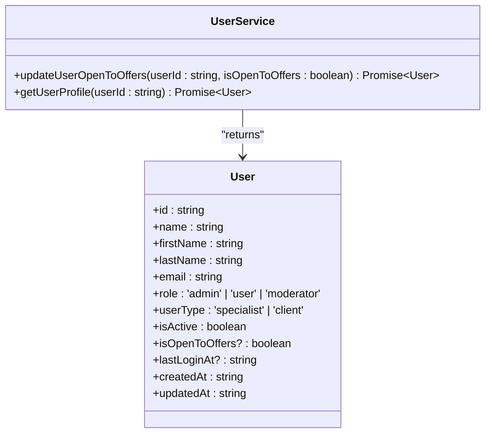
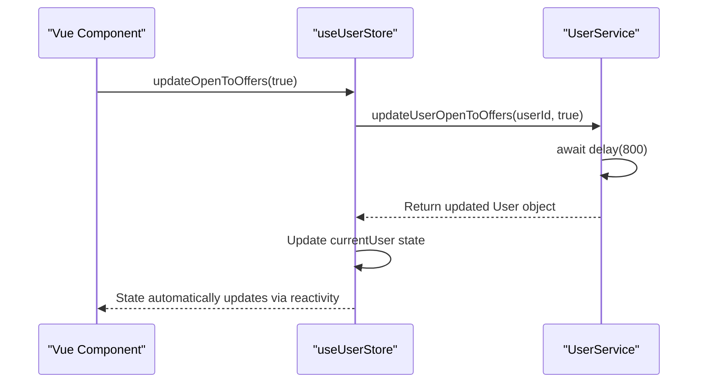
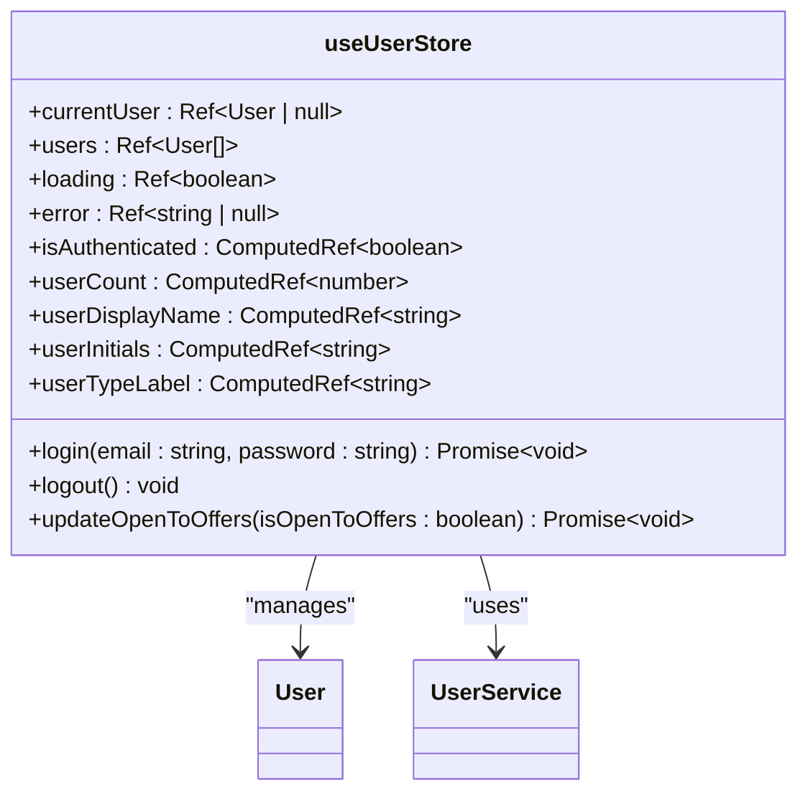
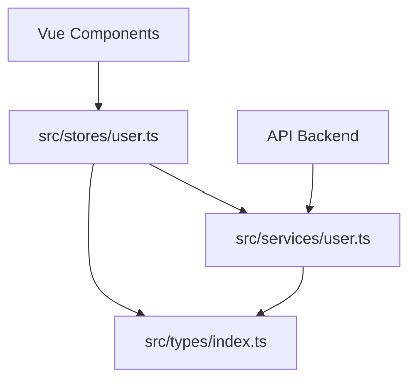

# User Service Implementation

<cite>
**Referenced Files in This Document**   
- [src/services/user.ts](file://src/services/user.ts#L1-L81)
- [src/types/index.ts](file://src/types/index.ts#L1-L170)
- [src/stores/user.ts](file://src/stores/user.ts#L1-L103)
</cite>

## Table of Contents
1. [Introduction](#introduction)
2. [Project Structure](#project-structure)
3. [Core Components](#core-components)
4. [Architecture Overview](#architecture-overview)
5. [Detailed Component Analysis](#detailed-component-analysis)
6. [Dependency Analysis](#dependency-analysis)
7. [Performance Considerations](#performance-considerations)
8. [Troubleshooting Guide](#troubleshooting-guide)
9. [Conclusion](#conclusion)

## Introduction
The User Service is a core component of the MayaWork frontend application, responsible for managing user-related operations such as authentication, profile retrieval, and status updates. This document provides a comprehensive overview of its implementation, including API interfaces, integration patterns, and usage examples. The service is designed with modularity and testability in mind, using TypeScript for type safety and Pinia for state management.

## Project Structure
The project follows a feature-based organization with clearly separated concerns:
- **src/services**: Contains service classes for API communication (e.g., user.ts)
- **src/stores**: Manages application state using Pinia (e.g., user.ts store)
- **src/types**: Defines shared TypeScript interfaces and types
- **src/components**: Organized by feature areas (profile, search, support, etc.)
- **src/pages**: Top-level page components mapped to routes

The User Service specifically resides in `src/services/user.ts` and interacts with the user store in `src/stores/user.ts`, forming a clean separation between data access logic and state management.

**Diagram sources**
- [src/services/user.ts](file://src/services/user.ts#L1-L81)
- [src/stores/user.ts](file://src/stores/user.ts#L1-L103)
- [src/types/index.ts](file://src/types/index.ts#L1-L170)

**Section sources**
- [src/services/user.ts](file://src/services/user.ts#L1-L81)
- [src/stores/user.ts](file://src/stores/user.ts#L1-L103)

## Core Components
The User Service implementation consists of three primary components:
1. **UserService class**: Handles API operations for user data
2. **User interface**: Defines the user data structure
3. **useUserStore**: Manages user state and provides business logic

These components work together to provide a robust user management system with proper error handling and loading states.

**Section sources**
- [src/services/user.ts](file://src/services/user.ts#L1-L81)
- [src/types/index.ts](file://src/types/index.ts#L1-L170)
- [src/stores/user.ts](file://src/stores/user.ts#L1-L103)

## Architecture Overview
The User Service follows a clean architecture pattern with distinct layers:
- **Presentation Layer**: Vue components that consume user data
- **State Layer**: Pinia store managing user state
- **Service Layer**: UserService handling API interactions
- **Type Layer**: Shared TypeScript interfaces

This layered approach ensures separation of concerns and makes the codebase maintainable and testable.

**Diagram sources**
- [src/services/user.ts](file://src/services/user.ts#L1-L81)
- [src/stores/user.ts](file://src/stores/user.ts#L1-L103)
- [src/types/index.ts](file://src/types/index.ts#L1-L170)

## Detailed Component Analysis

### UserService Class Analysis
The UserService class provides methods for user-related operations with mocked API delays to simulate real-world network conditions.

**Diagram sources**
- [src/services/user.ts](file://src/services/user.ts#L1-L81)
- [src/types/index.ts](file://src/types/index.ts#L1-L170)

#### API Workflow for Updating User Status
The sequence diagram below illustrates the flow when updating a user's "Open to Offers" status:

**Diagram sources**
- [src/services/user.ts](file://src/services/user.ts#L15-L45)
- [src/stores/user.ts](file://src/stores/user.ts#L75-L95)

### User Store Analysis
The useUserStore provides a reactive state management solution for user data with computed properties and actions.

**Diagram sources**
- [src/stores/user.ts](file://src/stores/user.ts#L1-L103)
- [src/services/user.ts](file://src/services/user.ts#L1-L81)

## Dependency Analysis
The User Service and its associated store have the following dependencies:

Key dependency relationships:
- The store depends on both the service and type definitions
- The service depends on type definitions for interface contracts
- Components depend on the store for user data access
- The service would depend on an HTTP client in production

**Diagram sources**
- [src/stores/user.ts](file://src/stores/user.ts#L1-L103)
- [src/services/user.ts](file://src/services/user.ts#L1-L81)
- [src/types/index.ts](file://src/types/index.ts#L1-L170)

**Section sources**
- [src/stores/user.ts](file://src/stores/user.ts#L1-L103)
- [src/services/user.ts](file://src/services/user.ts#L1-L81)

## Performance Considerations
The User Service implementation includes several performance considerations:
- **Simulated API delays**: The `delay()` function simulates network latency (800ms for updates, 600ms for reads)
- **Error simulation**: 10% failure rate in `updateUserOpenToOffers()` for testing error handling
- **Reactive state**: Pinia store provides efficient state updates without unnecessary re-renders
- **Type safety**: TypeScript interfaces prevent runtime type errors

In a production environment, consider implementing:
- Caching mechanisms to reduce API calls
- Request debouncing for rapid status updates
- Proper HTTP client configuration with timeouts and retries

## Troubleshooting Guide
Common issues and their solutions when working with the User Service:

**Issue: User status update fails**
- **Symptoms**: Error message "Failed to update user status. Please try again."
- **Cause**: Simulated API failure (10% chance) or invalid user ID
- **Solution**: Retry the operation or verify the user ID exists

**Issue: User data not updating in UI**
- **Symptoms**: State changes in store but UI doesn't reflect updates
- **Cause**: Missing reactivity or component not properly subscribed to store
- **Solution**: Ensure component imports store correctly and uses reactive references

**Issue: Type errors with user data**
- **Symptoms**: TypeScript compilation errors related to User interface
- **Cause**: Missing required fields or incorrect field types
- **Solution**: Verify all required User interface fields are present and correctly typed

**Issue: Login not working with expected email**
- **Symptoms**: User type not assigned correctly during login
- **Cause**: Mock logic only recognizes 'client@example.com' as client type
- **Solution**: Update mock logic or use appropriate test email addresses

**Section sources**
- [src/services/user.ts](file://src/services/user.ts#L1-L81)
- [src/stores/user.ts](file://src/stores/user.ts#L1-L103)

## Conclusion
The User Service provides a well-structured implementation for managing user data in the MayaWork frontend. Its clean separation of concerns between service, store, and type definitions makes it maintainable and testable. The use of TypeScript ensures type safety, while Pinia provides efficient state management. The current implementation uses mocked data for development purposes, with clear pathways for integrating with a real backend API. Future enhancements could include caching, improved error handling, and additional user management features.